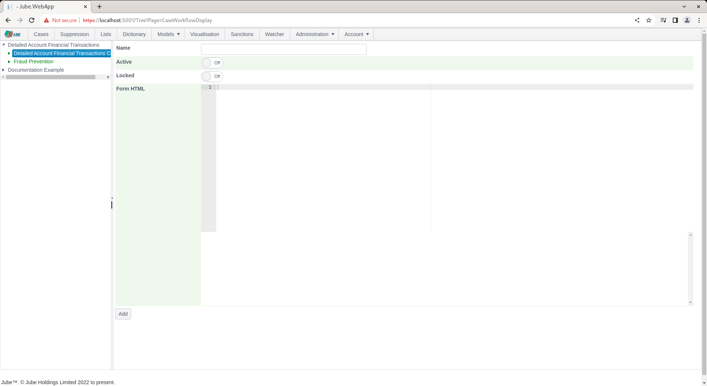
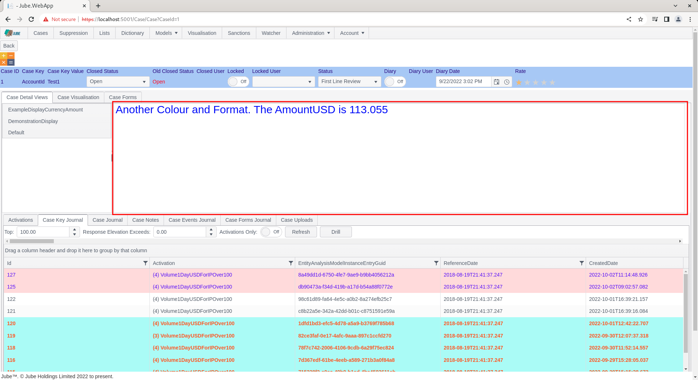

# Case Workflow Display
Upon the creation of a case the payload that caused the creation is stored alongside the case record.  Upon navigation to the case creation record in the case page,  the record is of course displayed in the default view whereby data is extracted and colored from the payload record using the Cases Workflows Xpath functionality.  It is a key value table.

From the Cases page, the default display can be seen as follows:


The Cases Workflow XPath functionality provides some capability to format cells but it is quite limited and the amount of information can be overwhelming in the case of very large payloads.  Cases Workflow Displays provide a means to create a custom display based on arranging tokens in HTML fragments.  A Cases Workflow Display allows a narrower and emphasised display as compared with the default.

Start by navigating to Models >> Cases Workflows >> Cases Workflow Displays:


Click on a Cases Workflow in second level of tree to expose the add case display configuration:



The form looks almost identical to the Cases Workflow Form configuration,  with the only difference being that the Display HTML is intended for display HTML and not form elements.  Furthermore,  the Cases Workflow Display supports tokenization that will swap tokens for the values that have been extracted by the Cases Workflow XPath.  In this example the AmountUSD has been specified as a Cases Workflow XPath.  The tokenization takes the same form as is expected in the Notification functionality,  with the name being flanked by the [@ and @] characters.  Upon rendering of the Cases Workflow Display,  the tokens will be extracted and replaced with their actual values as extracted by the Cases Workflow XPath.

The form takes the following properties:

| Value        | Description                                                                                                                                                                                                                                                                                      | Example               |
|--------------|--------------------------------------------------------------------------------------------------------------------------------------------------------------------------------------------------------------------------------------------------------------------------------------------------|-----------------------|
| Display HTML | HTML display Elements for the purposes of data capture.  The HTML display elements will be embedded in a HTML div on rendering, hence,  it will support all HTML. Tokens [@ @] can be used to replace the token placeholder with the value name having being extracted in cases workflows xpath. | As below for clarity. |

```html
<p style="color:blue;font-size:30px;">Another Colour and Format.  The AmountUSD is [@AmountUSD@]</p>
```
Complete the form as above and below example:


Notice that the HTML display has been rendered,  yet not tokenized with data.

Click the Add button to create a version of the Cases Workflows Display:


Navigate a the case record:


Notice the creation of a new entry in the displays list item on the left hand side:


Click on the newly created display to expose tokenized display:



The display has been rendered in exactly the same manner as the configuration,  with the token being swapped for the actual value on case creation.
