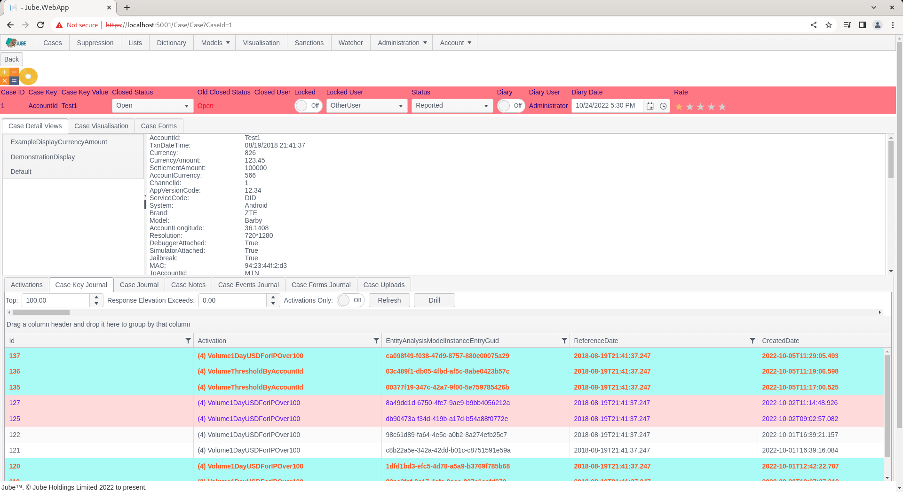
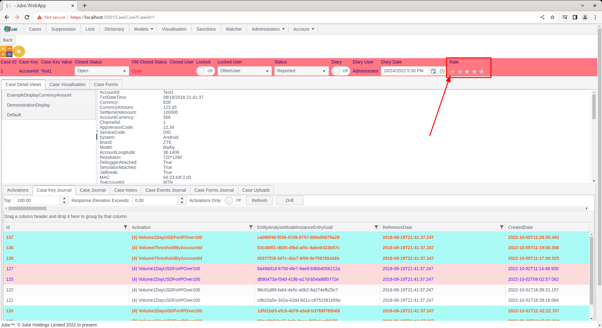
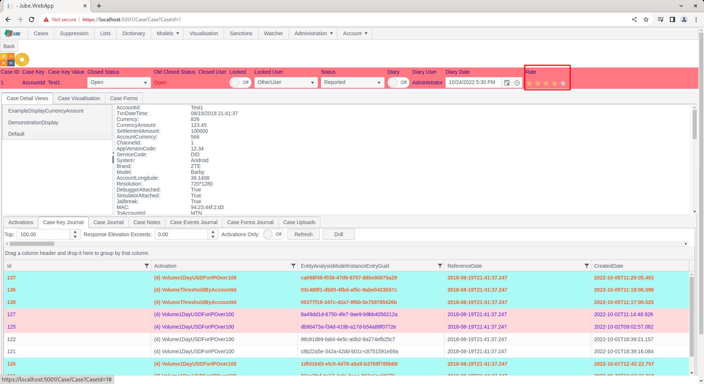

# Working Case Rating
To obtain case quality feedback from the end user there exists a star rating which is intended to capture the subjective judgement as to the quality of the case.   Case evaluation is a grading rather than a strict binary outcome.

Navigate to a case record via either Fetch or Skim:

Take note of the rating in the status bar,  that includes a default of one star:

Suppose that the quality of a case - the rules or machine learning that caused the case creation record - is of reasonable (but not exceptional) quality,  then it would be judged to be four stars.  To set a star rating,  float over the star rating:

After floating, click to commit. The case record will be updated to four stars.