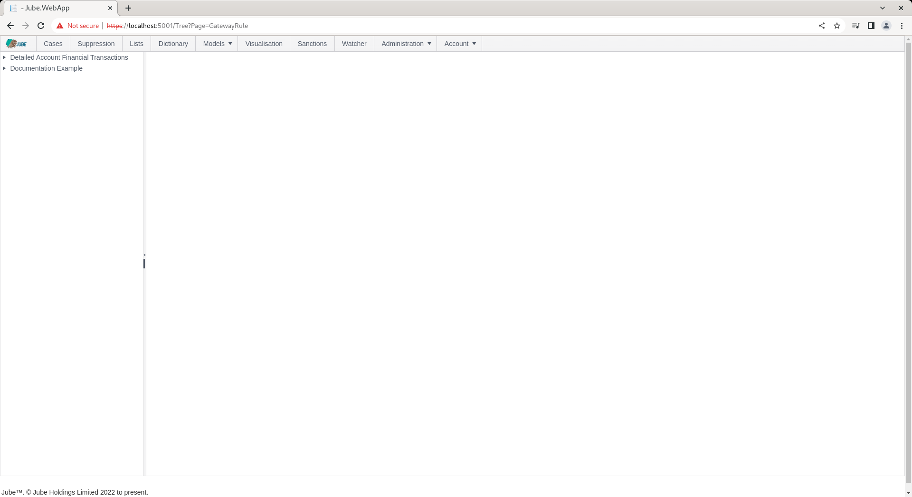
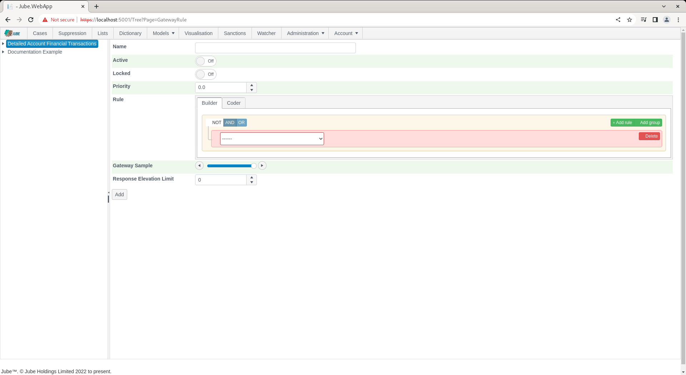
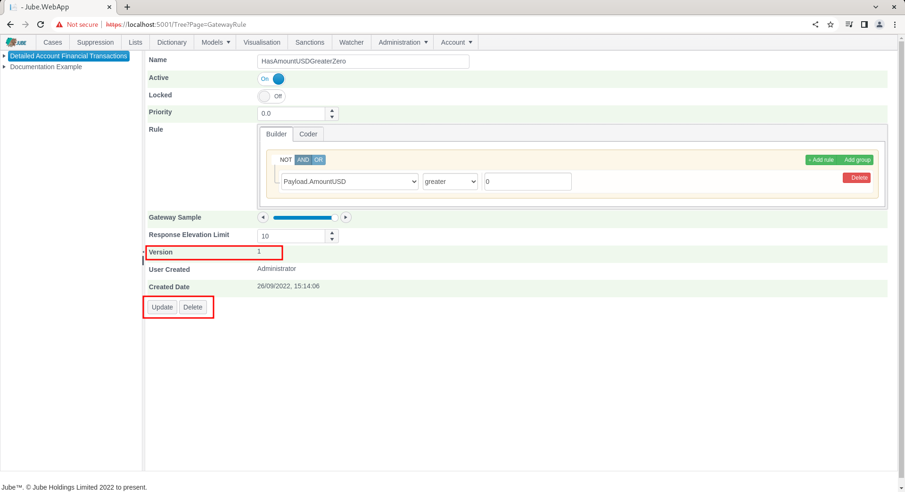

# Gateway Rules
Gateway Rules are pre-filtering and sampling to reduce the transaction volume eligible for the processing by more intensive functions that perhaps follow.

Transactions will only proceed to the subsequent steps in model processing in the event that Gateway Rule matches. Upon a Gateway Rule matching,  it can also be tested against a random sample, as a means to reduce the volume further. The page is available by navigating through the menu as Models >> References >> Gateway Rules:

The page exists to create Gateway Rules, which are VB.net code fragments, to be compiled into the engine during synchronisation.  Gateway Rules accept data objects and tests the code fragment for equality,  expecting a return of True on match, or otherwise False.  The Builder and Coder the following data:

| Value   | Description                                                                                       |
|---------|---------------------------------------------------------------------------------------------------|
| Payload | The fields created in the Request XPath page, Inline Functions and Inline Scripts (if allocated). |

To add a new Gateway rule,  click on the Model in the tree towards the left hand side:

The parameters for the Gateway Rule are described as follows:

| Value                  | Description                                                                                                                                                                                                                                                                                                                                                                                                                                                                             | Example |
|------------------------|-----------------------------------------------------------------------------------------------------------------------------------------------------------------------------------------------------------------------------------------------------------------------------------------------------------------------------------------------------------------------------------------------------------------------------------------------------------------------------------------|---------|
| Gateway Sample         | A percentage value,  between 0% and 100%, representing the sample that should be allowed through to subsequent processing.  The sample will only be taken in the event that the Rule returns as true.  For example,  if the Gateway Sample is set to 20%,  it would imply that only 20% of the matching transactions will be passed through for subsequent processing.                                                                                                                  | 100%    |
| Max Response Elevation | Upon a Gateway Rule Matching,  the Maximum Response Elevation is set such to provide some risk management to the magnitude of the Response Elevation.  For example,  if the Response Elevation is used to instruct a bid,  the open-boundedness could be cause for alarm. This value is the largest response elevation that may be responded,  with any values exceeding this value being truncated to this value.  Keep in mind that there are similar limits at the model level also. | 10      |

Complete the form as above parameters and with an example rule that ensures that the AmountUSD is greater than 0:

Click the Add button to create the Gateway Rule:

Synchronise the model via Entity >> Synchronisation. 

Gateway Rules exist to marshal a transaction or event for subsequent processing, and only on match, to the following processing steps:

* Sanctions.
* TTL Counters.
* Abstraction Rules.
* Abstraction Deviation.
* Abstraction Calculation.
* Adaptation.
* Activation Rules.

It follows that none of the aforementioned functions will be processed except in the event of a match on the Gateway Rule.  Henceforth,  to validate the Gateway Rule, it is necessary to deploy one of the aforementioned functions.