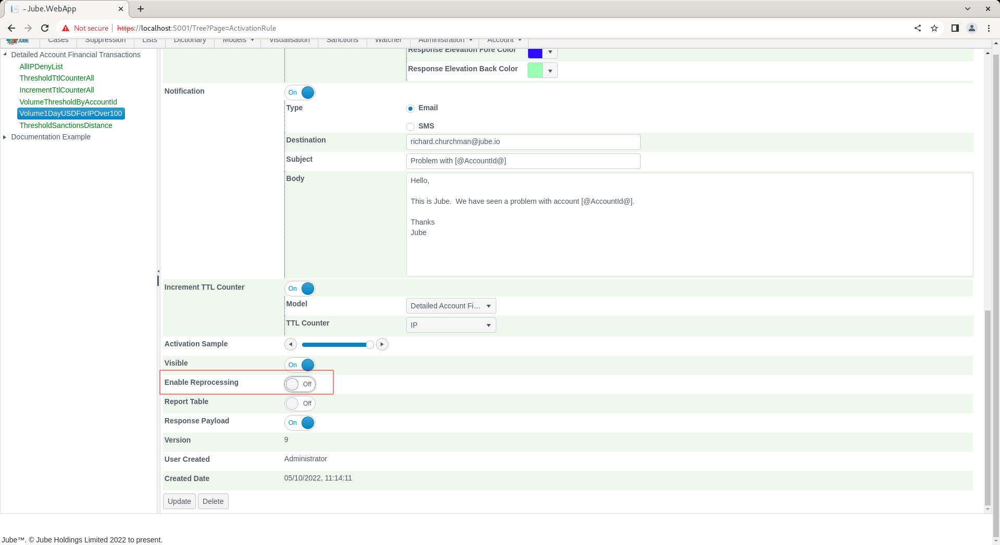

# Reprocessing Eligibility
Reprocessing allows for the contents of the Archive table to be reprocessed one by one retroactively,  which is useful if a new rule has been created and some historic management is required.

It should be noted that reprocess is computationally expensive and should not be used in place of a forward only transaction or event methodology.  A common use case is to facilitate the reprocessing of an extremely targeted specification,  such as a particular high risk client or customer subset.  It should also be noted that reprocessing takes it data from the archive and will upset the value to the cache.  The upsert step puts some demand on the cache but also the extent to which the cache may grow should be considered if data is being processed outside of a time frame know to otherwise have good coverage in the cache.

There are a number of ways to remove load from the reprocessing task.

The steps for reprocessing are firstly, setting an Activation Rule to be eligible for reprocessing.  Navigate to the Activation Rule Volume1DayUSDForIPOver100:

Scroll down the Activation Rule and locate the Reprocessing switch:

Ensure that the Enable Reprocessing is switched to true for this Activation Rule to be eligible for reprocessing.

Reprocessing jobs are responsible for fetching data from the Archive table,  filtering and performing model invocation for each event returned:

When reprocessing takes place, model invocation is almost exactly the same as if it were being called real-time,  and on a similar one by one basis in order of transaction processing date.  However, when it comes to executing Activation Rules as part of model invocation,  only rules that have been marked as Reprocessing are evaluated.

To set a rule to be eligible for reprocessing,  it is a simple matter of updating the Reprocessing check-box in the Activation Rule.  Scroll down to enable reprocessing by setting the switch to true:

Scroll down and update the Activation Rule to create a version:

It is important that the model is synchronised, as reprocessing relied upon the Activation Rule configurations, henceforth,  navigate to Models >> Synchronisation and enact.

