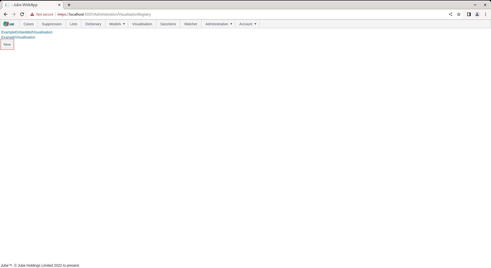

# Visualisation Registry
Think of a Visualisation Registry as a report. The Visualisation Registry can have many Datasource's which share a common set of parameters.  The Visualisation Registry is the wrapper and specifies the the size of the canvass for the datasource's to be arranged.  The registry entry also controls the availability of navigation to the Visualisation through the Visualisation Directory.

To create a Visualisation Registry,  navigate Administration >> Visualisation >> Visualisation Registry:

To select an existing Visualisation Registry locate the link corresponding to the name:

Clicking on the link will expand the Visualisation Registry:

To return to the list,  click the Back button:

To create a new Visualisation Registry click the New button:

On clicking the New button a page will be presented with empty fields for the creation of the Visualisation Registry:

The Visualisation Registry takes the following parameters:

| Value             | Description                                                                                                                                  | Example |
|-------------------|----------------------------------------------------------------------------------------------------------------------------------------------|---------|
| Show In Directory | A flag indicating is the Visualisation is to be presented in the Visualisation page (otherwise available only in the Case page as embedded). | True    |
| Columns           | The number of columns that the Visualization Registry will be divided into for the purpose of arranging the Datasource's, or tiles.          | 6       |
| Column Width      | Given the columns having been specified,  the size in pixels of each column.                                                                 | 300     |
| Row Height        | Rows are otherwise unbounded,  however,  like columns,  have their size in pixels specified.                                                 | 300     |

Complete the page as follows and above:

Click Add to create a version of the Visualisation Registry:

Upon a new Visualisation Registry having been created, and noting that the Show in Directory having been selected,  it will be available for recall.  Clicking Visualisation from the main menu:

It can be noted that a new entry has been created:

Clicking on the new entry  will expose a blank page however in the absence of parameters nor datasource's having been created for teh Visualisation Registry.