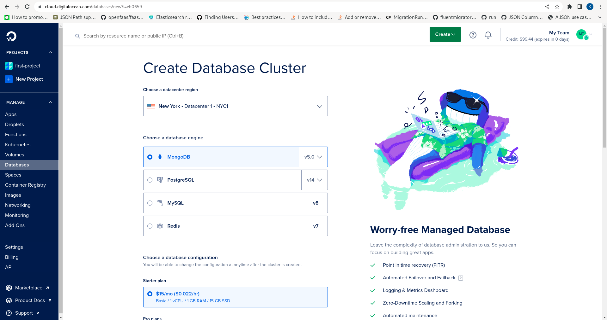
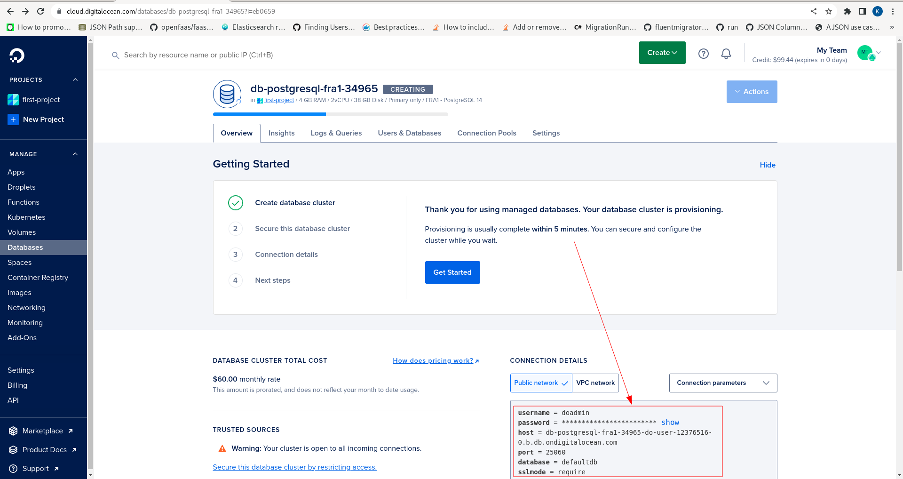

# Creating Database

It is possible to install PostgreSQL to a Droplet on a self managed basis,  which is a cost effective and oftentimes preferable approach.  The resources are available at the following location:

[https://www.postgresql.org/download/](https://www.postgresql.org/download/)

PostgreSQL is a remarkable database and is not especially difficult to maintain, although it has tendency to become more anxious when it comes to assuring backups and high availability.  The maintenance of high availability and backups is the main value proposition of Managed PostgreSQL on [DigitalOcean](https://m.do.co/c/8be72e86abb2) or alternative hosting provider.

For the purpose of this documentation,  PostgreSQL Managed Database at [DigitalOcean](https://m.do.co/c/8be72e86abb2) will be used.

In the [DigitalOcean](https://m.do.co/c/8be72e86abb2) Control Panel, navigate to Databases on the left hand navigation:


Click on the Database menu item to expose the page to begin database creation:


Locate the prominent Create Database Cluster button:


Click the button to expose the Create Database Cluster:



Specify a datacenter nearby (in this case Frankfurt) and PostgreSQL version 14:


Scroll down to size the server, selecting in this case 2vCPU and 4GB RAM: 


No standby is needed although it would be suggested given production use.  Scroll down and note the Create Database Cluster button:


Click the Create Database Cluster button to begin the process of database creation:


Upon the database having been created note the availability of the connection settings:



Clicking the show button will expose the password:

```text
username = doadmin
password = *******
host = db-postgresql-fra1-34965-do-user-12376516-0.b.db.ondigitalocean.com
port = 25060
database = defaultdb
sslmode = require
```

The database settings which will be passed as an Environment Variable later in the documentation.

Network security is outside the scope of this documentation; however, note that it is sensible to restrict access to the database to only the remote IP address in use, although this will not affect connections via the local network:

