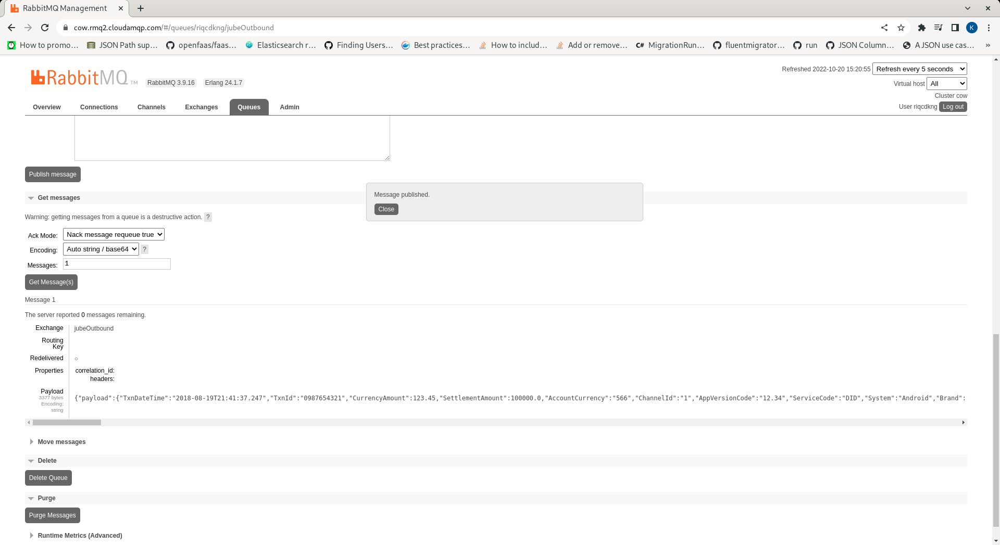

# AMQP Queue Ingestion and Exchange Publishing
In addition to the synchronous and asynchronous HTTP model invocation methods,  there exists AMQP, which is available for processing the same exact payload specification. The model GUID (EntityAnalysisModelGuid) is passed in a header rather than the URL. There exists no Async switch as AMPQ is asynchronous by its nature.

To enable AMQP integration,  the Environment Variable must be configured to firstly allow AMPQ, thereafter specify the fully qualified URL to establish a connection:

``` text
AMQP=True
AMQPUri=amqps://<User>:<Password>@cow.rmq2.cloudamqp.com/User
```

Aside from the AMQP protocols, the messaging payload is identical to the HTTP API.

Jube will establish queues and exchanges upon connection to the AMQP Server or Cluster.  The resources required for AMQP integration are as follows:

| Resource     | Type     | Description                                                                                                        |
|--------------|----------|--------------------------------------------------------------------------------------------------------------------|
| jubeInbound  | Queue    | A queue that accepts model request JSON in the body and a header titled EntityAnalysisModelGuid.                   |
| jubeOutbound | Exchange | A exchange that accepts model response JSON in the body and is published such that queues may be subscribed to it. |

In this example,  a Queue has been created that is subscribed to all messages passing through the jubeOutbound Exchange:


To pass a JSON message via AMQP, messages are queued to jubeInbound with JSON in the Body and a header named EntityAnalysisModelGuid which matches the model Guid (the EntityAnalysisModelGuid would otherwise have been part of the URL slug):


Queuing the message will make it available asynchronously to an instance of Jube with AMQP enabled.  On receipt of a message from AMQP, it will be processed as if it were received synchronously, albeit sending the response payload to the jubeOutbound exchange, rather than as a response in HTTP context:

