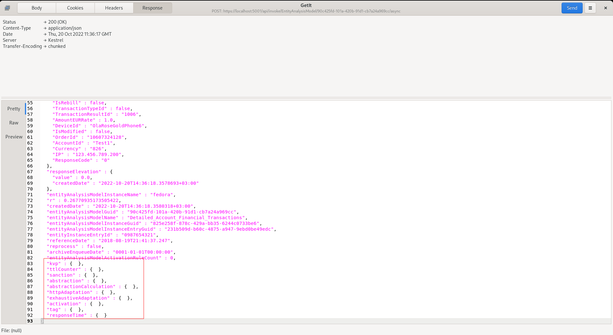
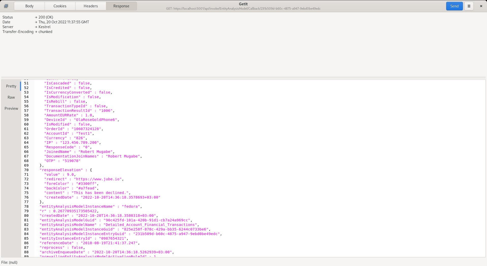

# HTTP API Asynchronous Model Invocation
Most of the procedures in this documentation makes use of synchronous HTTP requests in which the request is blocked until absolute conclusion of the processing.

As the HTTP requests are handled by the Kestrel web server embedded into Jube, this translates to a request being made of a Thread from the .Net managed Thread Pool. 

There is no use of asynchronous methods during model invocation (except in the case of ForkAbstractionKeys, which is not the default setting) hence that thread will be unavailable to the Thread Pool until completion.

The .Net Thread Pool is exceptionally good at sizing itself, however in periods of burst, thread load or saturation can occur,  which may lead to inconsistent - yet not necessarily unreasonable - response times.  The manageability and maintainability of the application becomes difficult should unmarshalled requests be made of the thread pool,  especially in burst.  Henceforth,  as a philosophy, it is a preferred approach to queue work on in the instances internal concurrent queues and manually size thread counts, having detailed knowledge of the underlying hardware infrastructure.  A further benefit of the manual thread sizing approach is to allow for asynchronicity in the client integration, without having to relying on asynchronous methods and thread pools client side,  which may bring about many of the same challenges that this architecture sets out to solve.

There exists a switch in the model invocation endpoint which will instruct the asynchronous processing of a transaction or event:

[https://localhost:5001/api/invoke/EntityAnalysisModel/90c425fd-101a-420b-91d1-cb7a24a969ccc](https://localhost:5001/api/invoke/EntityAnalysisModel/90c425fd-101a-420b-91d1-cb7a24a969ccc)/async


By adding the Async switch to the endpoint url the request payload is only processed up to the conclusion of Request XPath,  after which the remainder of the processing is instructed via internal asynchronous queue, with a partial response payload being returned by HTTP.  There are a predefined number of threads available for the remaining model invocation, specified as an Environment Variable called ModelInvokeAsynchronousThreads:

``` text
ModelInvokeAsynchronousThreads=1
```

In the event of burst, or incorrectly sized thread instantiations given available compute and load,  then the queue will backup.  The queue balance can be monitored via select:

``` sql
select * from "EntityAnalysisModelAsynchronousQueueBalance"
```

Returning the following data:


Queue balances are captured roughly evey minute. In burst,  queues backing up are to be expected,  and will clear assuming that the threads are sized slightly ahead of demand.

Post the example Json to [https://localhost:5001/api/invoke/EntityAnalysisModel/90c425fd-101a-420b-91d1-cb7a24a969ccc/async](https://localhost:5001/api/invoke/EntityAnalysisModel/90c425fd-101a-420b-91d1-cb7a24a969ccc/async):



The payload returned for asynchronous processing is identical to the synchronous processing,  except only the existence of the Request XPath can be assured. Although the processing will stop at the point the Request XPath has been extracted, the head check, the pickup of the instruction from the background process may be so rapid that processing begins,  henceforth there may be additional elements having been processed beyond just the Request XPath being echoed back.  While race conditions might provide for more data in the initial payload,  it should not be relied upon without a callback.

Even though processing will have taken place in the background,  the response payload can be called back via the invocation of the GET HTTP method Callback HTTP endpoint using the entityAnalysisModelInstanceEntryGuid element value taken from the initial HTTP response as key:

[https://localhost:5001/api/invoke/EntityAnalysisModel/Callback/de1119dc-dda0-4916-a716-bbd39c69a17e](https://localhost:5001/api/invoke/EntityAnalysisModel/Callback/de1119dc-dda0-4916-a716-bbd39c69a17e)


The response payload will be identical to that returned synchronously having been stored in an instance buffer once it is complete,  and communicated via notification to other running instances.  The default timeout is three seconds which implies that should background processing not have concluded, and made available within three seconds,  a HTTP status 404 will be returned.  The presence of timeouts would imply that that the threads are not handling burst adequately and not able to reach requests within tolerance.



A callback may only be made once, as the callback is deleted upon matching EntityAnalysisModelInstanceEntryGuid value.

To enable HTTP callbacks, it is necessary to set the EnableCallback and CallbackTimeout Jube Environment Variables:

``` text
EnableCallback=True
CallbackTimeout=3000
```

There exists cluster wide publishing of callback Create and Delete events to facilitate effective continued load balancing.  The full response payload is stored in the instance memory,  duplicated by however many instances are configured for callback, which is the main rational for both Create and Delete events,  allowing for the releasing of the memory across all instances just as soon as the Callback has been collected.

Given the potential for memory saturation on orphaned callbacks, in the event that a callback has not been collected, it will be removed upon the timout interval having been realised, configured in milliseconds in the CallbackTimeout Environment Variable. Monitoring for timeouts is achieved by polling the "EntityAnalysisModelAsynchronousQueueBalance" table as above,  as a timout counter is maintained for each Callback.