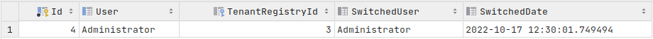
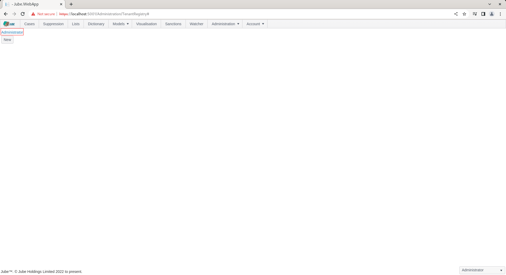
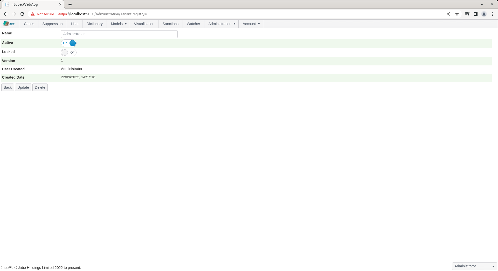
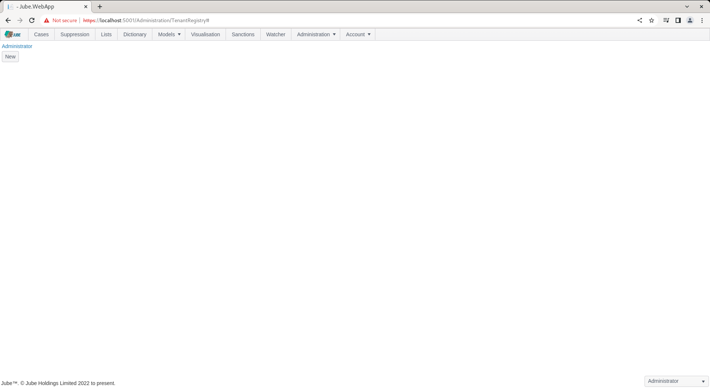
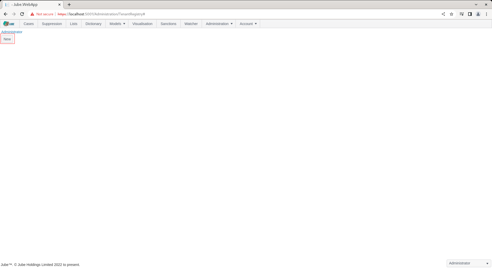
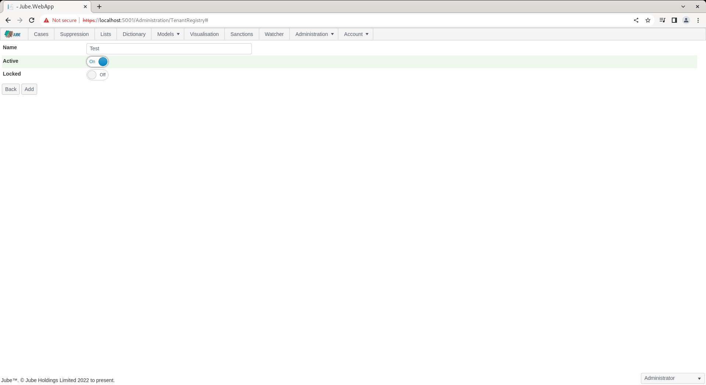
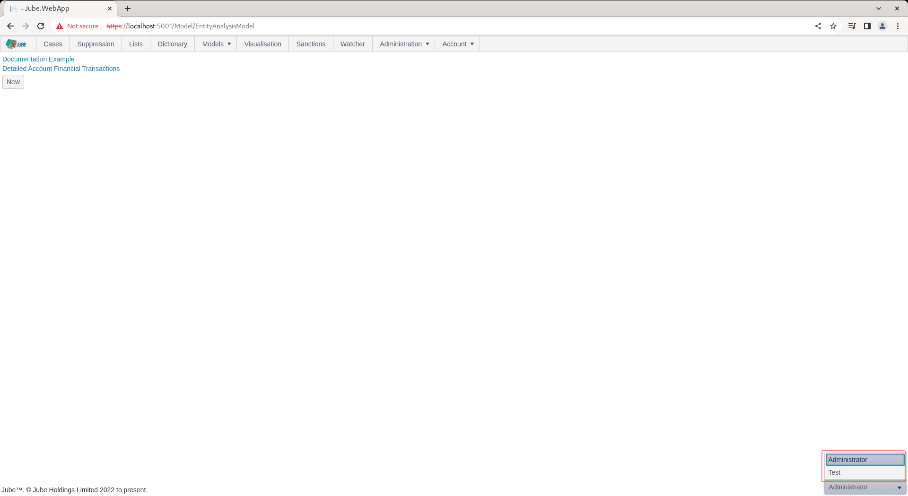

# Enabling Multi Tenancy And Switching
On each request the UserInTenant table is inspected for the authentication user to identify the allocated TenantRegistryId:

``` sql
select * from "UserInTenant"
```

Returning the following data:



Only a single instance of a given user name may be in use for the entire implementation of Jube.  It is not possible to switch users between tenant, except on the basis that the tenant that the user belongs to is designated as a Landlord, which means that all authorisation mechanisms are bypassed, all permissions are available, across all tenants, for all users belonging to that tenant.

The designation of a Tenant as being of type Landlord may only happen via database update.  The following SQL will update the Administrator Tenant to be a Landlord:

``` sql
Update "TenantRegistry" set "Landlord" = 1 where "Id" = 1
```

Assuming however the Landlord permission has been updated,  it becomes possible to create new Tenants and move that user between tenants,  with total authorisation assumed.  

Upon Landlord having been designated, navigate to Administration >> Security >> Tenants:


There already exists a default tenant that has been created by migration.  In the absence of Landlord having been allocated,  the default tenant just remains the solitary tenant (it could be said single tenanted).

Note the link to the Administrator tenant:



Clicking on the link expands upon the properties of the tenant:



Locate the back button:


Clicking on the Back button returns to the list of tenants:



To create a new Tenant locate the New button:



Clicking on the New button to expose an empty tenant:


Create a tenant titled Test as follows:



Click the Add button to create a version of the tenant:


By way of illustration, navigate to Models >> Models:


There are several models being returned as belonging to the Administrator tenant.

The availability of a new tenant allows for the switching to that tenant, given the Landlord permission.  Note since Landlord permission,  in the bottom right hand corner of the user interface, there is a dropdown box:


The dropdown box is the tenant switcher and contains all tenants available.  The selection is the current allocation of user to tenant:



In selecting a different tenant,  the currently authenticated user will be allocated to the newly selected tenant,  with the screen being refreshed:


Given a new tenant,  there is no data, as only data owned by this tenant is returned.  All pages in the user interface may be used in a manner as documented, with data being completely isolated from one tenant to another.