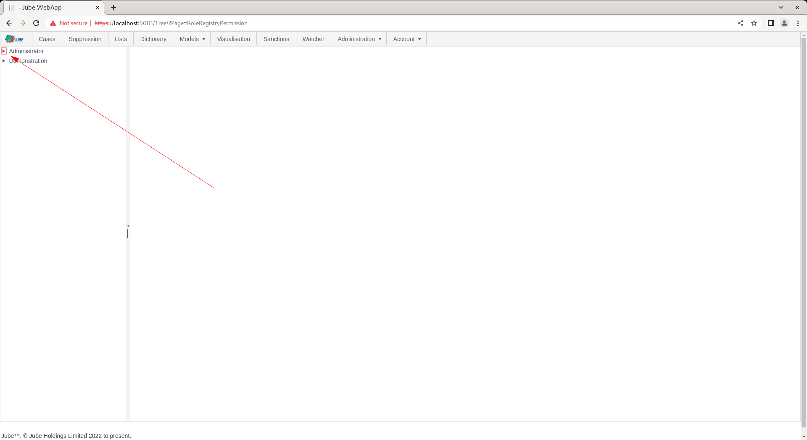
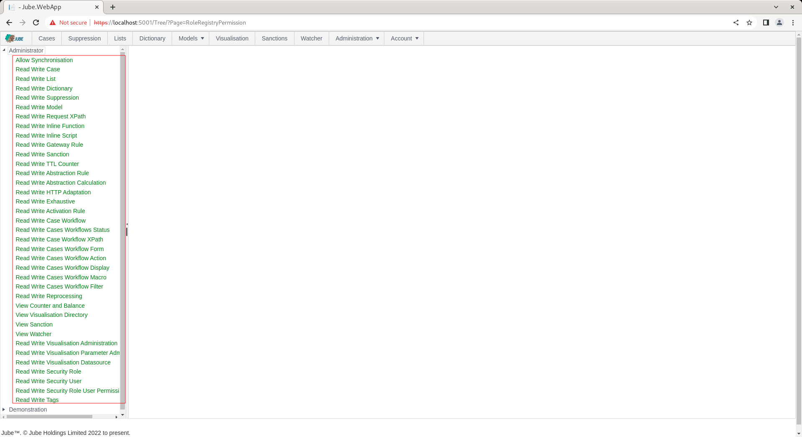
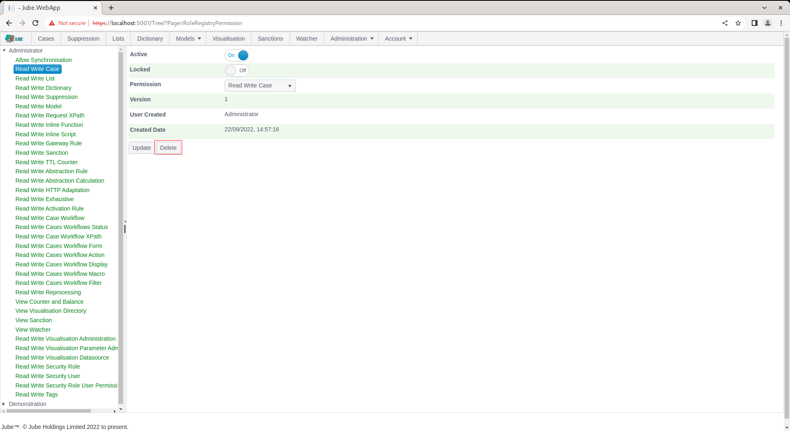
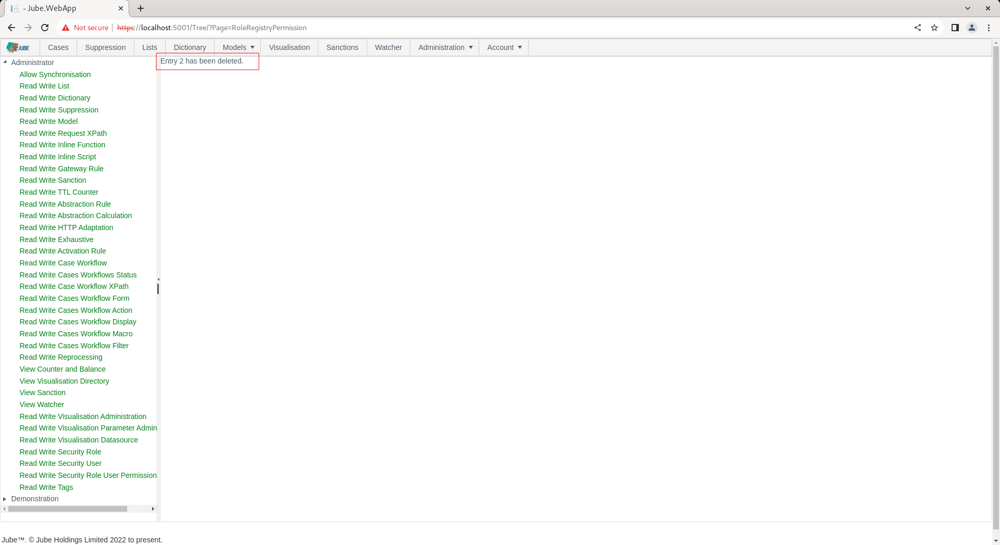
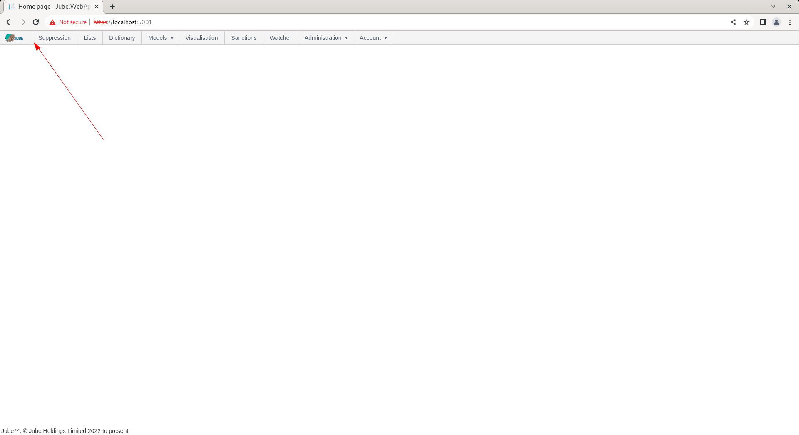
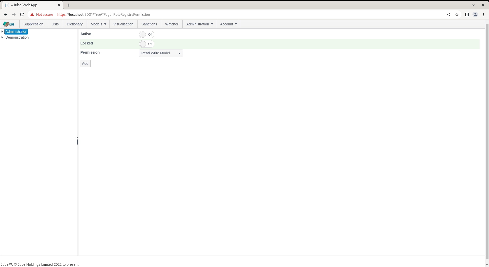
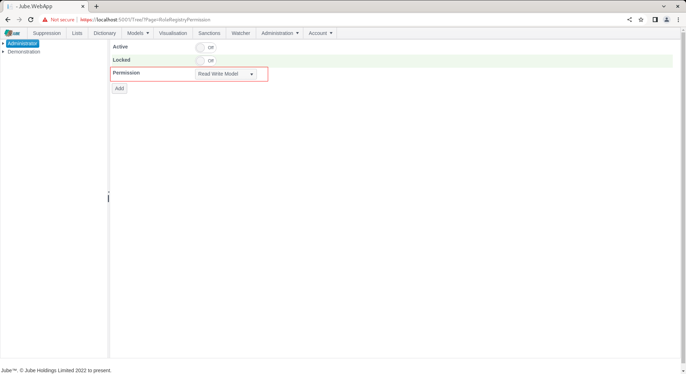
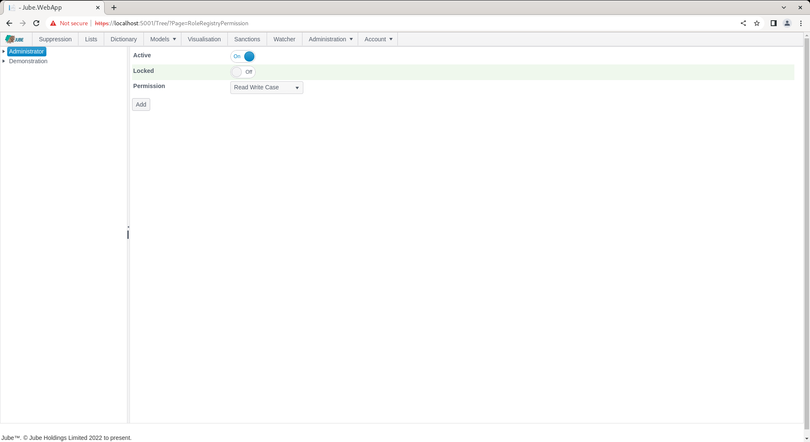
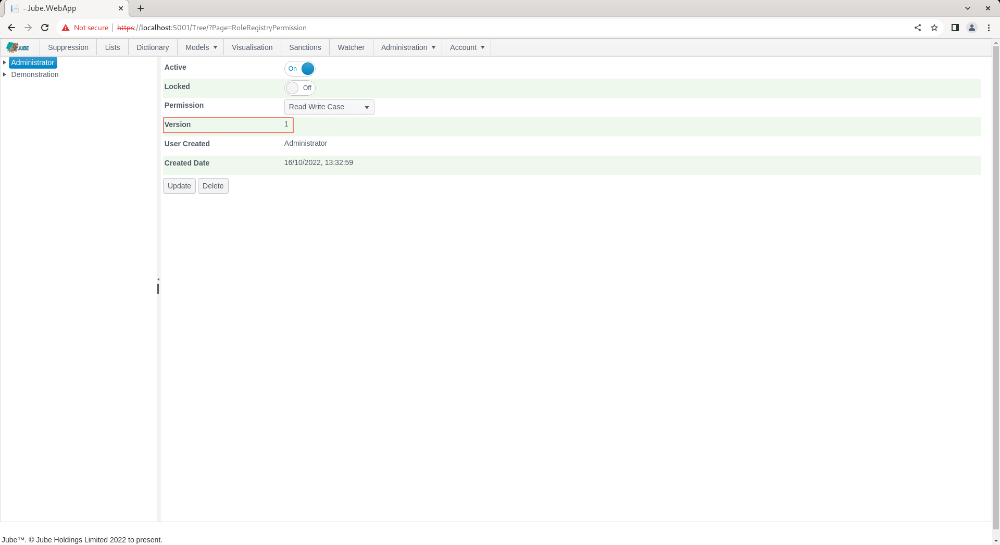
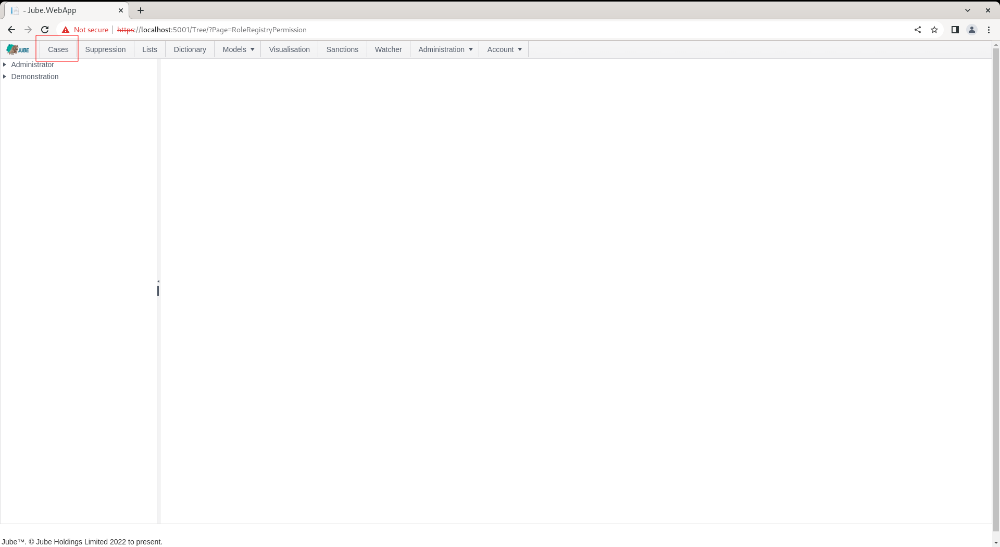

# Permissions
Permissions grant access to resources in the user interface,  typically pages.  Permissions are added to Roles,  and then a Role is allocated to a user.

In practice,  it is unlikely that a user with day to day responsibilities in customer services would require access beyond Case Management, Lists, Dictionary or Suppression.  Similarly,  an analyst that has responsibility for the creation of rule and reports is unlikely to need access to those pages enjoyed by customer service.

In the absence of a permission the user will not be able to navigate given absence of the resource in the menu.  In the event of deep linking to a resource without a permission,  an unauthorised http status code will be returned.

The Administrator role is created during migrations and has all available permissions allocated.  To view permissions for the Administrator role,  start by navigating Administration >> Security >> Permissions:

Locate the triangle to bring about an expansion of the tree,  to expose the permissions for the Administrator role:

Click to expand permissions for the Administrator role:

Locate the Read Write Case permission for the Administrator:

Click on the Read Write Case permission to expand on the properties:

Deleting this permission will render the Case pages inaccessible:

Locate the Delete button:

Click the Delete button and confirm:

Refreshing the whole page will construct the menu without the Case menu item for absence of permission:

To establish the permission once again navigate to back to Administration >> Security >> Permissions, and click on the top on the tree node Administrator to create a new entry:

To add a permission is to select the permission from the drop down of available permissions.  Locate the permissions drop down:

Select Read Write Case and ensure Active: 

Click Add to create a version of the permission:

As permission may not be added twice.  In the event the permission has already been allocated to the Role,  the existing entry will be updated for the new properties.  With the permission resetablished to access the Cases,  a refresh of the whole page will make available the menu item:

