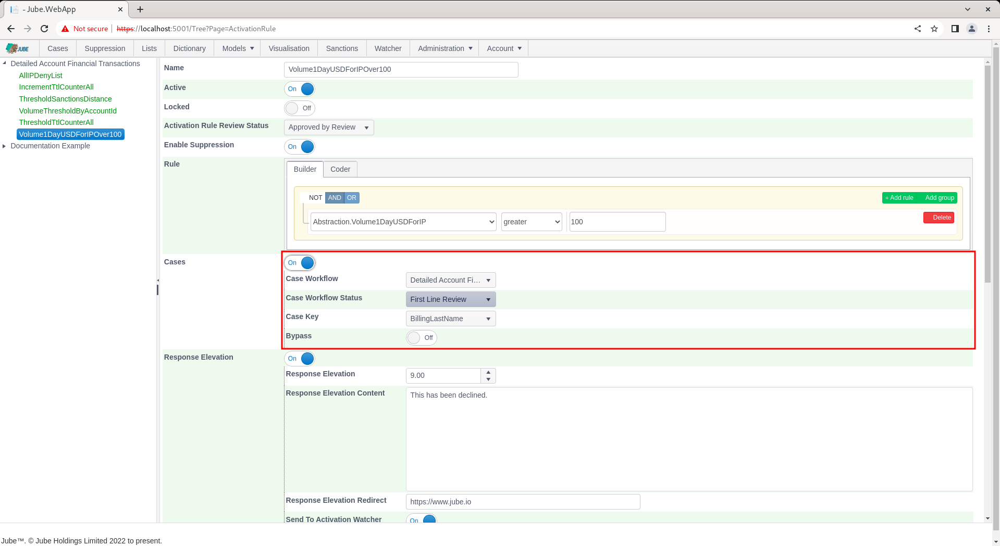
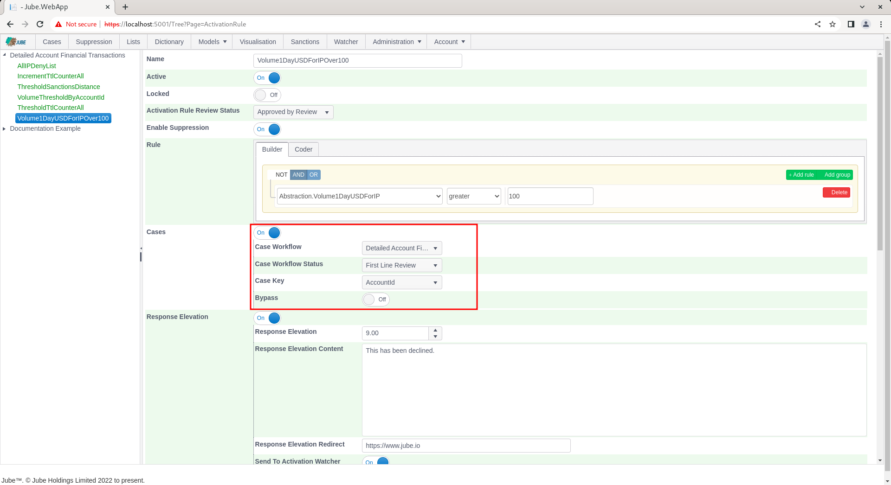
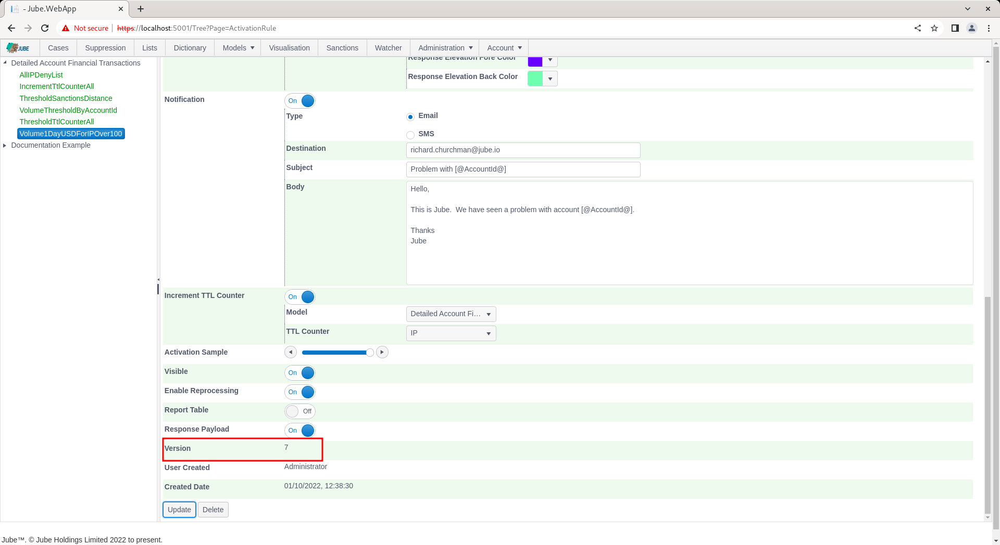
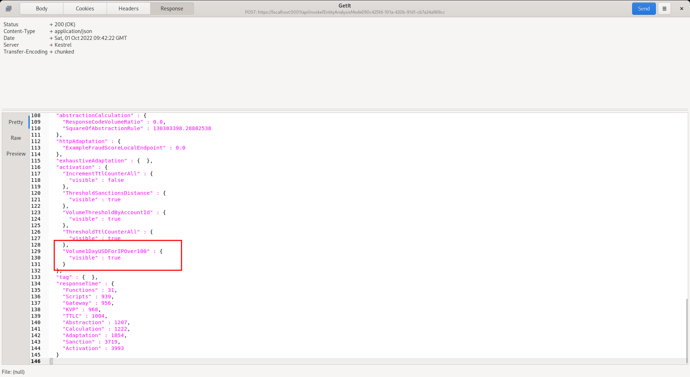
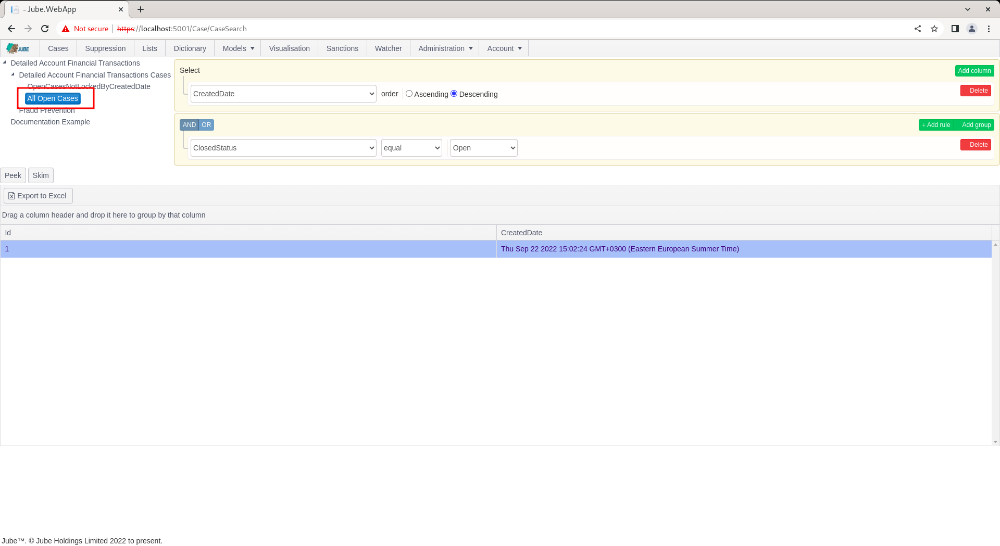
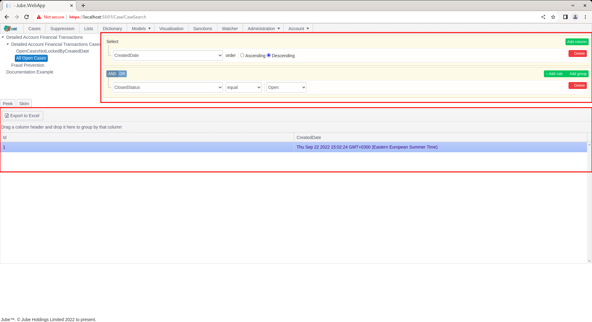

# Creating Case Entry With Activation Rule
Revisit Activation Models Activation and Reprocessing in this documentation before proceeding.

To create a case record as a consequence of an Activation Rule match, navigate to the Volume1DayUSDForIPOver100 created beforehand:

Scroll down to Cases checkbox in the Activation Rule:

Check Cases to expose the options to create a case as a consequence of this Activation Rule matching:

For the time being,  do not adjust the Bypass parameters,  yet note that the default case creation parameters are the Case Workflow and Case Workflow Status created in the previous procedures.

The Case Key refers to the value that will be used to distinctly create the case,  whereby the case creation integrity will be enforced on that key.  For example,  if a Case Key is AccountID,  only a single case record can be created for for a Case Key Value combination,  for a case workflow.

Select parameters as follows:

Scroll down the page and click Add to create a version of the Activation Rule:

Synchronise the model via Entity >> Synchronisation and repeat the HTTP POST to endpoint [https://localhost:5001/api/invoke/EntityAnalysisModel/90c425fd-101a-420b-91d1-cb7a24a969ccc](https://localhost:5001/api/invoke/EntityAnalysisModel/90c425fd-101a-420b-91d1-cb7a24a969ccc) for response as follows:

It can be seen from the response that the Case Creation Activation Rule has activated,  which will have driven the creation of a case.

To view the created case,  navigate to Cases:

If not already selected by session,  click on a Case Workflow Filter to display open cases:

It can be seen upon matching,  a case has been created.

