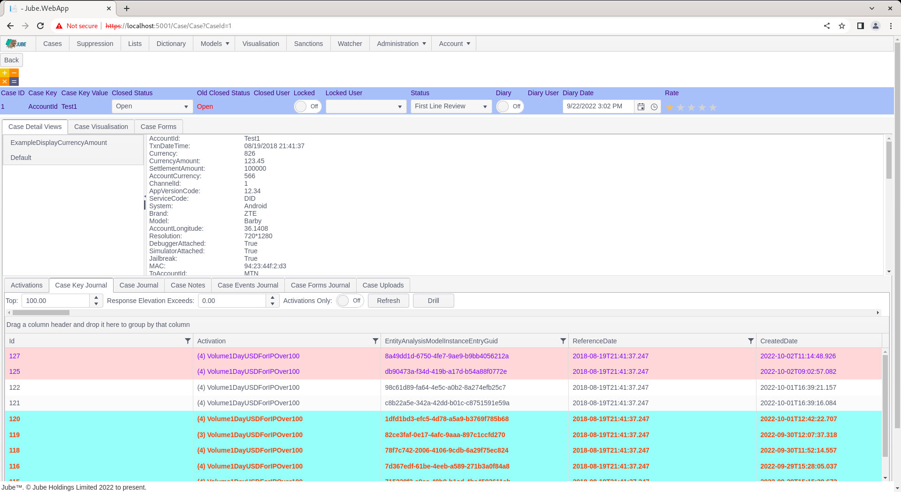
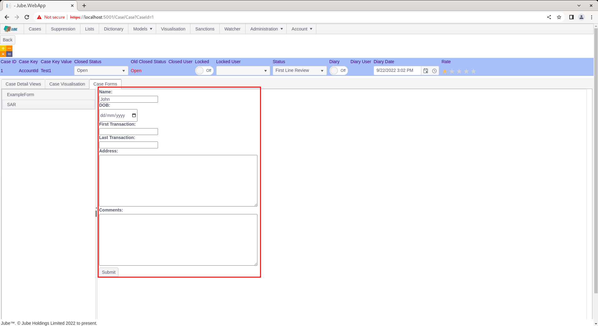
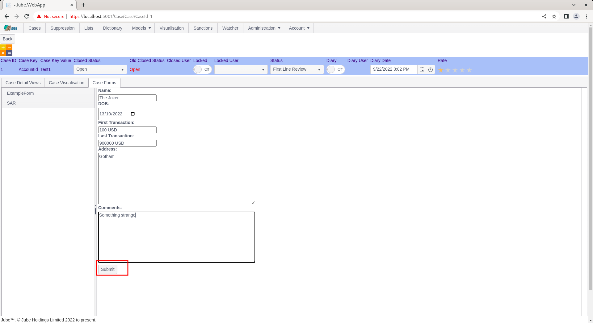
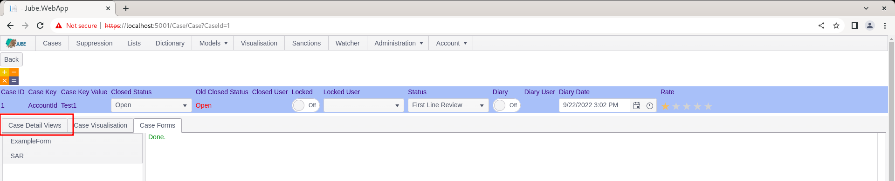
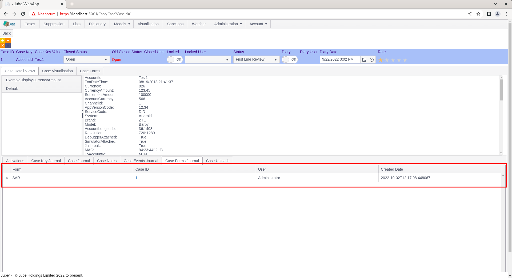
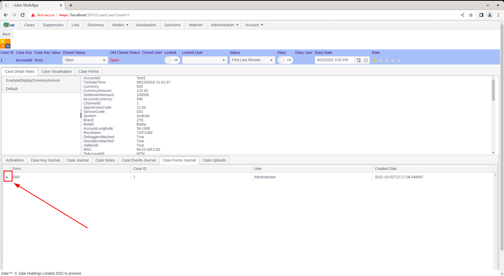

# Case Workflow Form
There are several ways to capture outcome in case management,  such as:

* Updating Status.
* Updating Closed Status.
* Memos and;
* Acton Codes on Memos.
* File Uploads.

The issue with the aforementioned data capture methods is that the data captured, beyond the payload data having created the case, is largely unstructured and provides limited opportunity for reporting,  and even less opportunity for integration or automation (using the Notification and HTTP endpoint functionality documented separately).

Workflow Forms allow the embedding of HTML form elements for the purposes of data capture and integration \ automation.  In this example,  a basic form will be created to compile a Suspicious Activity Report (SAR) for submission to a regulator,  with the following example fields:

* First Transaction Date.
* Last Transaction Date.
* Name.
* Date Of Birth.
* Address.
* Comments.

While the form may not be compliant with the requirements of SAR for a local regulator,  it provides a solid example.

Start by navigating to the Cases Workflow Forms configuration by navigating Models >> Cases Workflows >> Cases Workflow Forms:


Expand the second level of the tree and click on the Case Workflow highlighted above to add a new Case Workflow Form:


The form takes the following parameters:

| Value     | Description                                                                                                                                                                                                                                             | Example               |
|-----------|---------------------------------------------------------------------------------------------------------------------------------------------------------------------------------------------------------------------------------------------------------|-----------------------|
| Form HTML | HTML Form Elements for the purposes of data capture. The HTML form elements will be embedded in a HTML div on rendering, hence,  it will support all HTML use case. It is not necessary to include a submit button as this is handled by the case page. | As below for clarity. |

```html
  <label for="fname">Name:</label><br>
  <input type="text" id="name" name="name"><br>
  <label for="DOB">DOB:</label><br>
  <input type="date" id="DOB" name="DOB"><br>
  <label for="first">First Transaction:</label><br>
  <input type="datetime" id="last" name="last"><br>
  <label for="last">Last Transaction:</label><br>
  <input type="datetime" id="first" name="first"><br>
  <label for="address">Address:</label><br>
  <textarea name="address" rows="10" cols="60"></textarea><br>
  <label for="comments">Comments:</label><br>
  <textarea name="comments" rows="10" cols="60"></textarea>
```

Complete the form as above and below example:


Notice that the HTML is rendered in the text box below,  which will provide an accurate preview of the form rendering in the case page.

Scroll down and click the add button to create a version of the Cases Workflow Form:


Navigate to the case page using the previous case record:



Click on the Case Forms tab towards the top of the page, under the status bar:


The tab will reveal all Cases Workflow Forms towards the left hand side of the tab content pane:


Click on the list item SAR to load the form:



Notice how the form has been rendered in the same fashion as configuration,  with a Submit button being added by the case page (this was not specified in the configuration).

Complete the form as follows (or as required):


Upon clicking the submit button,  the page will iterate through each form element and extract the input element value alongside the name property of the input element,  and post it to the case.

Click Submit for the purposes of this example:



On submission of the form,  a Done message is shown.  To validate that the form was processed and the data captured:


Navigate to the Case Detail Views tab:



Locate the Case Forms Journal tab in the Case Detail Views tab:


Upon clicking the Case Form Journal tab,  it can be observed that an instance of a Case Form Submission has been recorded, where the form results are brought back rolling up to the Case Key and Case Key Value (and not CaseId):



The grid is hierarchical in nature,  hence clicking on the expansion icon on the left hand side:



Clicking the expand icon will proceed to expand to reveal the form element entries and values:


Notice how the elements of the form have been merged into the case creation payload,  which happened during the submission of the form and before any Notification or HTTP Endpoint invocation,  such that all these elements are available for tokenization.  Given the structured nature of the data capture,  it is now easy to produce rich reporting based on the structured data submissions,  although the most powerful use case for Cases Workflow Forms is for the purposes of Integration and Automation via HTTP invocation.