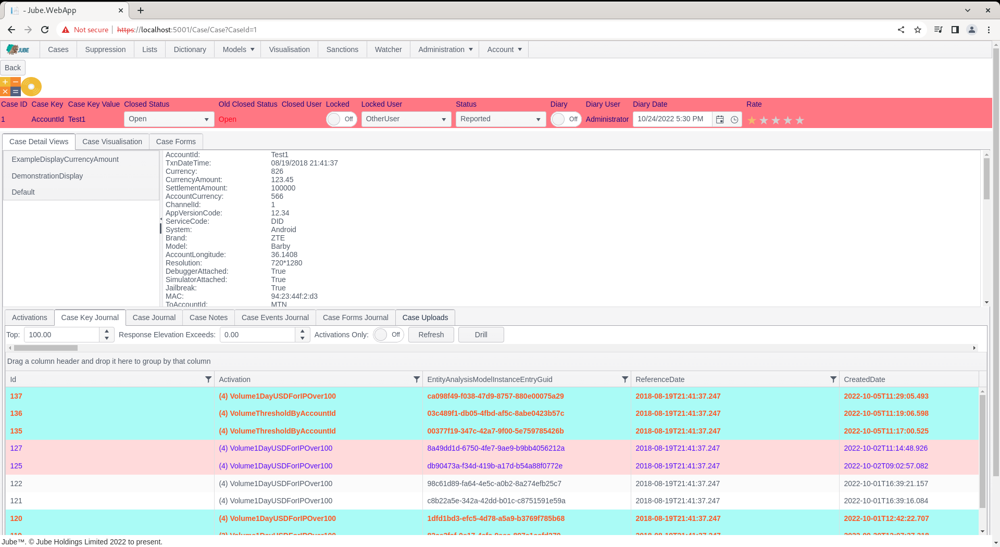
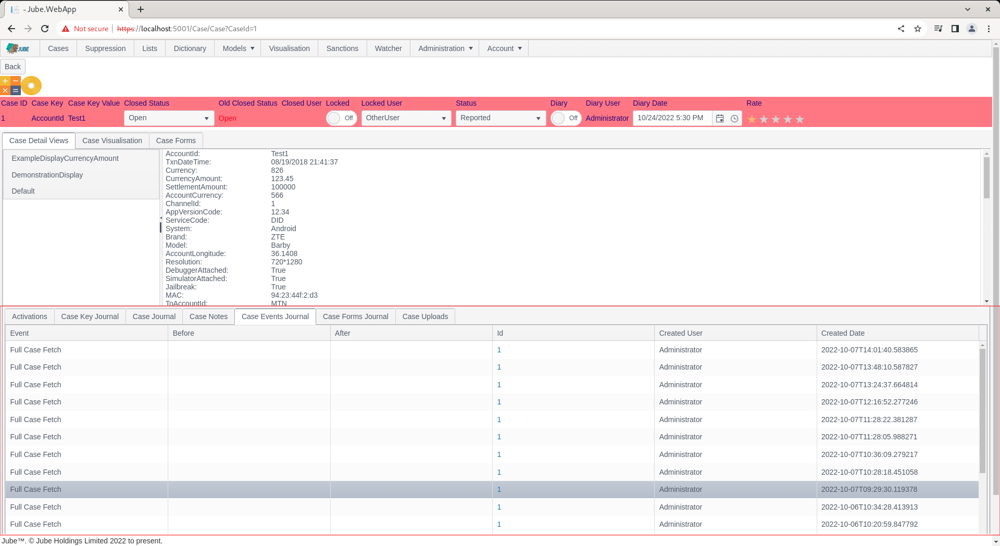

# Working Case Event Journal
The Case Note relies on specific intervention by an end user or analyst to create an audit trail.

The elective Case Note approach to an audit trail is risky for the purposes of maintaining audit integrity. To assure audit integrity, Jube maintains a very detailed audit trail of all interactions in for a case record including the following events:

| Value             | Description                                                                                                                                                                                                                                                                                                                                         | 
|-------------------|-----------------------------------------------------------------------------------------------------------------------------------------------------------------------------------------------------------------------------------------------------------------------------------------------------------------------------------------------------|
| Automatic Unlock  | The case has been unlocked by an automated background process.                                                                                                                                                                                                                                                                                      |
| Skim Case         | The case was opened via the Skim functionality.                                                                                                                                                                                                                                                                                                     |
| Automatic Lock    | The case was locked automatically as part of the automated Skim functionality.                                                                                                                                                                                                                                                                      |
| Full Case Fetch   | The case was fetched.                                                                                                                                                                                                                                                                                                                               |
| Closed            | The case was closed.                                                                                                                                                                                                                                                                                                                                |
| Manual Lock       | The case was manually locked.                                                                                                                                                                                                                                                                                                                       |
| Diary             | The case was given a new diary flag.                                                                                                                                                                                                                                                                                                                |
| Status Change     | The case was given a new status.                                                                                                                                                                                                                                                                                                                    |
| Diary Date Change | The case was given a new diary date.                                                                                                                                                                                                                                                                                                                |
| Rating Change     | The case was given a new case rating.                                                                                                                                                                                                                                                                                                               |
| Suspend Closed    | The case was given a suspend closed status.                                                                                                                                                                                                                                                                                                         |
| Suspend Open      | The case was given a suspend open status.                                                                                                                                                                                                                                                                                                           |

Navigate to a case record via either Fetch or Skim:

Note the Case Events Journal tab:

Click on the Case Events Journal:

Case Events are displayed in a grid form, from newest to oldest by their creation date. Case events are comprised of the following information:

| Value        | Description                                     | Example                               | 
|--------------|-------------------------------------------------|---------------------------------------|
| Event        | As described above,  the event that took place. | Status Change                         |
| Old Data     | The data as before update.                      | DAMLCO                                |
| New Data     | The data as after update.                       | AMLCO                                 |
| User         | The user that that initiated the audit.         | Administrator                         |
| Created Date | The date and time stamp of the audit.           | The date and time stamp of the event. |

Notice that the Case Id is a link:

The Case Id link,  upon click,  will load that case into the case page as if it were fetched or skimmed.

In the event that there are several cases for a case key and case key value history,  the link allows for the navigation through the history of the case key and case key value.

As the tabs retrieve their information based on a Case Vey Value combination,  only the case record contents will change over time,  such as the event \ transaction payload.