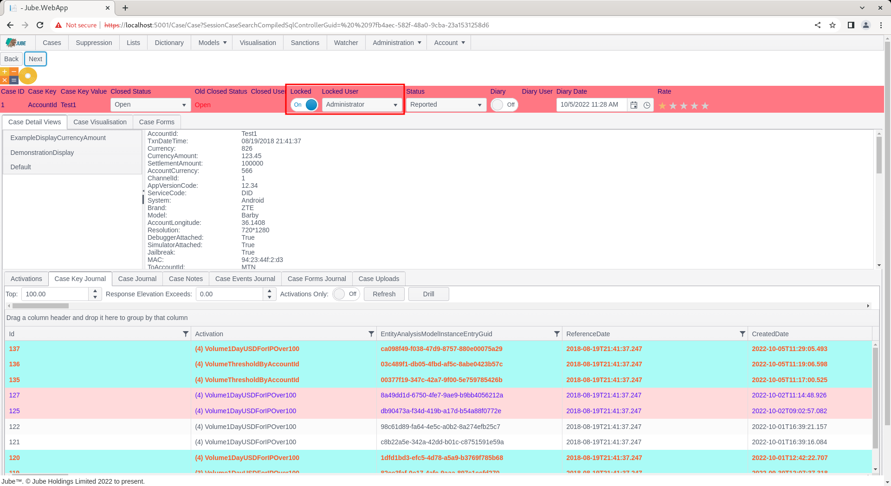
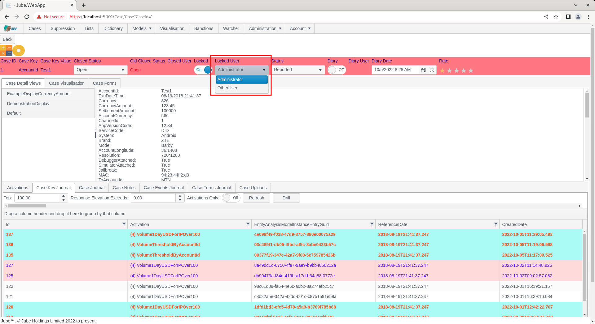
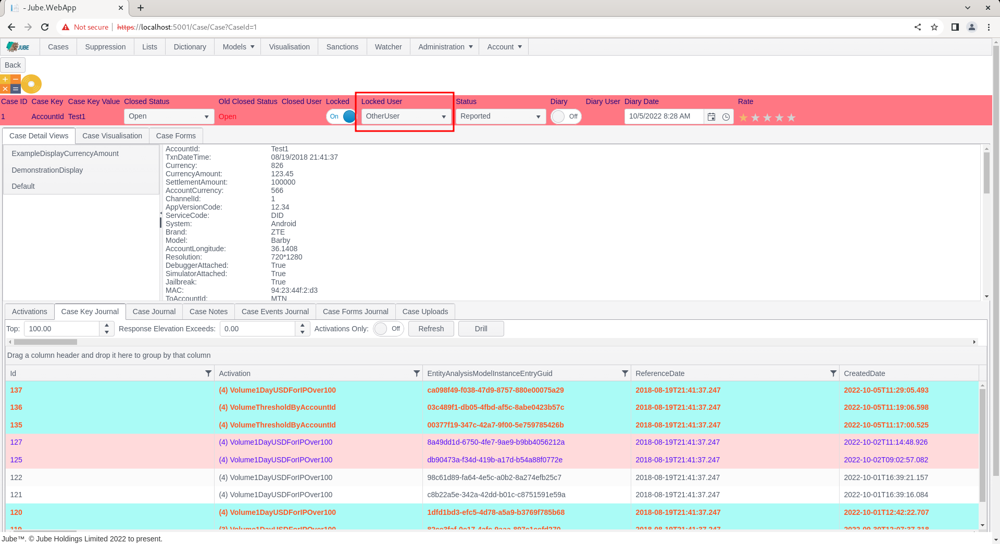

# Working Lock, Allocation and Unlock
When a cases is locked to a user,  it is owned by that user until such a time that it is unlocked or the user allocates the locked status to another user.

In the following, the Case Key Value combination AccountId = Test1 has been Skimmed, therefore automatically locked:

Noting two case status properties, Locked and Locked User, to allocate the lock status to another user,  the Locked User drop down can be used to search for, then select, another system user in the tenant:

Click on a new user after which the case will update to lock to that user:

To unlock a case record,  it is a simple matter of sliding the Locked toggle button to False, or unchecked:

The case record will be updated and no longer be considered locked:

