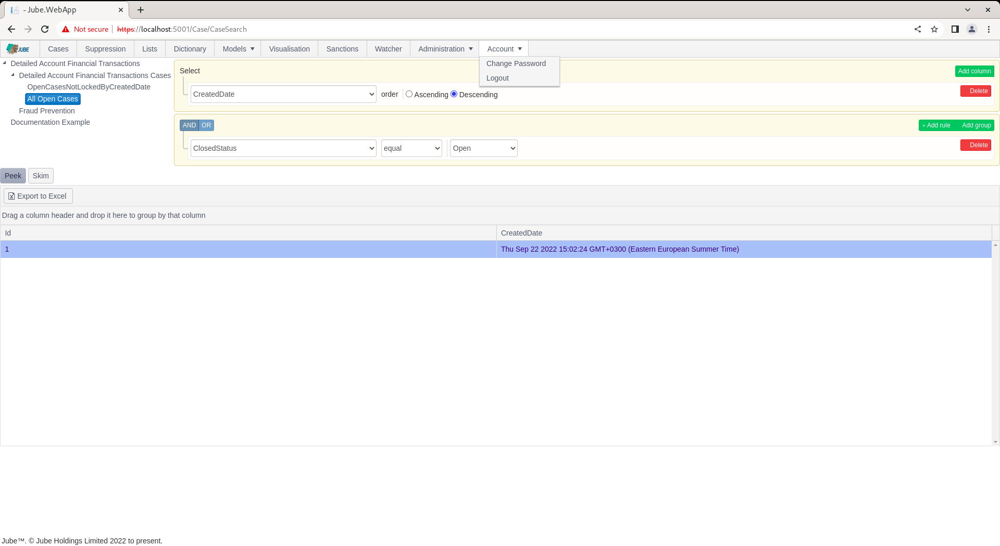
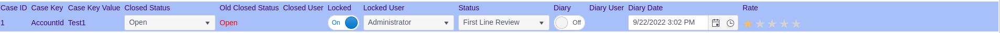
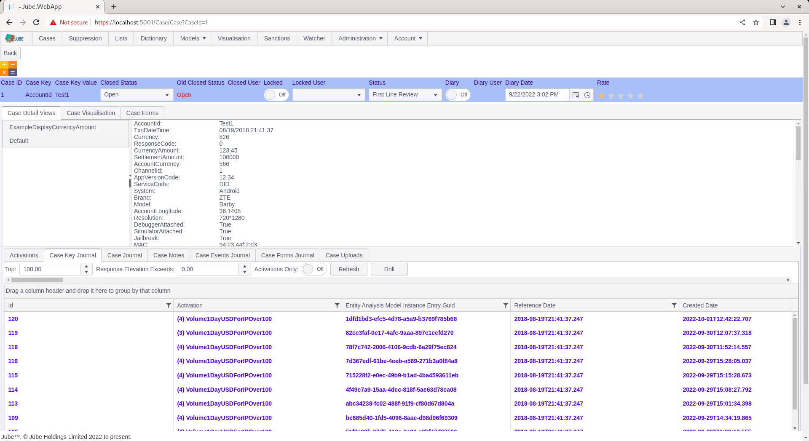

# Navigating Case Record
Having created a case record and having it available for review,  the case record must be expanded upon for the purposes of working.

Navigate to a the journal of created cases:

There are two ways to navigate to a case,  Skim and Fetch.

Skim is the function of taking the first available case off the top of the available cases (keeping in mind the sorting specified),  opening it then locking it to avoid collision in a multi user environment.  Skim is useful to ensure that cases are worked in a priority order and agents are not colliding on cases.

To open a case by Skim,  simply click the Skim button above the cases grid:

The Skim function will re-execute the cases workflow filter and take the very top record (keeping in mind ordering of the preset filter),  opening it in the case page:

Note the availability of the Next button,  which will Skim the next case (but only if the case has been updated to not match the cases workflow filter in question):

Notice also the Locked button, which is set to Locked as a consequence of Skim (and not Fetch) having taken place:

The status bar contains the properties of the case record and is covered in more detail, at this stage, note the colour corresponds to the cases workflow status and as per the grid of all cases available as filter:

Click the Back button to return to the Cases page:

Notice how the filter definition has been retrieved from the session,  and executed:

Locked cases do not automatically unlock, thus had a filter explicitly excluded locked status,  it would not be available.  It follows that locked is a means to avoid collision in a multiuser environment (such as many call centre users examining cases).

An alternative method of retrieving cases is the individual selection.  To individually select a case,  directly click on the row in the cases grid for selection:

Upon clicking on the row,the Fetch button will be exposed, along with a text description of the selected Case Id:

Click the Fetch button to navigate the selected case id to the case page:

Notice the absence of the Next button.  On Fetch a case is not locked automatically, unlike Skim.  In this example,  the case is only locked having originally been skimmed:

