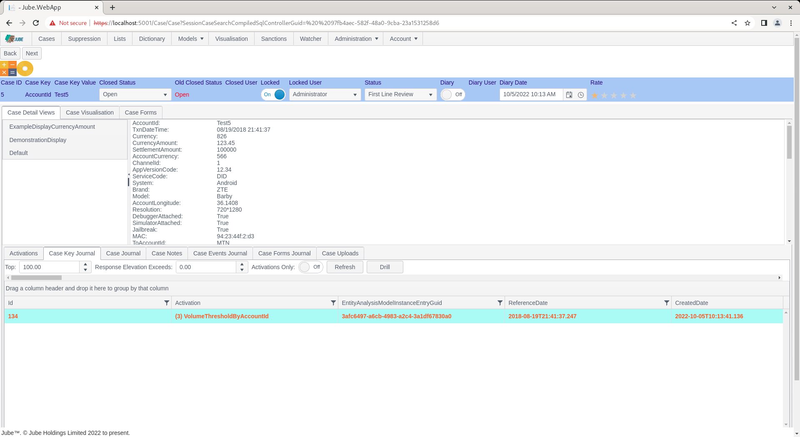
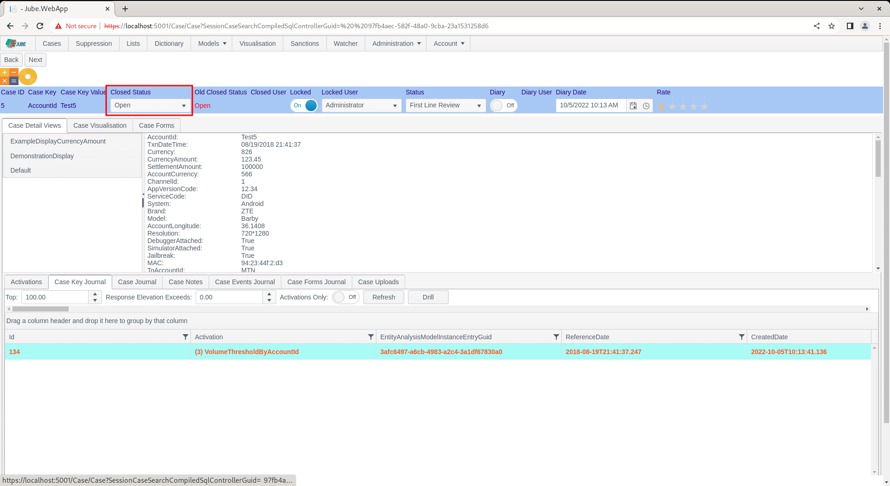
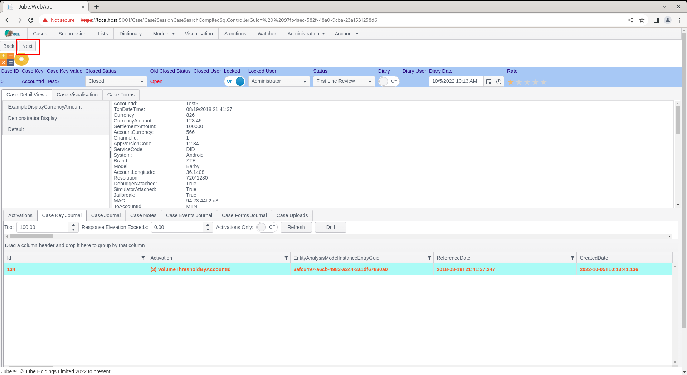

# Working Skim, Lock and Next
In practical life case management is intended for use by several users, and it is plausible that several user may try and take the case at exactly the same moment,  thus causing duplication of work when users collide in the same case. For multi-user case working it is advisable to use the Skim function rather than the Fetch function.  The skim function will automatically take the very first case qualifying for the Cases Workflow Filter, and open it in the case page, automatically setting the locked status and locked user to establish case ownership.

To invoke the Skim and Lock functionality,  start by navigating to the Case page, selecting the All Open filter created elsewhere in this documentation:

When a Case Workflow Preset Filter is set (or it is expanded upon via the Advanced Filter) the filter is saved to the users session.  The saving of the filter to the users session facilitates the functionality to move from case to case by clicking the Next button in the Case page, without needing to return to the cases page).

Notice the Skim button:

By clicking the Skim button, the filter will be applied in the background and the very first case record will be grabbed for presentation in the Case page:

Upon the presentation of the case in the Skim process, the case is immediately set to a Locked status, alongside the user having locked it:

Note that the Case Key Value combination is AccountID = Test5.

It should be noted that the cases workflow filter is showing only cases that have a Closed Status of Open, henceforth, if the Closed Status is changed to Closed,  then it will no longer qualify for the cases workflow filter, nor Skim.

Closed Status is discussed in more detail later in the documentation, but for the purposes of this procedure, navigate to the drop down titled Closed Status:

Upon the Closed Status having been changed in the drop down, which will update the case record straight away,  it should not no longer be eligible for that case preset filter:

Notice that the Next button is available,  which had not been available on Fetch:

Click the Next button to run the cases workflow preset filter in the background and evaluate the next first matching case, fetching and immediately locking it:

Notice that the Case Key Value Combination has changed to AccountID = Test1,  as the original case was updated to a closed status, thus no longer matching the cases workflow preset filter.

Locked can be used in a case workflow preset filter for the purpose of avoiding all but the most immediate concurrency on cases.