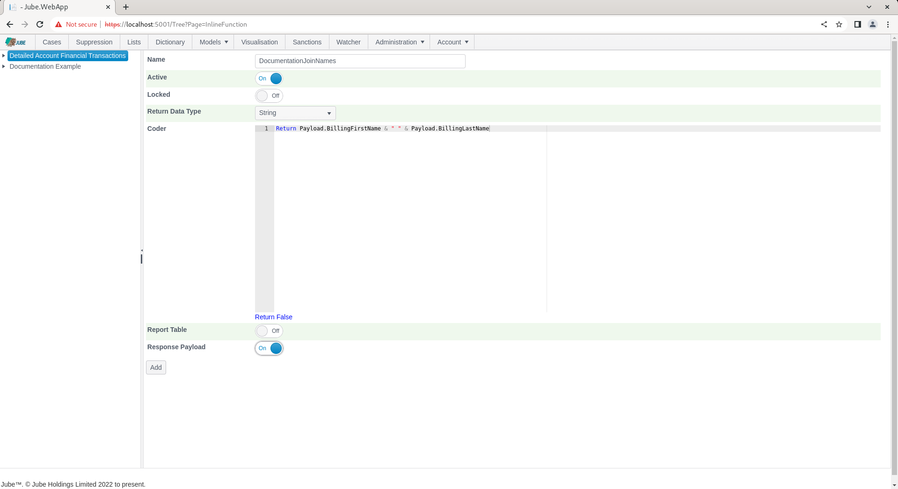
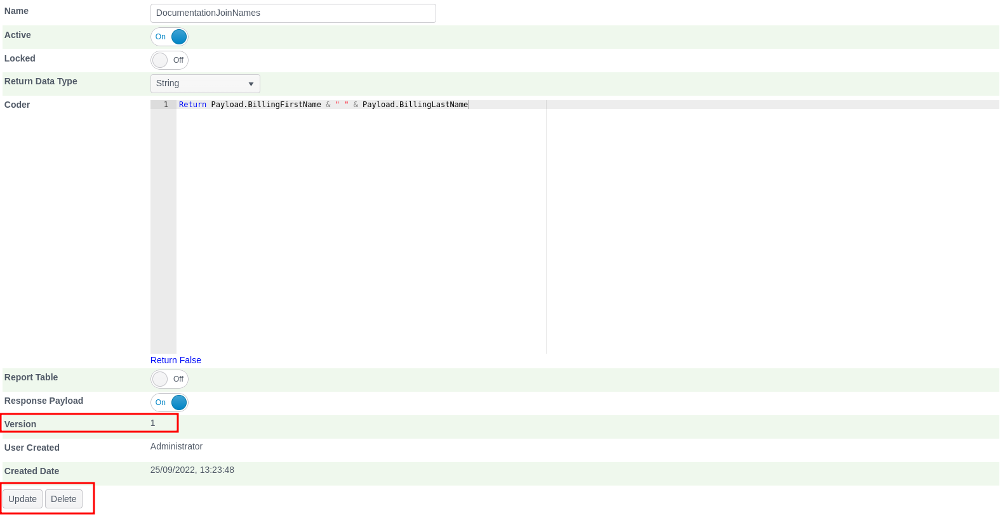
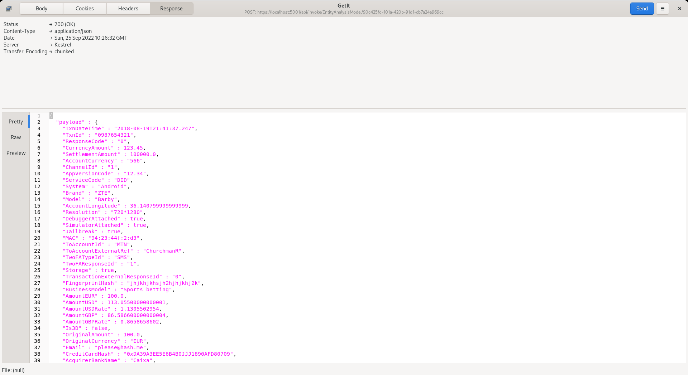

# Inline Functions
Inline functions exist for the purpose of adding new fields to the payload by performing coded functions on data added thus far (i.e. via Request XPath of Inline Scripts).

Consider the use case where data is extracted by Request XPath for a customer name as First Name and Last Name, separately,  an Inline function might be used to concatenate these values to create a Full Name (which is the multi-part string specification required of the real time sanctions checking).

An Inline Function is achieved by creating a VB.net code fragment which takes the various parameters taken from the payload collection of all values created by Request XPath or Inline Scripts.

The page is available by navigating through the menu as Models >> References >> Inline Functions. Add a new Inline Function by clicking an Entity Model entry in the tree towards the left hand side for the Detailed Account Financial Transaction Model:

The parameters available to Inline Function are described as follows:

| Value            | Description                                                                                                                                 | Example                                                         |
|------------------|---------------------------------------------------------------------------------------------------------------------------------------------|-----------------------------------------------------------------|
| Return Data Type | The type of data that the Inline Function is set to return so that the right functions in the Abstraction and Activation Rules can be used. | String                                                          |
| Code             | The creation of a vb.net function fragment which will return its value in the Matched variable.                                             | Return Payload.BillingFirstName & " " & Payload.BillingLastName |

Complete the form as per the above specification, and as below:

Click Add to create the Inline Function version:

Synchronise the model via Entity >> Synchronisation and repeat the HTTP POST to endpoint [https://localhost:5001/api/invoke/EntityAnalysisModel/90c425fd-101a-420b-91d1-cb7a24a969ccc](https://localhost:5001/api/invoke/EntityAnalysisModel/90c425fd-101a-420b-91d1-cb7a24a969ccc) for response as follows:

Paying close attention to a new element by the name DocumentationJoinNames in the response payload:

The value will be available for all further processing in model invocation as if it were passed in the JSON and extracted by Request XPath (in this case the value is of most use in Sanctions being presented in the prescribed multi-part string format).