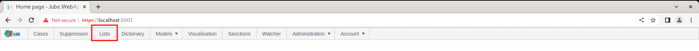
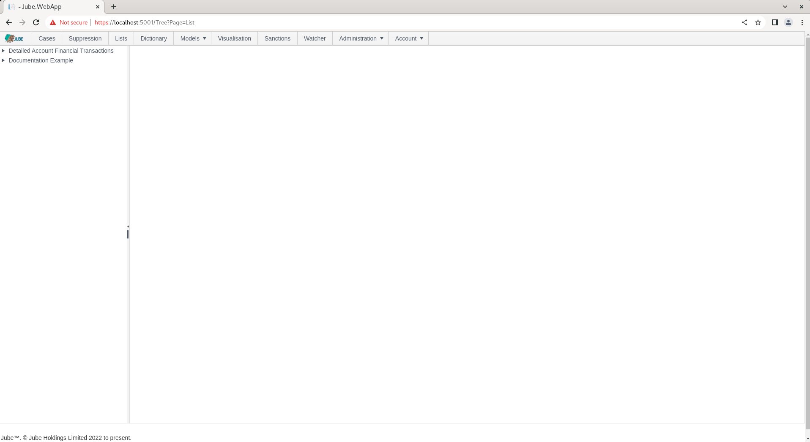
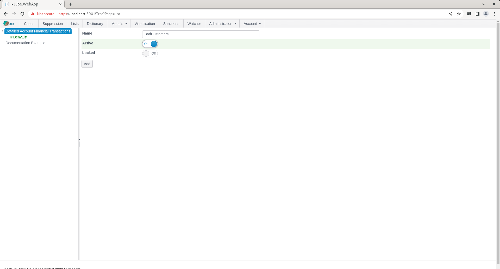
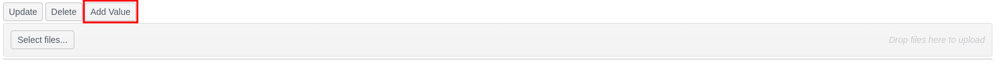
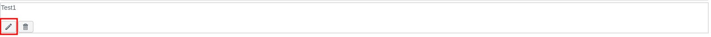
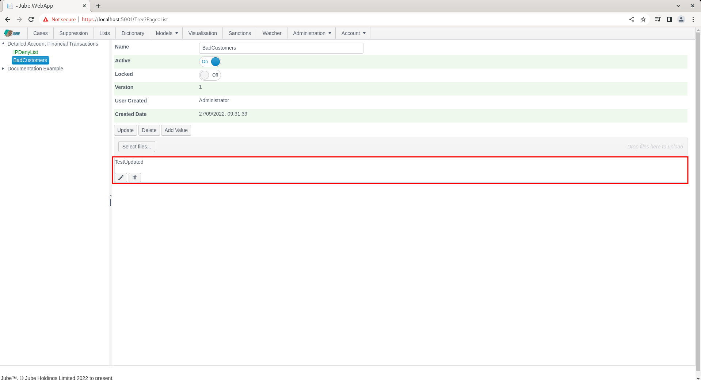
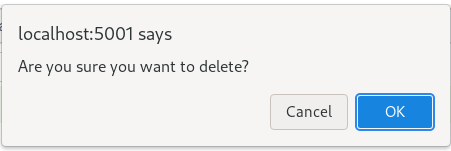
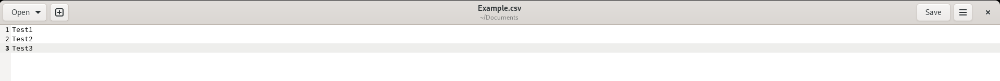
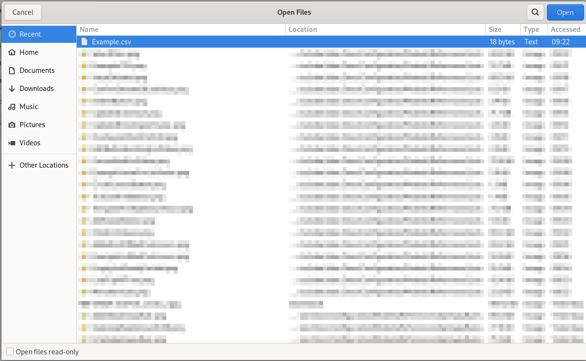
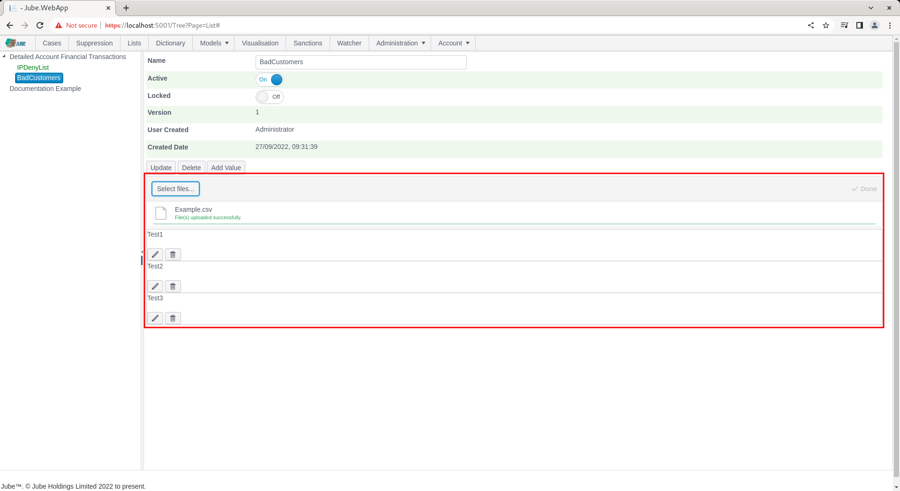

# Lists
The Lists Page facilitates the creation of lists of data that can be referenced as an operator in all rules in the models.  For example, the Lists page can be used to maintain a list of bad customer account identifiers that can be referenced using the Builder or Coder.

Lists might for example be used to maintain large Deny and Accept lists, without having to embed large amounts of complexity into rules,  instead embedding only the list reference.

Lists are synchronised by the engine in the background constantly, and they do not require an explicit synchronisation.  It follows that any new list value is available more of less straight away.

The page is available by navigating to the menu item Lists, in the main page.  The positioning of the List navigation is in the main section,  even though it is in fact part of models, for the purposes of delegating this otherwise administrative function to customer service orientated roles:

Click as customary to expose a model tree which takes a similar form as other model administration objects:

To create a list,  click on the Model in the tree towards the left hand side:

Creating a List by the name Bad Customers:

Click the Add button to confirm creation of the List:

The List values are maintained using a grid facilitating the addition, updating and removal of List Values:

To add a value to the list,  a button is implemented titled 'Add Value':

Clicking the Add button will overlay a form and create a new entry in the grid:

To commit the new value,  click on the tick icon:

Or to cancel the creation of the Value click the opposing icon:

Include the value as follows in the input box:

To update a List Value,  click on the pen icon for the list value to be updated. Upon clicking the Pen icon:  

A form with a text box will be overlay:

Update the text box with the new value:

Commit by clicking on the Tick icon:

Or to cancel the edit of the Value click the opposing icon:

Upon the successful commit of the Value,  it will appear updated in the List control:

To delete a List value entry,  it is a simple matter of clicking on the Disk Icon next to the List Value targeted for deletion:

A confirmation of the delete will be sought:

Upon confirming the delete,  it will be removed from the list of values:

It is also possible to upload a list of values by uploading a CSV file of the following structure:

Note there is no column header in the above file and structure. The control to upload a file is the button Select Files:

Either drag the file to the area shown above,  or click the button titled Select files,  navigating to the file:

Clicking Open, which will happen implicitly if the file has been dragged and dropped, will both upload the file and process,  adding each row as a new list entry:

The list and its values will now be available to rules,  for example:

