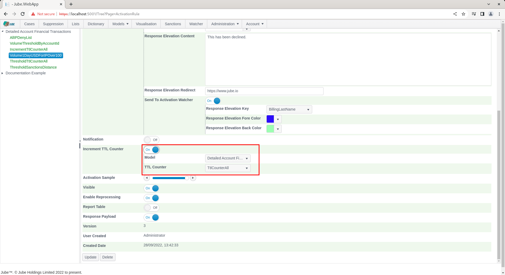
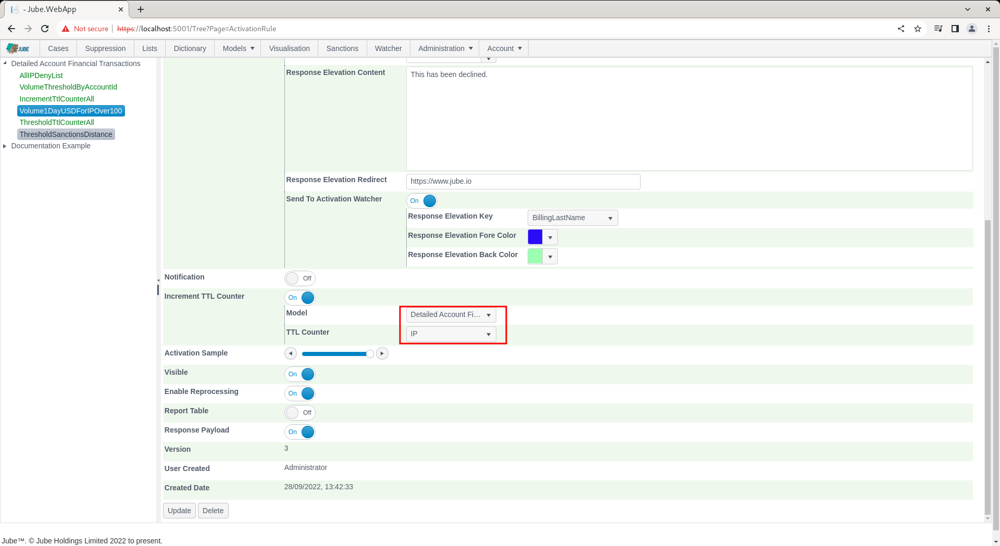
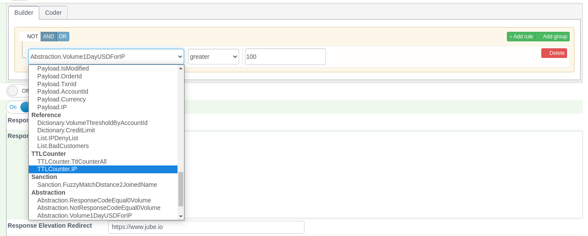

# TTL Counter Activation Rule Incrementation
In previous documentation the TTL Counter definition was introduced and a TTL Counter by the name of IP was created.  

To remind,  navigate to Models >> Abstraction >> TTL Counters:

This TTL Counter definition will be incremented on the match of Volume1DayUSDForIPOver100.  Navigate to the Volume1DayUSDForIPOver100 Activation Rule:

Scroll down to the section where the Increment TTL Counter check box exists:

Check Increment TTL Counter to expose the options for incrementing TTL Counters:

It is worthy of note that TTL Counters can be incremented cross model,  which assumes that the model being incremented has the IP field available to both models.  In this case, select the IP for the same model:

Scroll down and click Update a create new version of the Activation Rule:

Synchronise the model via Entity >> Synchronisation and repeat the HTTP POST to endpoint [https://localhost:5001/api/invoke/EntityAnalysisModel/90c425fd-101a-420b-91d1-cb7a24a969ccc](https://localhost:5001/api/invoke/EntityAnalysisModel/90c425fd-101a-420b-91d1-cb7a24a969ccc) for response as follows:

The Activation Rule should of course be showing as activated,  however,  the TTL Counter will have been incremented also. 

As incrementation takes place AFTER the activation of the rule, it can be seen that the TTL Counter has not been incremented at the point the response is written out, as the count was TTL counts were fetched BEFORE the invocation of the TTL counter.

Repeat the HTTP POST to endpoint [https://localhost:5001/api/invoke/EntityAnalysisModel/90c425fd-101a-420b-91d1-cb7a24a969ccc](https://localhost:5001/api/invoke/EntityAnalysisModel/90c425fd-101a-420b-91d1-cb7a24a969ccc) for response as follows:

It can be seen that the TTL counter was incremented on the first post,  and is now available for the subsequent transaction. 

As introduced elsewhere in this documentation, TTL Counters exist as a lightweight means to maintain state and history for a given key:

