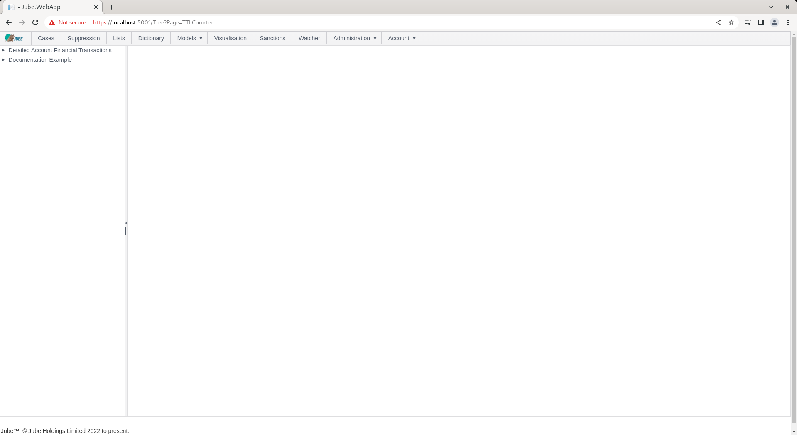
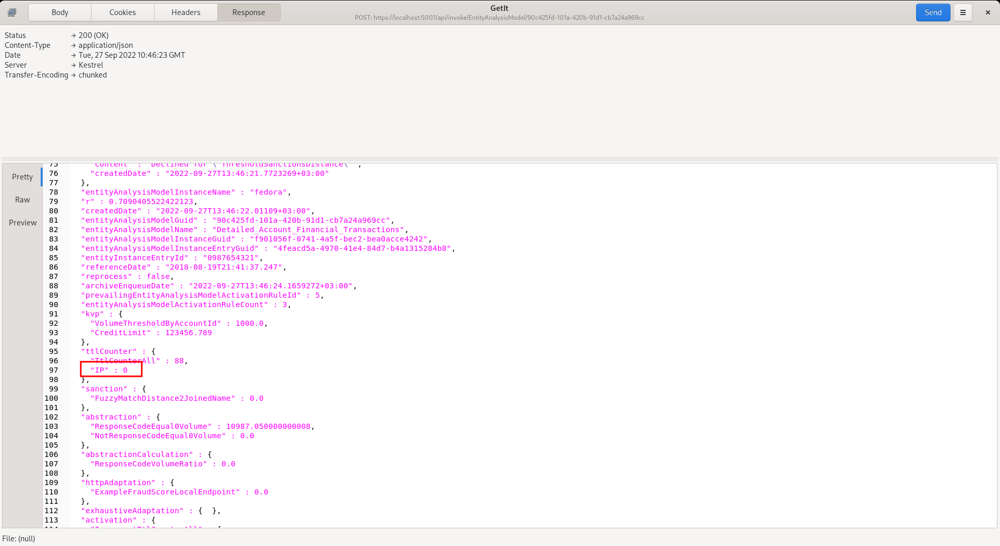

# TTL Counters

Time to Live Counters (TTL Counters) are an alternative way to create model memory without needing to store the full transaction or event data in the cache tables.  TTL Counters are incremented as the result of an Activation Rule matching and are set to live for only a prescribed amount of time after entry increment creation, after which they will decrement.

TTL Counters allow for a condition only counter, storing a lightweight counter entry as opposed to the entire transaction or event picture that would otherwise be in the cache.  It follows that the storage of TTL Counters is substantially less burdensome than maintaining the full transaction picture in cache.

The storage required to maintain a TTL Counter is substantially less than that required to keep a full history in the cache,  it is therefore a useful tool when dealing with ultra high volumes requiring retention of historic events for a very long period of time.  Instead of storing the full picture of an event in the Cache,  a very lightweight counter entry can be stored,  thus can retained for a substantially longer period of time as it takes up so much less space.  For basic count type rules,  it is advisable to use TTL Counters instead of Abstraction Rules.

For TTL Counters to be enabled,  the Enable Ttl Counter flag must be set at the model level.  The Enable Ttl Counter flag must be active for the process to continue.  In the event that the Enable Ttl Counter flag is not active,  the routine will be stepped over, with an INFO message being written out that this has occurred. In the event that the Enable Ttl Counter flag is not enabled,  the performance timer is still written out.

TTL Counters are created and stored in their own collection such that they can be referenced separately in Activation and Abstraction Rules.

The TTL Counter process relies on the Cache Database aggregating all TTL Counter entries and returning the count for each TTL Counter, achieved in a single request of the Cache Database.

There are two types of TTL Counter,  Online Aggregation and Offline Aggregation.

Upon a TTL Counter definition having been created, it will be available in the Activation Rules page such that it can be incremented as a consequence of an Activation Rule matching.

The page is available by navigating through the menu as Models >> Abstraction >> TTL Counters:

Click on the model tree entry towards the left hand side to add a new TTL Counter:

The fields in the construction of TTL Counters are described as follows:

| Value                      | Description                                                                                                                                                                                                                                                                                                                                                                                                                                                                                                                                                                                                                                                                                                                                                                                                                                                                                                                                                                                                                                                                                                                                                                                                                                                                                                                                                                                                                                                               | Example             |
|----------------------------|---------------------------------------------------------------------------------------------------------------------------------------------------------------------------------------------------------------------------------------------------------------------------------------------------------------------------------------------------------------------------------------------------------------------------------------------------------------------------------------------------------------------------------------------------------------------------------------------------------------------------------------------------------------------------------------------------------------------------------------------------------------------------------------------------------------------------------------------------------------------------------------------------------------------------------------------------------------------------------------------------------------------------------------------------------------------------------------------------------------------------------------------------------------------------------------------------------------------------------------------------------------------------------------------------------------------------------------------------------------------------------------------------------------------------------------------------------------------------|---------------------|
| Online Aggregation         | A flag that indicates if the TTL counter entries should be counted up in real time on each event,  which is computationally expensive and places load on the Cache,  but reduces the need for the upsert of the TTL Counter counters cache on match and in the real-time recall of a model. Online aggregation only stores the instance or entry of a TTL Counter being incremented and does not update a summary value which is faster and less computationally expensive at this stage, but far more expensive in retrieval. In the event that neither Online nor cache aggregation returns records during processing, the TTL Counter value is added to the collection,  albeit with a value of 0 alongside the TTL Counter Name.  If a record is returned,  the TTL Counter Value is simply extracted from the results set,  with that value being added to the collection alongside the TTL Counter name.  Online Aggregation targets the transactions Reference Date otherwise it is the transactions Created \ System date of insert.                                                                                                                                                                                                                                                                                                                                                                                                                              | False (Recommended) |
| Live Forever               | A flag that indicates if the TTL counter should ever be decremented. In the event that the Live forever flag is specified,   the TTL counter cache will be updated but no TTL counter entry will be created to wind back that counter entry, or rather Cached Aggregation. The concept of Cached Aggregation is that the TTL Counters are incremented in real-time for the grouping key, so the pre aggregated counter can be recalled more rapidly in real-time from the cache.  The Cached Aggregation moves some computational and processing expense to the real-time processing, as it requires two trips to the cache database,  one of which increments a value,  rather than just an insert in online aggregation. A background process is responsible for decrementing Cached Aggregation,  henceforth,  it is possible that Cached Aggregations will be slightly latent and inaccurate.  If an absolute real-time picture and immediate decrementing of TTL Counters is required, then Online Aggregation would be the most appropriate choice. A background process is responsible for decrementing Cached Aggregation,  henceforth,  it is possible that Cached Aggregations will be latent and inaccurate.  If an absolute real-time picture and immediate decrementing of TTL Counters is required, then Online Aggregation would be the most appropriate choice.  Live forever would mean that there is no record made available for background decrement. | False (Recommended) |
| TTL Counter Interval Type  | The amount of time before the TTL Counter is to be decremented after a counter entry has been created and incremented the counter.  The TTL Counter Interval Type is taken together with the TTL Counter Interval Value.                                                                                                                                                                                                                                                                                                                                                                                                                                                                                                                                                                                                                                                                                                                                                                                                                                                                                                                                                                                                                                                                                                                                                                                                                                                  | Day                 |
| TTL Counter Interval Value | The amount of time before the TTL Counter is to be decremented after a counter entry has been created and incremented the counter.  The TTL Counter Interval Type is taken together with the TTL Counter Interval Value.                                                                                                                                                                                                                                                                                                                                                                                                                                                                                                                                                                                                                                                                                                                                                                                                                                                                                                                                                                                                                                                                                                                                                                                                                                                  | 1                   |
| TTL Counter Data Name      | The key to be extracted from the data payload that will be used for the purposes of grouping the TTL Counter (e.g. Account ID).  This value allows counts to be maintained on different keys.                                                                                                                                                                                                                                                                                                                                                                                                                                                                                                                                                                                                                                                                                                                                                                                                                                                                                                                                                                                                                                                                                                                                                                                                                                                                             | IP                  |

Complete the page fields as set forth in the table above:

Click the add button to create a version of this TTL Counter:

Mindful that a TTL Counter must be incremented by an Activation Rule match,  when recalled at this time, it would return zero in the response body, synchronise the model via Entity >> Synchronisation and repeat the HTTP POST to endpoint [https://localhost:5001/api/invoke/EntityAnalysisModel/90c425fd-101a-420b-91d1-cb7a24a969ccc](https://localhost:5001/api/invoke/EntityAnalysisModel/90c425fd-101a-420b-91d1-cb7a24a969ccc) for response as follows:

It can be seen that TTL Counters are being recalled in their aggregated state, albeit, given no incrementation by Activation Rule,  returned as 0 for IP. Values are available for Activation Rules subsequently,  as an alternative to Abstraction Rules.

Where the background thread is relied upon to decrement TTL counters,  the eligibility for TTL lapse is based on the system date and time that the counter was created (and not the reference date extracted from the transaction).
