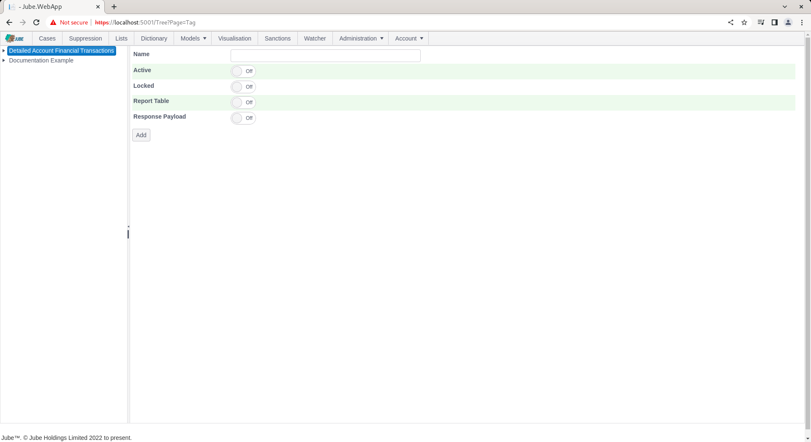

# Tags
Jube will likely drive decisions via Response Elevation,  and as with all such systems, may be prone to error.

Tags provide an means to obtain feedback to drive advanced analytics and machine learning with the goal of reducing that error.

The Tags page has the simple purpose of creating a list of Tags that are eligible to be added to the Tags section of the payload in the Archive database table. Tags can thereafter be used in reporting, advanced analytics or machine learning training.  For example,  one example of a Tag would be marking fraud to be blended into an anomaly classification.

To create a Tag, navigate to Models >> References >> Tags:

Click on the top of tree node to create a new Tag:

There are no parameters beyond the common parameters, the Tag is taken to be the Name.

Complete the page as follows:

Scroll down and click Add to create a version of the Tag:

The Tag is subject to immediate synchronisation and will be available for merge to Archive payload on the basis of the EntityAnalysisModelEntityInstanceGuid.  In the absence of a Tag existing, a 400 Bad Request http status code will be returned.  The existence of the in Archive is not validated.

The Tag is also available for filtering in Exhaustive machine learning, which is explained in another section of this documentation,  although as follows for illustrative purposes:

