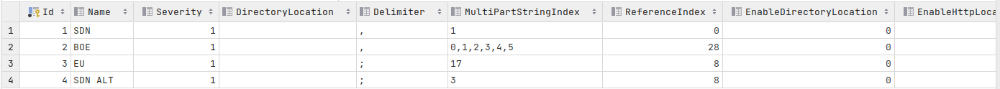

# Sanctions Loader
Sanctions are published by various bodies and provide a list of names for which business is prohibited.  The functionality offered by Jube allows the loading of Sanctions lists into the engine for matching using fuzzy logic (Levenshtein Distance) to create matches.  Jube also allows this matching to be embedded into the Entity Analysis Model recall in real time.  Sanctions data is stored in the engine, in memory, so to assure that the recall is extremely fast.

Sanctions requires the EnableSanction Environment Variable being set to True:

```text
EnableSanction=True
```

On the enabling of sanctions, a thread will be started.  This thread should be started on all servers that require online recall of sanctions,  either directly or via model invocation.

There are many different types of sanctions file available,  published from the EU,  US,  UN etc.  The specification of sanctions files are stored in the SanctionEntrySource database table the name, delimiter and presence of several mappings detailed later in the loading process:

```sql
select * from "SanctionEntrySource"
```



By default there are four file definitions in place, alongside their locations on the internet:

* US Office Of Foreign Assets Control (OFAC) Specially Designated National (SDN).
* Bank of England (BOE) Sanctions. 
* European Union (EU) Sanctions.
* US Office Of Foreign Assets Control (OFAC) Specially Designated National (SDN) alternative names.

New entries to the SanctionEntrySource table can be accepted as following definition:

| Value                     | Description                                                                                                                                                                                                                              | Example                                         |
|---------------------------|------------------------------------------------------------------------------------------------------------------------------------------------------------------------------------------------------------------------------------------|-------------------------------------------------|
| Name                      | The reference for the sanctions source.                                                                                                                                                                                                  | SDN                                             |
| Severity                  | An integer number to express notional severity.                                                                                                                                                                                          | 1                                               |
| Directory Location        | In the absence of internet or HTTP polling the local file system directory to poll for same file.  All files in the directory will be consumed.  Intended for use only on the basis that security disallows access to the HTTP resource. | /Sanctions/SDN                                  |
| Delimiter                 | The delimiter separating the field in the file.                                                                                                                                                                                          | ,                                               |
| Multipart String Index    | The zero based field location for the multipart string.  I the event of many elements needing to be concatenated,  seperated with a comma, whereby concatenation will be seperated by space.                                             | 1                                               |
| Reference Index           | The zero based field location for the reference of the entry                                                                                                                                                                             | 0                                               |
| Enable Directory Location | A bit value to instruct polling of a Directory Location for new files.                                                                                                                                                                   | 0                                               |
| Enable HTTP Location      | A bit value to instruct polling of a HTTP location for latest file.                                                                                                                                                                      | 1                                               |
| HTTP Location             | The location to poll for current sanctions files.                                                                                                                                                                                        | https://www.treasury.gov/ofac/downloads/sdn.csv |
| Skip                      | The first rows to skip on account of having header data.                                                                                                                                                                                 | 0                                               |

To enable the loading process, the following Environment Variables need to be set:

| Value              | Description                                                                                                                                                                                                                      |
|--------------------|----------------------------------------------------------------------------------------------------------------------------------------------------------------------------------------------------------------------------------|
| EnableSanctions    | A flag indicating if sanctions should be loaded via this instance of the engine and inserted into the SanctionEntry database table,  noting that this table will be synchronised to memory.                                      |
| SanctionLoaderWait | Interval in millisecond between polling and synchronizing new sanctions files.  A key concept is regular polling of the official locations with a view to perpetual validation and merging of the new records with the database. |

```text
EnableSanctionsLoader=True
SanctionLoaderWait=60000
```

By default the sanctions loader process is disabled so not to make connections to the internet without explicit instruction by the end user.  Via Migration, there is only a single example sanction for Robert Mugabe loaded by default for the purpose of documentation and training.

In enabling Environment Variables for the loader, the files will be loaded and their contents inserted into the SanctionEntry database table:

```sql
select * from "SanctionEntry"
```


The SanctionEntry database table is the initial target for the synchronisation on loading of the instance. On perpetual processing of sanctions files the entries will be merged.  An entry is validated by creating an MD5 hash then checking its existence in the SanctionEntry database table, and thereafter if new, adding it to both the SanctionEntry database table and the in memory copy of it.