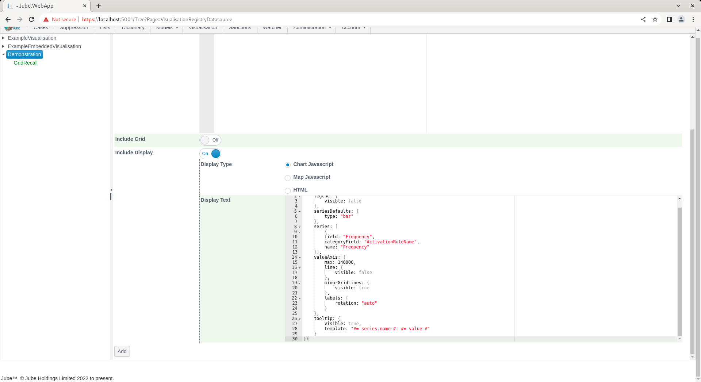
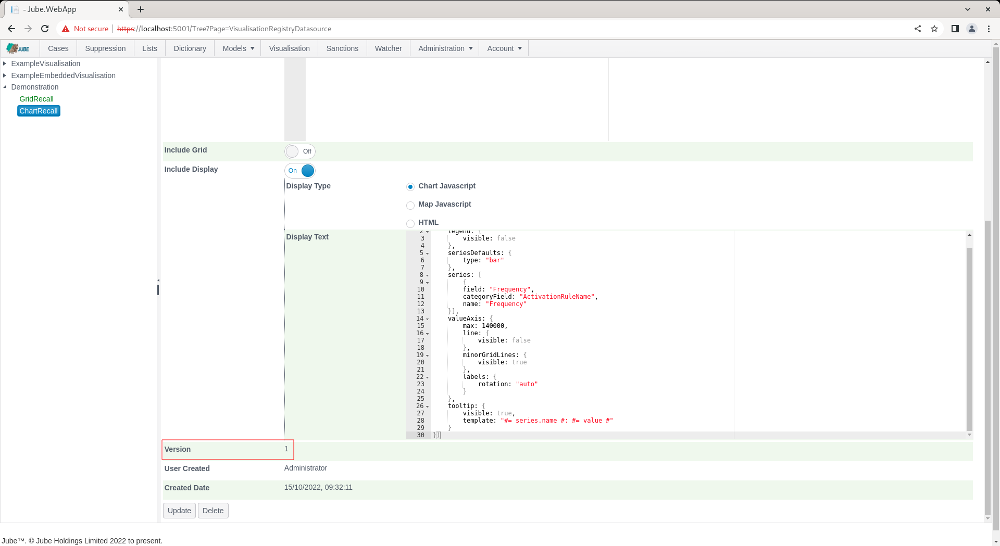
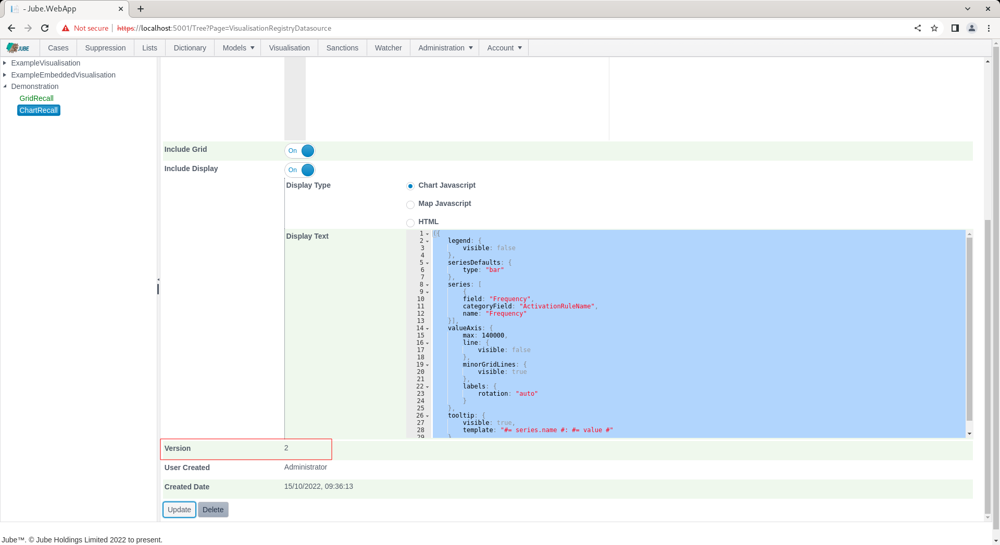
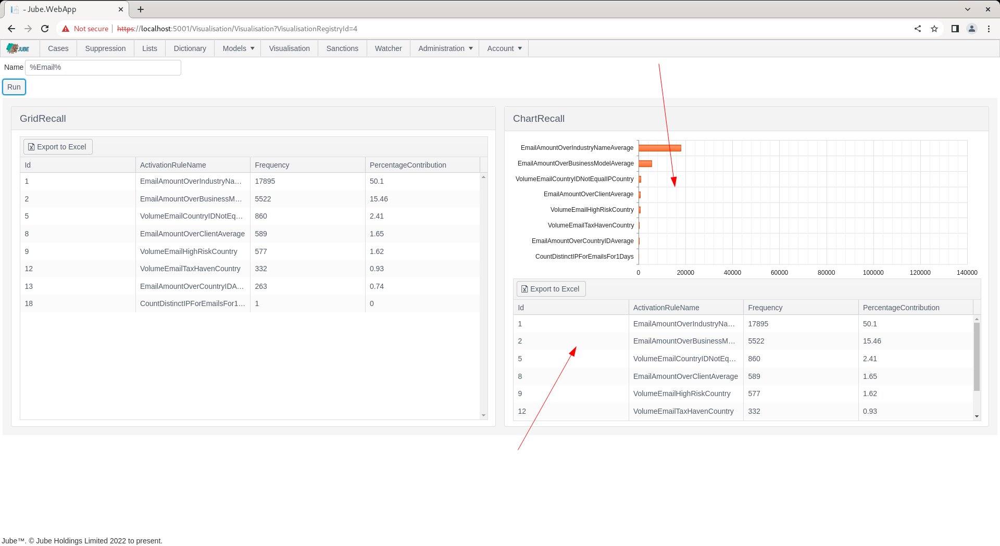

# Generate Chart in Visualisation Datasource
In all instances of Visualisation Datasource recall, SQL will be executed and returned as a dataset that can be switched to present as a grid.

In the creation of dashboard type visualisations it is likely some form of chart will be embedded.

Visualisations are achieved via embedding configuration JSON like initialisation Javascript for the Kendo Charting JQuery toolset.  The Kendo Chart JQuery toolset provides a rich set of charts that can be used to alternatively present data that would otherwise be in grid form. A demonstration of the Kendo charting tools can be seen as follows:

[https://demos.telerik.com/kendo-ui/bar-charts/index](https://demos.telerik.com/kendo-ui/bar-charts/index)

A datasource can accept the initialisation parameters for a Kendo Chart:


Extracted as follows:

``` javascript
({
    title: {
        text: "Site Visitors Stats \n /thousands/"
    },
    legend: {
        visible: false
    },
    seriesDefaults: {
        type: "bar"
    },
    series: [{
        name: "Total Visits",
        data: [56000, 63000, 74000, 91000, 117000, 138000]
    }, {
        name: "Unique visitors",
        data: [52000, 34000, 23000, 48000, 67000, 83000]
    }],
    valueAxis: {
        max: 140000,
        line: {
            visible: false
        },
        minorGridLines: {
            visible: true
        },
        labels: {
            rotation: "auto"
        }
    },
    categoryAxis: {
        categories: ["Jan", "Feb", "Mar", "Apr", "May", "Jun"],
        majorGridLines: {
            visible: false
        }
    },
    tooltip: {
        visible: true,
        template: "#= series.name #: #= value #"
    }
})
```

For the purpose of chart initialisation, series are the columns returned by the SQL statement:


Taking the following example of Kendo Chart initialisation:

``` javascript
({
    legend: {
        visible: false
    },
    seriesDefaults: {
        type: "bar"
    },
    series: [
        {
        field: "Frequency",
        categoryField: "ActivationRuleName",
        name: "Frequency"
    }],
    valueAxis: {
        max: 140000,
        line: {
            visible: false
        },
        minorGridLines: {
            visible: true
        },
        labels: {
            rotation: "auto"
        }
    },
    tooltip: {
        visible: true,
        template: "#= series.name #: #= value #"
    }
})
```

Note the series collection has been updated to match the column names returned by the SQL such to achieve the desired visualisation type:

``` javascript
    series: [
            {
            field: "Frequency",
            categoryField: "ActivationRuleName",
            name: "Frequency"
        }]
```

Any datasource object will be added during the recall process and should be removed from the initialisation.

Navigate Administration >> Visualsiation >> Visualisation Datasources,  then click on the Visualisation Registry entry to create a new datasource:


The SQL will be the same as used for basic grid generation:

```sql
select * from "ExampleCaseVolumeEntry"
where "ActivationRuleName" LIKE @Name
```

Using the example SQL and chart initialisation as above, create a new entry:




Click Add to create a version of the Visualisation Registry Datasource, which will parse the SQL and create the series definitions in the background:



Navigate to the Visualisation Registry through the Visualisation Directory to recall. Noting the default parameter value for Name, as Email, click on Run to execute the datasource, whereby SQL will be parameterized as provided:


The chart will take up 100% height and width of the tile. To include the base data alongside the chart is to ensure that Include Grid is enabled in the Visualisation Registry Datasource.  Navigate to the entry just created, ChartRecall, and locate the Include Grid switch:


Toggle the Include Grid switch and scroll down to create a version by clicking Update:



Recall the Visualisation with the default parameter value:



It can be observed that a grid now shares the tile, on a basis of 50/50 in height.