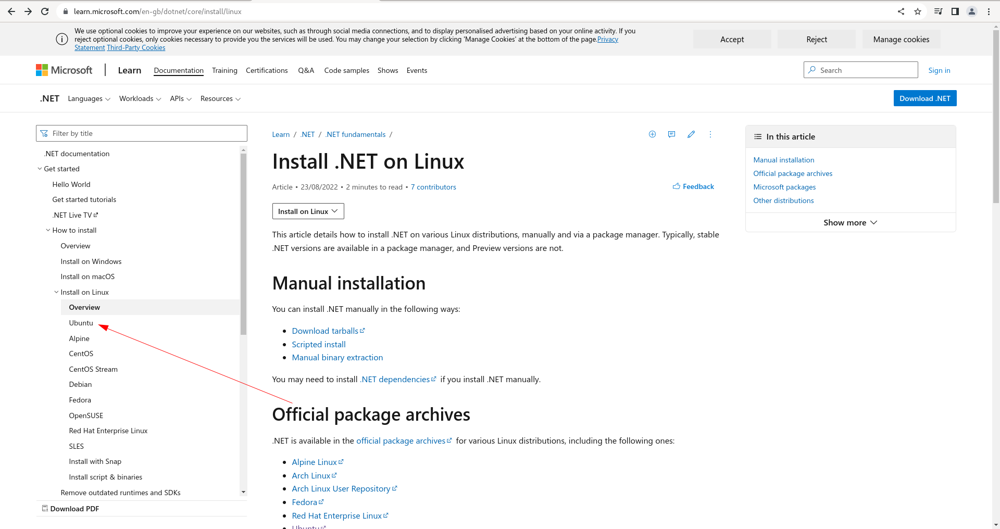

# Installing .Net 6 SDK to Virtual Machine

The Droplet will be missing the .Net 6 SDK by default, and it needs to be installed.  The packages are available from Microsoft as follows:

[https://dotnet.microsoft.com/en-us/download/dotnet/6.0](https://dotnet.microsoft.com/en-us/download/dotnet/6.0)

For Linux as follows:

[https://learn.microsoft.com/en-gb/dotnet/core/install/linux?WT.mc_id=dotnet-35129-website](https://learn.microsoft.com/en-gb/dotnet/core/install/linux)

Scroll down the page and identify the package for the Linux distributuin in use,  in this case  Ubuntu:



Click on the link to expose the command line statements to install:


The command to install can be extracted as follows:

```shell
sudo apt-get update && \
  sudo apt-get install -y dotnet6
```

The shell command above is simply executed in the console via copy and paste:


Pressing enter will begin the process:


Until conclusion.