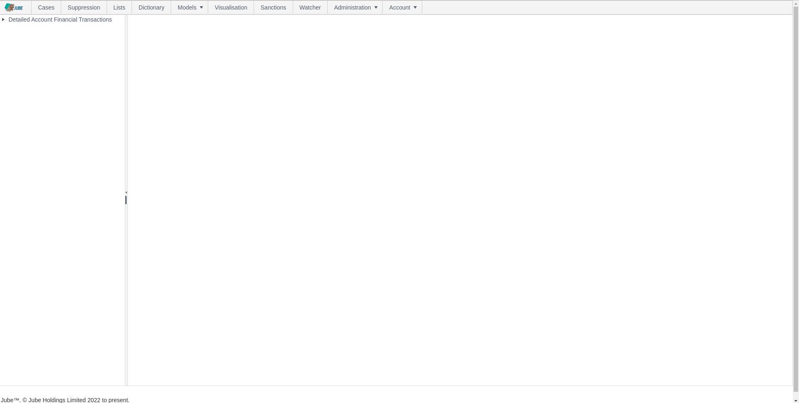

# Main Menu Navigation

Navigation in the Jube platform is centred around a Menu, where each Menu item will redirect the user to a specific page
to administer Jube:

In the above example, navigating to the Request XPath screen would be referred to as Navigate to Models > References >
Request XPath, navigating firstly to the Entity Models menu item, Then, the References sub menu item and finally
clicking the Request XPath sub menu item.

In this example the Request XPath page has been used,  however, there are many pages which are navigated to in a similar manner.  The functionality of each page is detailed individually in this documentation.

Upon clicking on the menu item, in this case Request XPath, the page will be redirected away to the Model Request
XPath page:

The Main Menu Navigation is:

| Title          | Description                                                                                                                                                                                                                                                                                                                                                             |
|----------------|-------------------------------------------------------------------------------------------------------------------------------------------------------------------------------------------------------------------------------------------------------------------------------------------------------------------------------------------------------------------------|
| Cases          | Cases is the case management system that can output work to end users, as the result of Activation rules having matched.                                                                                                                                                                                                                                                |
| Suppression    | Suppression allows an end user, for example a customer service agent, to stop Activation Rules triggering for a given entity, for example an account number. Suppression allows for the removal of data from activation without necessitating the updating of the underlying Activation Rule. Suppression is an alternative to Lists.                                   |
| Lists          | Lists are components of Gateway, Activation, Abstraction Calculations, Inline Functions and Abstraction rules that allow the lookup of values,  such as deny lists.                                                                                                                                                                                                     |
| Dictionary     | Dictionary are key value pairs that allow the real time lookup of values based on a key,  returning a float value. An example of a dictionary key value pair would be the lookup of custom credit limits based on an account identifier.                                                                                                                                |
| Models         | The specification of models in Jube. Examples of models might be Fraud Prevention, Advertising Technology, Credit Risk Analysis and Intrusion Detection. One example concept is that data is aggregated around an Entity identifier, such as an Account number.  The models menu item will reveal a large amount of configuration sub menu items documented separately. |
| Visualisations | Visualisation allows for the presentation of reports which have been created in the Administration >> Visualisation pages. These reports are configured in the administrative section ofJube, allowing end users can retrieve reports on a self-serve basis under their existing authentication and authorisation.                                                     |
| Sanctions      | Sanctions allows the manual lookup of names against multi part strings (e.g. ROBERT MUGABE) stored in Jube. Sanctions are supported on a real-time basis, direct API and manual basis.                                                                                                                                                                                  |
| Watcher        | The Watcher is a real-time streaming interface showing instances of transaction or events having matched upon an Activation Rule. If a Latitude and Longitude is configured and available in Request XPath, the event will be plotted to the map using the colours specified in the rule.                                                                               |
| Administration | Access to the administrative functions such as Authentication (Users), Authorisation (Roles and Permissions),  Visualisation, Tenants and thread monitoring.                                                                                                                                                                                                            |

As with the Menu Navigation section of this documentation,  navigating through the platform headlines is a simple matter of clicking on the menu item.  In the following example, Lists:

Clicking on the Lists will simply return the page as is common through all headings:

