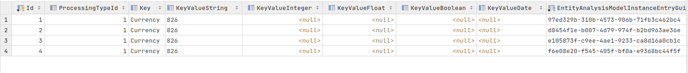

# Report Table
When request payload data has concluded processing, a comprehensive payload comes to rest as JSONB in a table of name Archive in the database.  The format of the data is largely the same as the response payload returned via HTTP response or AMQP,  except the Response Payload configuration will be ignored, and it will contain all elements processed:

```sql
select * from "Archive"
```


JSONB is a versatile datatype and has a means to expose all of the elements to SQL to support reporting.  For example,  elements can be extracted via syntax as follows:

```sql
select "Json" -> 'payload' ->> 'Currency' as "Currency"
from "Archive"
```

Elements can be extracted for the purpose of predication, grouping and selection,  henceforth it is fantastically powerful,  and akin to a traditional table structure.  Indexing is somewhat more contrived however.

JSONB is stored with a GIN Index in place, hence, many queries will perform well without any further consideration given to indexing.  However, an index may still be required for direct and predictable access, in which case  it can be achieved using the JSON predication, as above, in an expression index.

Setting a property to Report Table has the effect of promoting that value to a heavily indexed key value table, which can be joined to the Archive table.  Given the key and value being indexed, the performance of direct access queries can be improved.


```sql
select * from "ArchiveKey"
```


It can be observed that the table presents access via a Key (for example Currency) and its KeyValue (e.g. 826).  Note however that the key value is stored in an appropriate field for its datatype. Datatype for key values are configured in the Request XPath, otherwise it is of type Float.

In the current example,  the table is empty, as there has not been Report Table set for the purpose of promoting key values.

In the example of Currency, available in the Request XPath, there is no promotion of the element for reasons of it not being switched, as is default:


Toggling the Report Table field, followed by a synchronise (as is explained in detail elsewhere in this documentation),  will promote the key value, to be persisted during the same process as the JSONB to the Archive table:


The key values will be promoted on a forward basis only,  and there is no functionality to retroactively fill, hence this would need to be done via SQL should it be required (in the future this may be supported by the CLI).  To inspect:

```sql
select * from "ArchiveKey"
```

Returning the following data:



Note the presence of the Key as 'Currency',  the KeyValueString as '826' and the availability of the EntityAnalysisModelInstanceEntryGuid to join,  thus access, the wider JSONB payload in the Archive table:

```sql
select "Json" from "Archive"
inner join "ArchiveKey"
on "Archive"."EntityAnalysisModelInstanceEntryGuid" = "ArchiveKey"."EntityAnalysisModelInstanceEntryGuid"
where "ArchiveKey"."Key" = 'Currency' and "ArchiveKey"."KeyValueString" = '826' 
```


It is important to use Report Table and the promotion of keys sparingly as the values are indexed and will affect insert performance, and in many instances values may already have an efficient query path via the availability of the GIN index for the JSONB.