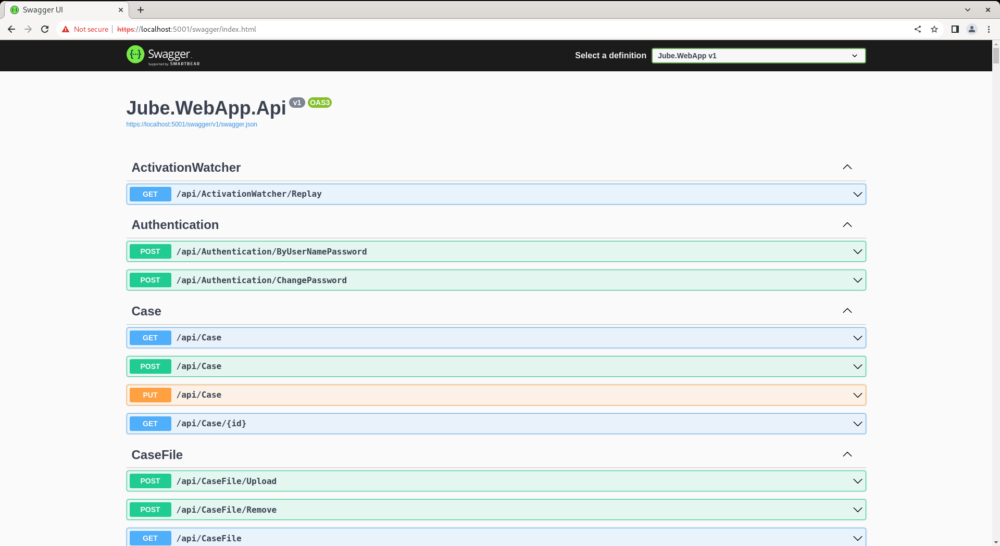

# HTTP API Concepts
There exists an embedded Swagger \ OpenAPI documentation available at the following location:

[https://localhost:5001/swagger](https://localhost:5001/swagger)

Which exposes the following landing page:



Swagger is the central resource for API documentation. The exception to self documentation is the /Invoke/EntityAnalysisModel endpoint which does not map to an object directly,  with that request body - which also needs to be JSON - being parsed manually given model definitions (i.e. Request XPath).  It follows that with the exception of the /Invoke/EntityAnalysisModel, which is documented extensively elsewhere, API endpoints benefit from strong typing.

The use of Swagger is outside the scope of this documentation,  and it may be noted that an alternative HTTP request tool has been used throughout this documentation,  however it is suffice to say that in addition to the documentation of the API,  there is also the functionality in Swagger to invoke any part of the API directly given JWT authentication token. 

For example,  the following API seeks to return Case with ID 1:


In the above example,  it can be seen that the API parameter is accompanied with a JSON Web Token, Bearer token,  without which a 401 http status code would be returned.

Where a JSON Web Token, Bearer Token, is required, Swagger will display required parameter.

The api/Authentication/ByUserNamePassword endpoint is available for the validation of user name and password returning a JSON Web Token in the response body:


As is standard, the HTTP header (which must be there on request, but is also echoed in the response) is named authentication with the value being the string "Bearer " concatenated with the JSON Web Token. The HTTP cookie meanwhile is called "authentication" and contains only the JSON Web Token,  although it is unlikely that an API led integration would choose to store or use a HTTP cookie, being more likely reserved for user interface page requests. 

The JSON web token is encrypted using Environment Variable values:

```text
JWTValidAudience=http://localhost:5001
JWTValidIssuer=http://localhost:5001
JWTKey=ExtraSuperDuperSecretKeyCreatedOnFirstStartup
```

| Value            | Description                                                                                                                                                                |
|------------------|----------------------------------------------------------------------------------------------------------------------------------------------------------------------------|
| JWTValidAudience | The server domain that is allowed the token.                                                                                                                               |
| JWTValidIssuer   | The server domain that issued the token.                                                                                                                                   |
| JWTKey           | The encryption key for the JWT.  This key is created randomly on first startup of a Jube instance executable and stored in the Jube.environment file,  but can be changed. |

Notwithstanding the stateless architecture, the token contains a single claim type of Name (http://schemas.xmlsoap.org/ws/2005/05/identity/claims/name) which will contain the username (e.g. Administrator).  It follows that in knowing the key values for the JSON Web Token, authentication can take place entirely out of band of the application.

The following HTTP status codes are implemented by the API:

| Status Code | Implementation                                                                                                                                                                                                                                       |
|-------------|------------------------------------------------------------------------------------------------------------------------------------------------------------------------------------------------------------------------------------------------------|
| 401         | Not authenticated.  JSON Web Token is either missing or expired.                                                                                                                                                                                     |
| 403         | Not authorised.  The authenticated user does not have access to the resource as configured in the permissions functionality.                                                                                                                         |
| 400         | Bad Request.  The request has not passed validation.  Error messages will be returned indicating the source of the failure in the JSON response body                                                                                                 |
| 204         | Key Not Found. In the case of PUT or DELETE methods,  the data was not found for modification.  This is often an indication of tenancy problems, where an attempt has been made to update data in a tenant which has not been allocated to the user. |
| 500         | Internal Error.  An error fatal to the request.  The error messages will only be written to logs server side and not communicated to the end user                                                                                                    |
| 404         | Not Found.  The resource has not been found.  There are very few programmatic uses of Not Found,  except in the case of the Invoke APIs,  hence the first step should be to check the URL.                                                           |

Resources are almost entirely subject to JSON Web Token authentication and permission authorisation with the exception of endpoints that are intended for the purpose of gaining authentication or integration.  Where an endpoint is outside of JSON Web Token Authentication,  there may however be other configuration options available for security:

| Status Code                                     | Implementation                                                                                                                                                                                     | Other Security                                                        |
|-------------------------------------------------|----------------------------------------------------------------------------------------------------------------------------------------------------------------------------------------------------|-----------------------------------------------------------------------|
| /api/Authentication/ByUserNamePassword          | An endpoint that exists to validate a user name and password,  returning a JSON Web Token in the response body,  the authentication header and placing the same in a cookie called "authenticate". | None                                                                  |
| /api/Invoke/Sanction                            | An endpoint for the purposes of integration to perform sanctions checking.                                                                                                                         | Environment variable EnablePublicInvokeController must be set to True |
| /api/Invoke/Archive/Tag                         | An endpoint for the purpose of adding tags to events stored in Archive.                                                                                                                            | Environment variable EnablePublicInvokeController must be set to True |
| /api/Invoke/EntityAnalysisModel/{guid}          | An endpoint for the invocation of models.                                                                                                                                                          | Environment variable EnablePublicInvokeController must be set to True |
| /api/Invoke/ExhaustiveSearchInstance/{guid}     | An endpoint for the invocation of exhaustive machine learning models beyond that available in model invocation.                                                                                    | Environment variable EnablePublicInvokeController must be set to True |
| /api/Invoke/ExampleFraudScoreLocalEndpoint      | A mocking endpoint to echo back a score for the purpose of testing.                                                                                                                                | Environment variable EnablePublicInvokeController must be set to True |
| /api/Invoke/EntityAnalysisModel/Callback/{guid} | An endpoint for the callback of the payload response given asynchronous model invocation.                                                                                                          | Environment variable EnablePublicInvokeController must be set to True |

The user interface is entirely Javascript set out on pages that are entirely static (save for some very minimal code behind authorisation).  Given that the user interface is Javascript there must therefore be some form of API available to support the functions. Every function that can be enacted in the User Interface is available via the API.  API which is prefixed with Invoke are not intended for use on an authenticated basis and are instead for the purpose of integration.

HTTP method verbs are implemented as customary:

| Verb   | Implementation                                                                                            |
|--------|-----------------------------------------------------------------------------------------------------------|
| GET    | HTTP requests to fetch data without a request body with parameterization in the URL stub or querystring.  |
| POST   | HTTP requests with a JSON request body for creation.                                                      |
| PUT    | HTTP requests with a JSON request body for update.                                                        | 
| DELETE | HTTP requests to delete data without a request body with parameterization in the URL stub or querystring. |

HTTP request body is in all instances JSON, with media type header of application/json, as following example, for PUT verb, targeting api/Case:

``` json
{
    "id": 0,
    "diaryDate": "2022-10-18T07:09:16.686Z",
    "caseWorkflowStatusId": 0,
    "createdDate": "2022-10-18T07:09:16.686Z",
    "locked": true,
    "lockedUser": "string",
    "lockedDate": "2022-10-18T07:09:16.686Z",
    "closedStatusId": 0,
    "closedDate": "2022-10-18T07:09:16.686Z",
    "closedUser": "string",
    "caseKey": "string",
    "diary": true,
    "diaryUser": "string",
    "rating": 0,
    "json": "string",
    "caseKeyValue": "string",
    "lastClosedStatus": 0,
    "payload": "string"
}
```

With response example as:

``` json
{
    "id": 0,
    "diaryDate": "2022-10-18T07:10:46.761Z",
    "caseWorkflowStatusId": 0,
    "createdDate": "2022-10-18T07:10:46.762Z",
    "locked": true,
    "lockedUser": "string",
    "lockedDate": "2022-10-18T07:10:46.762Z",
    "closedStatusId": 0,
    "closedDate": "2022-10-18T07:10:46.762Z",
    "closedUser": "string",
    "caseKey": "string",
    "diary": true,
    "diaryUser": "string",
    "rating": 0,
    "json": "string",
    "caseKeyValue": "string",
    "lastClosedStatus": 0,
    "payload": "string"
}
```

In all cases,  examples are available in Swagger given the strong typing of the controllers scaffolding the endpoints:


All requests with the exception of Invoke endpoints are subject to validation.  In the event validation fails,  a Bad Request HTTP status is served,  including details of the validation failure, as follows for PUT verb, to api/case:

```json
{
  "isValid": false,
  "errors": [
    {
      "propertyName": "Rating",
      "errorMessage": "'Rating' must be greater than '0'.",
      "attemptedValue": 0,
      "customState": null,
      "severity": 0,
      "errorCode": "GreaterThanValidator",
      "formattedMessagePlaceholderValues": {
        "ComparisonValue": 0,
        "ComparisonProperty": "",
        "PropertyName": "Rating",
        "PropertyValue": 0
      }
    }
  ],
  "ruleSetsExecuted": [
    "default"
  ]
}
```

In the above example validation has failed owing to the rating not being of a correct value.