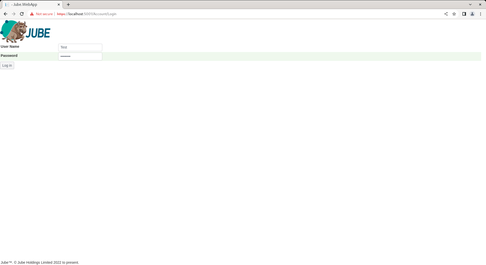
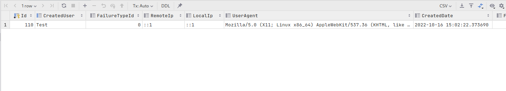

🚀Speed up implementation with hands-on, face-to-face [training](https://www.jube.io/training) from the developer.

# Users
All user interactions in the user interface are subject to authentication and authorisation.  Authentication rooted in a user account, which is more often than not accompanied by a password (keeping in mind the software also supports JSON Web Tokens for authentication).

Users are allocated to Roles,  which serves to consolidate authorisations upon authentication (in the form of permissions).

To create a user,  navigate Administration >> Security >> Users:


The tree will present a list of Roles available.  Click on the Role for which the User is to be created:


In addition to the Name, the user has the following properties:

| Value           | Description                                                                                                                                                                                                       | Example       |
|-----------------|-------------------------------------------------------------------------------------------------------------------------------------------------------------------------------------------------------------------|---------------|
| Role            | The role to allocate the user to,  defaulting to the role selected in the event of new user creation.  The drop down list is available in this manner to facilitate the moving of users from one role to another. | Administrator |
| Email           | The email address of the user for system communications.                                                                                                                                                          | test@test.com |
| Password Locked | A switch indicating is the password is locked.                                                                                                                                                                    | False         |

Complete the page for a new user called Test as follows:


Scroll down and click add to create a version of the User:


When the user is created no password is allocated and it is considered locked.

In the background a password is maintained using the Argon2 hashing algorithm.  A separate process to create a password,  store it securely and then unlock is available via the Get Temporary Password button:


Click the Get Temporary Password to present a randomly generated password for communication out of band to the user:


The password is set to have expired, which will force the user to change the password on first attempt at authentication.

To test the user account, make a note of the password and navigate to Account >> Logout:


Logging out clears the JSON Web Token from the header and cookies,  and accordingly all resources will be unavailable until a new one is in place, requiring authentication.  Complete the authentication page with the new user Test alongside the temporary password:



Click Logon to test the temporary password and be forced into change:


Upon change of password,  the permissions will be afforded as the role the user was allocated to, in this case administrator.

An authentication journal is available in the database which logs successful and unsuccessful logins,  the local IP, the remote IP and user agent of the browser.  The audit is available via selection of the UserLogin table:

```sql
select * from "UserLogin" order by 1 desc
```

Returning the following data:



In the event of all users having invalid credentials, the Command Line Interface (CLI) will need to be used to reset the Administrator password.  The CLI is documented separately. 