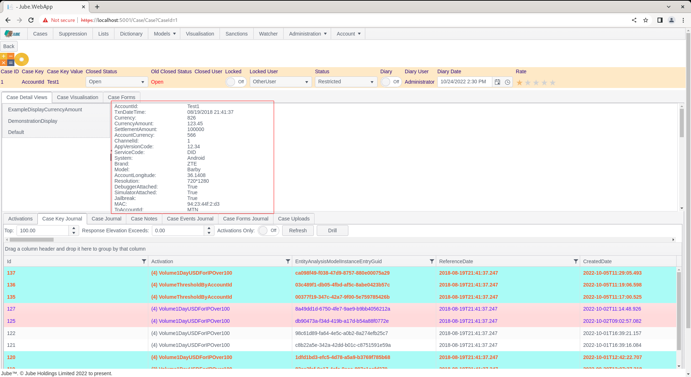
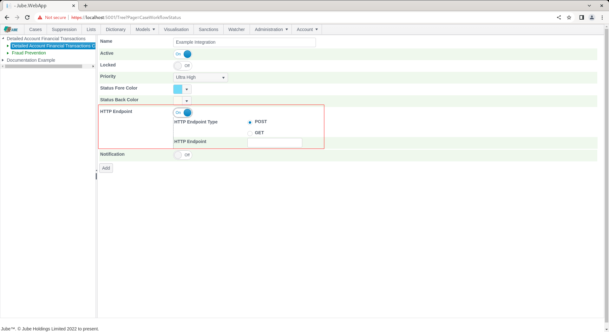
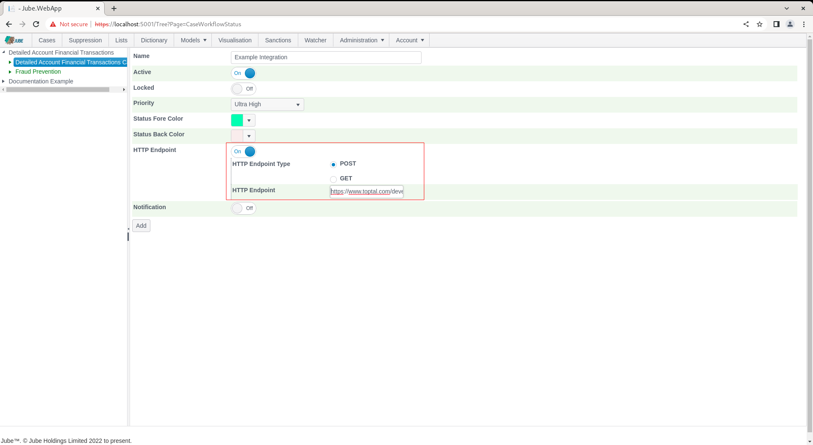
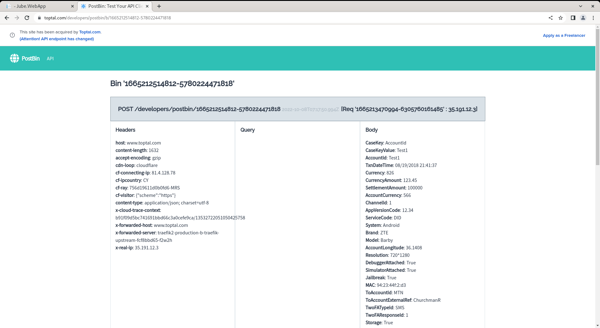
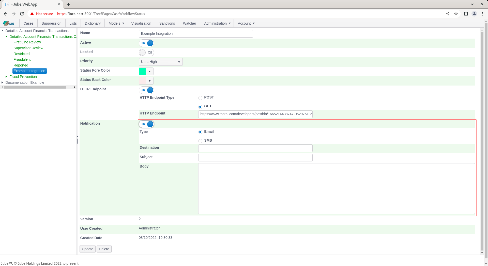
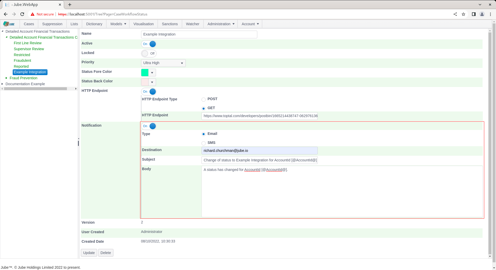
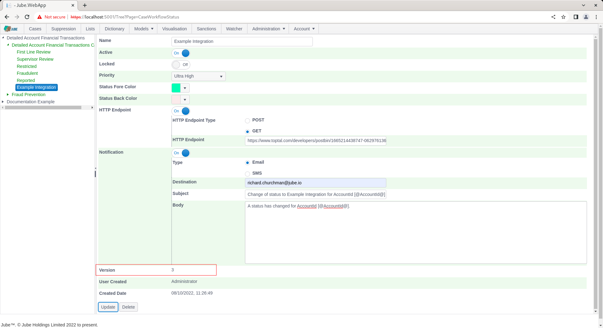

🚀Speed up implementation with hands-on, face-to-face [training](https://www.jube.io/training) from the developer.

# Creating Automation
The case management module supports basic automation and integration using Notifications and HTTP Endpoint hooks in the following cases workflow configuration items:

* Cases Workflow Status.
* Cases Workflow Form.
* Cases Workflow Action.
* Cases Workflow Macro.

Navigate Models >> Cases Workflows >> Cases Workflow Status, adding a new entry: 


Note the check boxes Enable HTTP Endpoint and Notification.

The purpose of both HTTP Endpoints and Notifications is to provide a means to integrate to external system and business processes within the context of the action being taken in the Case page.

For the purposes of tokenization, the parameters available will be,  at a minimum, the values displayed in the default section of the case:



Furthermore,  the Case Key and Case Key Value will always be embedded in the payload values made available to Notification or HTTP Endpoint functionality:


By way of example, upon the invocation of either a Notification or HTTP Endpoint where the above data is available,  the string "AccountID: [@AccountID@]" would be replaced to become "AccountID: Test1".

# HTTP Endpoint Introduction
HTTP Endpoint functionality brings together parameters and makes a POST or GET to a HTTP endpoint. The construction of the URL fully supports tokenization for the purposes of crafting querystring parameters.

Locate the HTTP Endpoint in the Cases Workflows Status configuration:


Expand on the HTTP Endpoint switch:



A HTTP Endpoint will upon invocation (in this example the submission of the form that was created in previous training procedures) compile all values into a JSON document \ message and submit to a remote HTTP endpoint.

In this example the Toptal Post Bin service will be used (https://www.toptal.com/developers/postbin/) and the following bin has been created:

[https://www.toptal.com/developers/postbin/1665212514812-5780224471818](https://www.toptal.com/developers/postbin/1665212514812-5780224471818)

The above HTTP endpoint will promiscuously accept the posts emitted synchronously from the case management functions.

The HTTP endpoint functionality is intended for the purposes of performing complex integrations and automations for which a bridge \ middleware must usually be created for that specific purpose.

The page accepts the following parameters for HTTP Endpoint (which is common across all cases workflow entries that process HTTP endpoints):

| Value              | Description                                                                                                                                                                                                                                 | Example |
|--------------------|---------------------------------------------------------------------------------------------------------------------------------------------------------------------------------------------------------------------------------------------|---------|
| HTTP Endpoint Type | The type of HTTP endpoint request.  If POST then the values will be compiled in a JSON document and submitted in the POST body.  If GET only the URL will be used in the HTTP request (although keep in mind that the URL is tokenization). | POST    |
| HTTP Endpoint      | https://www.toptal.com/developers/postbin/1665212514812-5780224471818                                                                                                                                                                       | True    |

To start,  perform a POST by completing the form as above and below:



Scroll down the page,  click to update to create a version of the Cases Workflows Status:


Navigate to a case:


Notice the Case Status Bar, specifically the Status:


Change Case Status to the newly created status:


On selection of the status,  there will be no obvious sign that a HTTP Endpoint integration has taken place from the form submission response, instead for the purposes of evidence the logs will be inspected to understand the interchange between the HTTP endpoint:


On refresh of the post bin endpoint however, it can be seen that the data has been posted and received:



In the case of GET,  the Post body would not be available,  instead,  data would be transposed to the query.  For this reason,  the querystring fully supports tokenization.

Navigate to the Cases Workflow Status:


Locate the HTTP Endpoint type set:


Update the HTTP Endpoint Type to GET and alter the HTTP Endpoint to include a resource as follows:

[https://www.toptal.com/developers/postbin/1665212514812-5780224471818?Example=[@AccountId@](https://www.toptal.com/developers/postbin/1665212514812-5780224471818?Example=[@AccountId@])


Scroll down and click update to create a version of the Cases Workflows Status:


Navigate to a case, changing status back to something else need be:


Change the status to that updated:


On inspection of the Post Bin,  the GET can be observed with the query string values properly tokenized:


Notifications are the sending of Email or SMS messages as a consequence of an event being raised in the Case page.  The notification functionality fully supports Tokenization in the Body,  Subject and Destination fields which will replace tokenized values with the values in the parameters from the triggering event. From the Cases Workflows Status:


Locate the switch for Notification:


Switch Notification to expose properties:



Complete a notification using tokenization on the AccountId (keep in mind that all fields support tokenization):



Scroll down and click Update to create a version of the Cases Workflows Status:



The process to change to this status is as laid out above, however in addition to a HTTP GET (or POST) being made,  an email (or SMS if that Notification Type has been selected) will be dispatched having been appropriately tokenized:


The Notification Type SMS expects a destination or telephone number,  using the + country code designation, and subject will be ignored.

As both the email and SMS notifications are on the basis of being straight through and synchronous, nothing needs to be enabled in the engine.  However,  the following values need to be considered as Environment Variables:

```text
SMTPHost=email.emailhost.com
SMTPPort=587
SMTPUser=UsernameExample
SMTPPassword=PasswordExample
SMTPFrom=richard.churchman@jube.io
```

| Value        | Description                                              |
|--------------|----------------------------------------------------------|
| SMTPHost     | The SMTP host name.                                      |
| SMTPPort     | The SMTP port name.                                      |
| SMTPUser     | The SMTP user name for authentication.                   |
| SMTPPassword | The SMTP password for authentication.                    |
| SMTPFrom     | The email address where the email will be received from. |

Likewise the Clickatell gateway in the case of SMS, using the values in the using a value set Environment Variable as:

```text
ClickatellAPIKey=APIKeyFromClickatell
```

| Value            | Description                         |
|------------------|-------------------------------------|
| ClickatellAPIKey | The API Key provided by Clickatell. |
