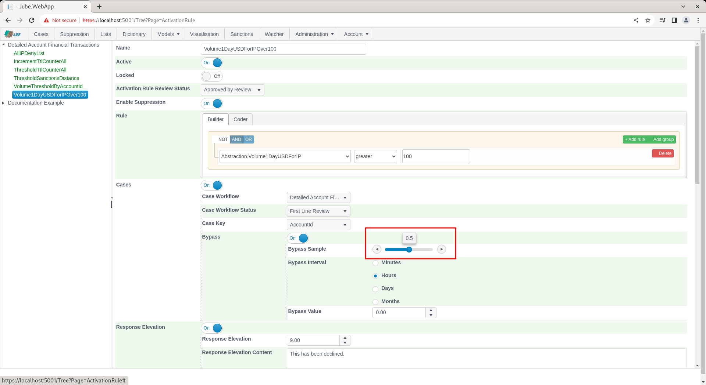

🚀Speed up implementation with hands-on, face-to-face [training](https://www.jube.io/training) from the developer.

# Creating Case Entry With Defer Activation Rule
When a case is created as a consequence of an Activation Rule match it would be placed into the case workflow, and assuming it is not already open pending closure,  in will be in an open status.  In the event that the case record is already in existence, and not in closed status, a case record will not be created.

Cases can be newly created either as an Open status,  or a Suspend Bypass status.

The Suspend Bypass status is used to create a case which is not intended to receive attention and only exists to ensure that no other case can be created for a case key and case key in the cases workflow.  An example of where a Suspend Bypass might be useful is in an audit use case,  where a sample of a very large population is adequate, as it may not be necessary to review each customer or client.   By using a Suspend Bypass status,  on case creation,  a random sample of case creation can be allocated to Open,  with the remainder being allocated to Suspend Bypass.  The Suspend Bypass will denote that the case has been sampled out and disallow any other case being created until a closed status is set for that case record.

Suspend Bypass status is subject to the diary automation functionality, and in concert with a diary date, will automatically lapse, moving from a Suspend Bypass Status to a Closed Status on a given date and time.

Revisit the Volume1DayUSDForIPOver100 Activation Rules and select the Activation Rule Create Case for the purposes of editing:

Scroll down to the configuration section that deals with case creation:

Locate the Bypass switch under Cases:

Toggle the Bypass switch to true to expose further options:

The case creation closed status is controlled by the Suspend Bypass sample slider which will evaluate against a random digit on case creation:

For example, suppose the suspend bypass sample is set at 50%,  hence the slider set as follows:

This would have the effect of sending half of the cases to an Open status and half the cases to a Suspend Bypass status.  The diary date is important so that the case management system knows when to move any Suspend Bypass status to a closed status (which will allow for the reopening of a case):

Scroll down the page and click update to create a version of the Activation Rule:

Synchronise the model via Entity >> Synchronisation and repeat the HTTP POST to endpoint [https://localhost:5001/api/invoke/EntityAnalysisModel/90c425fd-101a-420b-91d1-cb7a24a969cc](https://localhost:5001/api/invoke/EntityAnalysisModel/90c425fd-101a-420b-91d1-cb7a24a969cc) for response as follows, noting change of AccountId to Test2:

Repeat, changing AccountId to Test2, Test3, Test4, Test5, etc.  Note the createCasePayload element in the response by way of indication of Bypass having taken place:

In the above example,  there is no Bypass,  henceforth the case will be in an Open status.

Given the Bypass Sampling is at 50%,  it would be expected that roughly half of the newly created cases will be allocated an Open status, and half of the newly created cases will be allocated a Suspend Bypass status:

As opposed cases where filter updated to target Suspend Bypass:

Given that it is common that filters target only open cases,  notwithstanding the existence of a case record (which has the effect of disallowing further creation) it is practically removed from view until such time as the case moved automatically to a Closed status.