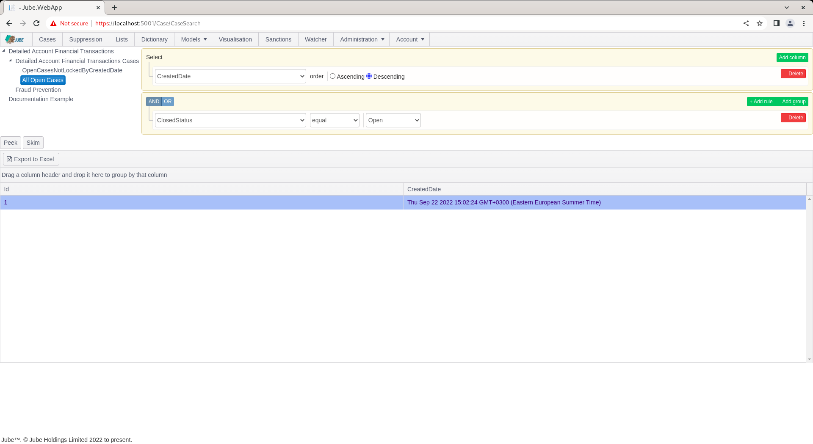

🚀Speed up implementation with hands-on, face-to-face [training](https://www.jube.io/training) from the developer.

# Case Workflow Filter
Throughout a case life cycle,  a case record can move through a multitude of dispositions.  The most simple is the hard-coded closed status, as follows:

| Value          | Description                                                                                                                                                    |
|----------------|----------------------------------------------------------------------------------------------------------------------------------------------------------------|
| Open           | A new case with a status of Open, pending review.                                                                                                              | 
| Suspend Open   | A case which has been suspended that will move to an Open status again once the Diary Date has lapsed.                                                         |
| Suspend Closed | A case which has been suspended that will moved to a Closed status once the Diary Date has lapsed.                                                             |
| Closed         | A closed case whereby the Case Key and Case Key Value will be eligible for reopening.                                                                          |
| Suspend Bypass | A status indicating that a case would have been created,  except it was sampled out.  The case will move to a closed status up on the lapse of the Diary Date. |

Cases Workflows Filters are a means to access Cases via the Cases page. Case Workflow Filters allows for the filtering of cases based on a customisable filter.  To create a Cases Workflow Filter,  start by navigating to Models >>  Cases Workflows >> Cases Workflow Filter:

For the Cases Workflow Detailed Financial Transaction Cases, Click on the tree node to add a new Cases Workflow Filter:

The cases workflow filter accepts the following parameters:

| Value  | Description                                                              | Example                                                       |
|--------|--------------------------------------------------------------------------|---------------------------------------------------------------|
| Filter | A query builder that allows both filtering and sorting of created cases. | Sort: Created Date,  oldest first. Rule: Closed Status = Open |

Complete the form as above or as follows:

Scroll down to add a version of the Cases Workflow Filter:

The Cases Workflow Filter is available in the Cases page:

Navigate to the Cases page:

Upon navigation to the Cases page the new Cases Workflow Filter can be seen immediately to afford access to the cases.  Clicking on the entry for the Cases Workflow Filter will return cases if available and also make the filter available for peeking by the end user:

The availability of cases and the peeking of cases is explained in more detail elsewhere in the documentation,  as part of case working.