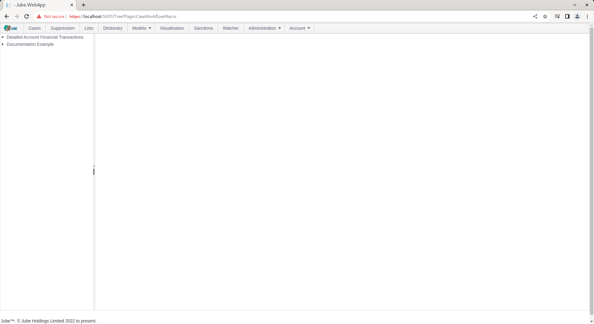
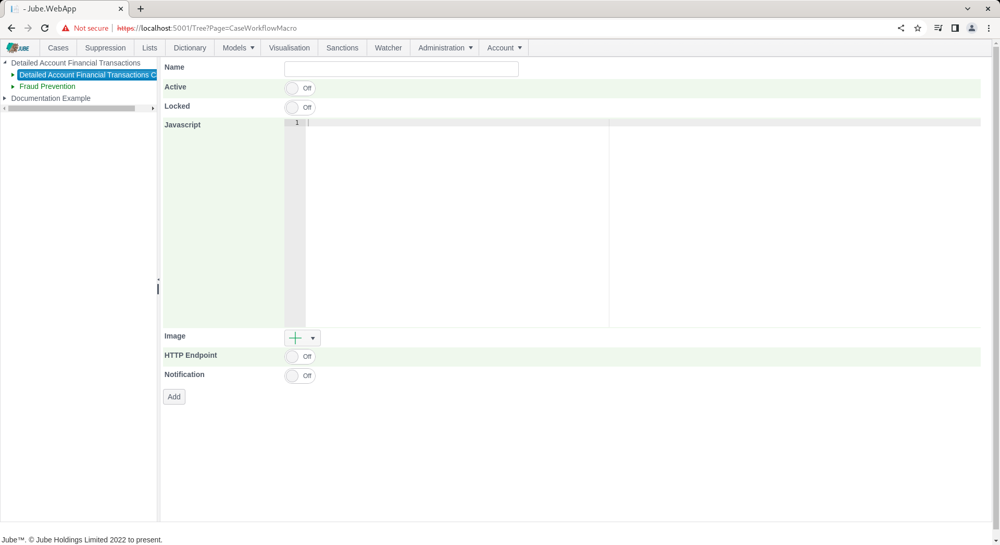
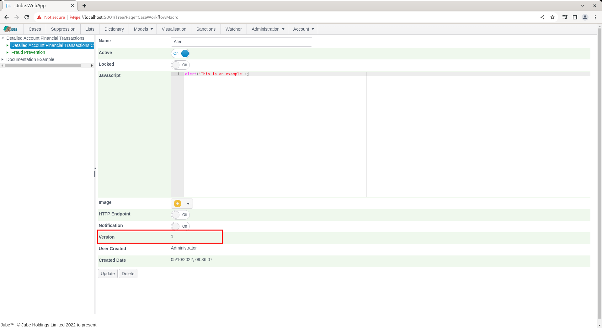

🚀Speed up implementation with hands-on, face-to-face [training](https://www.jube.io/training) from the developer.

# Case Workflow Macro
There are a multitude of functions in the case page for the purposes of updating and annotating a case. Each of these update functions have their own user interface controls.  For example,  to update the closed status,  it is a simple matter of just changing the value in the status bar drop down:

The case page can be extended by Macros which may invoke various Javascript functions on the case page to automate a series of common click sequences to expedite the case working process for an analyst.

The case pages Javascript functions are undocumented. The documentation as follows serves only to illustrate the functionality in general term.

To create a macro,  start by navigating to Models >> Cases Workflows >> Cases Workflow Macro:

Expand to the second level of the tree for a model, clicking on the Cases Workflow to create new Cases Workflow Macro:

The Cases Workflow Macro form takes the following parameters:

| Value      | Description                                                                                                                                                                                            | Example                      |
|------------|--------------------------------------------------------------------------------------------------------------------------------------------------------------------------------------------------------|------------------------------|
| Javascript | Javascript that will be invoked upon a click of the icon button. Do not include script tags as this will be handled by the Case page via the onClick event and then the eval() function of Javascript. | alert('This is an example'); |
| Image      | The image to be included in the image button. The name will represent the tool-tip of the button.                                                                                                      | Image                        |

Complete the form as above parameters or as below (use any image):

Click add to create a version of the Cases Workflow Macro entry:

To invoke the Cases Workflow Macro,  navigate to a case record:

Notice in the top left hand corner an image button has been created,  which will contain the Javascript function payload:

To invoke the Cases Workflow Macro,  simply click on the icon:

Keeping in mind that the alert is part of the Javascript,  the execution on conclusion will be another alert to the effect of Done:

Macros become especially powerful when used in conjunction with the common HTTP Endpoint or Notification functionality.