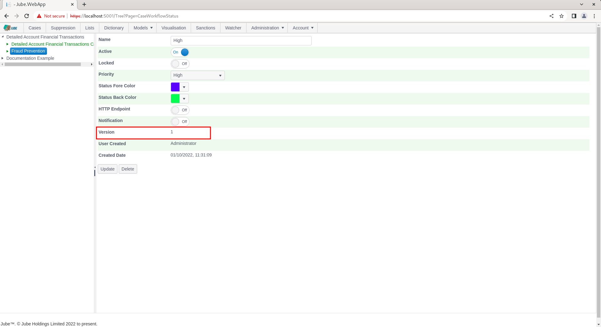

🚀Speed up implementation with hands-on, face-to-face [training](https://www.jube.io/training) from the developer.

# Cases Workflow Status
When a case is created,  it can be allocated a status, which is helpful for filtering.  Furthermore,  when a case is being worked, changing the status allows for the sub allocation of the record (for example to a money laundering officer for review).  Statuses are separate from the closed status (i.e. Open,  Closed etc).

A common example for case status use is to escalate cases through a hierarchy in an money laundering team,  such as:

* Front Line Defence (FLD).
* Deputy Anti Money Laundering Compliance Officer (DAMLCO).
* Anti Money Laundering Compliance Officer (AMLCO).

To begin the addition of Cases Workflow Status,  navigate to Administration >> Models >> Cases Workflows >> Cases Workflow Status:

Cases Workflows Status is a child of Cases Workflows, itself a Child of Models.  It follows that the tree to administer models and cases workflows is now of three levels deep.

It is incumbent to expand upon the model to reveal the Cases Workflows entry:

Exposing the newly created Cases Workflow, which can be used to create new children of the Cases Workflow:

Click on the Case Workflow entry to begin the process of adding Case Workflow Status:

The parameters are as follows:

| Value              | Description                                                                                                                                                                                                                 | Example |
|--------------------|-----------------------------------------------------------------------------------------------------------------------------------------------------------------------------------------------------------------------------|---------|
| Priority           | The priority of the workflow flow entry.  A status can be upwardly classified, such that if a case record already exists, the priority can be raised for that record, yet the priority of a case record may never decrease. | High    |
| Status Fore Colour | The colour of the text for this status.  The colour is used in the main bar on the status page.                                                                                                                             | #0000FF |
| Status Back Colour | The colour of the background for this status,  the colour is the main bar on the status page.                                                                                                                               | #880808 |

Notifications and HTTP Endpoint as common among the following section of Cases Workflow configuration, are documented separately and not covered in detail in this section, being common in several sections of the Cases Workflows configuration such as:

* Cases Workflow Form.
* Cases Workflow Action.
* Cases Workflow Macro.

Complete the page as described above and as below:

Scroll down the page and click the Add button to create a version of the Cases Workflow:

The Cases Workflow Status are available for allocation on case creation or by the end user while navigating the case.  

For confirmatory purposes, navigate to the Activation Rule definition for Volume1DayUSDForIPOver100 in the main menu, expand using the Cases switch,  and select the newly created Cases Workflow: 

It can be seen that the newly created Cases Workflow Status is now available as a child of the newly created Cases Workflows.

At this stage,  no case record has been created, but Cases Workflow Status are available for filtering via the Cases Workflow filter,  described separately.