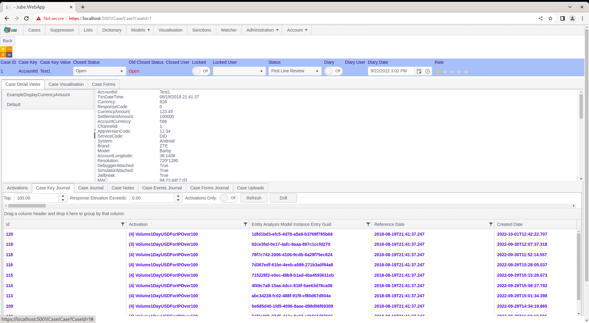
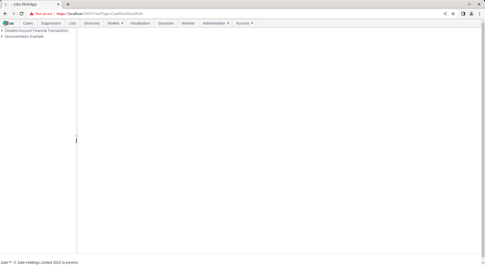
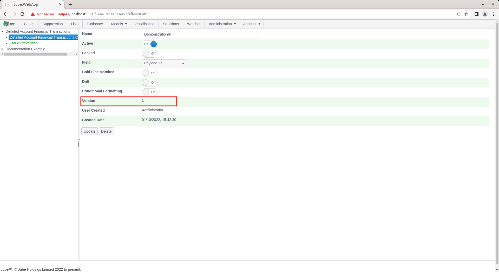
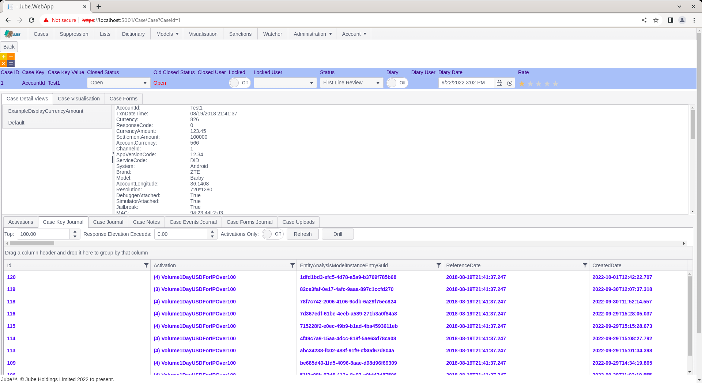
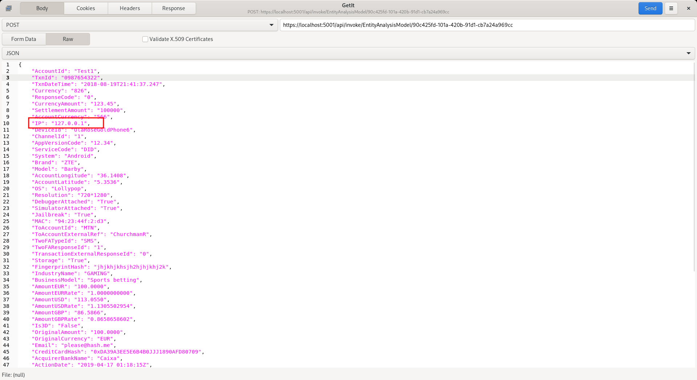
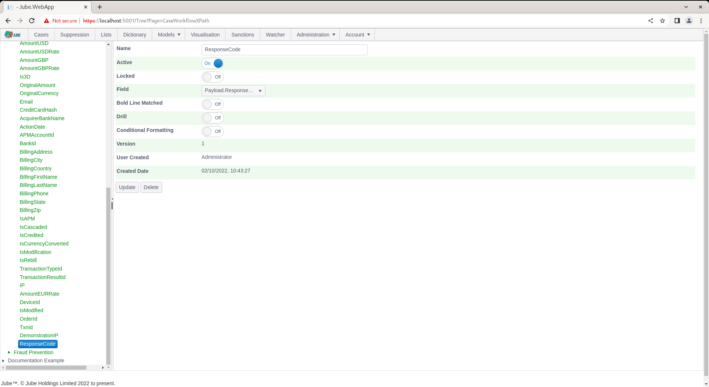
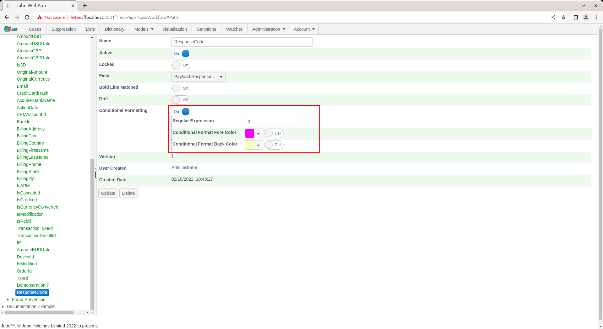

# Case Workflow XPath
Navigate to a case by Skim or Fetch:

In the default view it can be seen that the tab Case Key Journal has been set active by default (this is the first tab an agent will see):

The Case Key Journal is the retrieval of a grid of all events processed for the model where the Case Key Value matches that used in the creation of the case record,  in this example AccountID = Test1.

The use of the Case Key Journal is covered in more detail in later documentation and for the purposes of this documentation section it is suffice to recognise that each row corresponds to an event \ transaction.

Towards the left hand side of the case key journal is a column titled Activations:

The Activations column shows the highest priority rule having matched (in this example Test) prefixed with the number of other rules having matched (in this example 1,  which would indicate 1 rule having matched).  Notice however that no other columns have been returned,  despite an enormous amount of columns and granularity being available in the payload after model invocation.

A picture of the event is captured and stored alongside the case record at creation also,  and loaded by default on navigation to the case:

The default installation of Jube has a comprehensive list of columns displayed alongside the Activations, however this is as a result of the default installation having a comprehensive list of Case Workflow Request XPath entries.

All data comes to rest in the case record and archive in JSON format, being exactly the same format as returned in the response (except it will include all elements, not only those specified as a response payload):

Cases Workflow XPath allows for the extraction of data from the JSON for presentation in the Case page.

Start by navigating to Models >> Cases Workflows >> Cases Workflow XPath:

Click on the case workflow in the tree node in the top left hand corner to add a new Case Workflow XPath:

The Cases Workflow XPath page takes the following parameters:

| Value                          | Description                                                                                                                                                                                                                                                                                                                                                                                                                                                             | Example           |
|--------------------------------|-------------------------------------------------------------------------------------------------------------------------------------------------------------------------------------------------------------------------------------------------------------------------------------------------------------------------------------------------------------------------------------------------------------------------------------------------------------------------|-------------------|
| Name                           | The name to be allocated to this entry.                                                                                                                                                                                                                                                                                                                                                                                                                                 | AmountUSD         |
| Bold Line Matched              | A switch detailing if the row will be placed to bold based on this value matching that in the case creation entry.                                                                                                                                                                                                                                                                                                                                                      | True              |
| Bold Line Format Fore Colour   | If the value extracted from the transaction or event that caused the case creation matches a row in the grid,  then the colour will be allocated in the text.                                                                                                                                                                                                                                                                                                           | #0000FF           |
| Bold Line Format Back Colour   | If the value extracted from the transaction or event that caused the case creation matches a row in the grid,  then the colour will be allocated in the background.                                                                                                                                                                                                                                                                                                     | #00FF00           |
| Drill                          | Fields can be specified as being of type Drill. When a field is specified as being Drill,  this allows the wider selection of a data by cell and value.  On clicking drill,  the Case Journal will be filled with all values matching that condition newly created condition. Drill is useful functionality for identifying links in data. It is of paramount important that a Drill field is indexed in the database (noting that Archive has a GIN index by default). | True              |
| XPath                          | The JSONPath that is to be used to extract the value for presentation.                                                                                                                                                                                                                                                                                                                                                                                                  | Payload.AmountUSD |
| Conditional Formatting         | A flag that indicates if further regular expression matching will be performed on the event for the purposes of specifying individual row or cell formatting based on the disposition of the record.                                                                                                                                                                                                                                                                    | True              |
| Regular Expression             | The Regular Expression to search for a value in the extracted string.                                                                                                                                                                                                                                                                                                                                                                                                   | 1                 |
| Conditional Format Fore Colour | Subject to the regular expression matching a value,  the text colour to be used. Furthermore,  the Row or Cell check-box indicates if the formatting should be applied to the entire row or just the cell.                                                                                                                                                                                                                                                              | #880808           |
| Conditional Format Back Colour | Subject to the regular expression matching a value,  the background colour to be used. Furthermore,  the Row or Cell check-box indicates if the formatting should be applied to the entire row or just the cell.                                                                                                                                                                                                                                                        | #9F2B68           |

## Basic Extraction
Start an example by completing fields for just the extraction of a field available in the dropdown.  Complete the page as above or as below for the XPath field only,  using the Payload.IP, albeit with the name DemonstrationIP:

Scroll down and click the Add button to create a version of the Cases Workflows Request XPath entry:

Navigate to a case:

Scroll using the top horizontal bar in the grid:

Scroll all the way to the right. It can be observed that the AmountUSD has been extracted for each record:

The new extracted value is also available in the default display of the event having caused the case entry:

 
The default installation has a Cases Workflow Request XPath for each element available in the payload JSON for the Detailed Financial Transaction model.

## Bold Line Matching
The bold line matching functionality will match the specified value between the event \ transaction stored on case creation and the same value in the Case Journal.

Most ideally bold line matching should be on a unique basis, as the intention is to show the exact record that caused the case to be created (keeping in mind that a case can be created only once for a Case Key and Case Key Value,  for a case workflow, however it may well comprise of many problematic transactions \ events).

In this example, the TxnID should be unique on each transaction JSON post.

Navigate to Models >> Cases Workflows >> Cases Workflow XPath,  navigating the tree for the model and selecting the existing node titled TxnID:

Note the white background and blue foreground,  and the Bold Line Match switch toggled to true.

Alter the Bold Line Fore Colour and Back Colour as desired (in this example a Red foreground and light green background):

Scroll down and update the version of the Cases Workflow XPath by clicking the Add button:

The bold line matching details are returned alongside Cases Request Xpath,  in this case TxnId.  When the Cases Request Xpath is being processed in the case page,  if "Bold Line Matched" is enabled,  a check to compare if the value extracted for the row matches that same value in the case creation payload, and upon a match, the fore and back colour will be set for that row only.

Post to [https://localhost:5001/api/invoke/EntityAnalysisModel/90c425fd-101a-420b-91d1-cb7a24a969cc](https://localhost:5001/api/invoke/EntityAnalysisModel/90c425fd-101a-420b-91d1-cb7a24a969cc) but pay special attention to changing the TxnId in the request as this will likely have been the same,  so to assure that only a single bold line match is visible for that TxnId:

Navigate to the case record:

There are two observations.  Firstly,  the colour of the bold line match on TxnId has now changed.  Secondarily, as the TxnID in the most recent request payload does not match the TxnId of the record having driven case,  it is no longer bold line matched,  thus it does not have corresponding highlighting.

## Conditional Formatting
In the above example,  a straight forward match was done between the extracted field and the case creation field, whereby a match would apply the row formatting (fore colour and back colour specified and emboldening the text).

Conditional formatting is similar functionality that uses regular expressions to change either cell or row colour based on a regular expression matching when tested against the extracted value only (i.e. it does not compare to the case creation record).

The first of the examples for conditional formatting will be to check the DemonstrationIP address created beforehand for being of type localhost (i.e. 127.0.0.1),  and colour just the cell if it happens to match that string.

Navigate to the entry DemonstrationIP in Cases Workflows XPath for editing:

Scroll down to the Conditional Formatting switch:

Toggle true the Conditional Formatting switch to expose options available:

Use a very basic matching regular expression, simply applying the 127.0.0.1 string in the Regular Expression text box:

Upon regular expression match,  the cell will be coloured as per the colours having been picked as follows:

In the absence of clicking the Row check box next to the colours,  upon match, only the cell will have formatting applied.  Update the entry for IP:

Scroll down and update a version of the Cases Workflows XPath:

Being sure to change the IP address in the request payload to 127.0.0.1 repeat the HTTP POST to endpoint [https://localhost:5001/api/invoke/EntityAnalysisModel/90c425fd-101a-420b-91d1-cb7a24a969cc](https://localhost:5001/api/invoke/EntityAnalysisModel/90c425fd-101a-420b-91d1-cb7a24a969cc) for response as follows:

Navigate to the case record and scroll to the right to present the DemonstrationIP column in the Case Key Journal:

It can be seen from the above example that the cell for IP 127.0.0.1 has been coloured as per the specification, given a matching regular expression on that value.

Navigate back to the DemonstrationIP Cases Workflows XPath entry:

The Conditional Fore Colour and Back Colour has been specified as of cell type, given the absence of the Row having been selected (to the right of the colours).

Update the check boxes to designate the colours as being of type row:

Scroll down to update a version of the Cases Workflow XPath:

Navigate to the case record:

It can be observed that the same formatting has been applied to the row,  rather than just the cell. It is possible to mix and match fore colour and back colour,  row and cell formatting, such that the background of a row is coloured, just just the cell fore is coloured.

The formatting is applied to both the case creation record and the records in the display,  except for, in this instance,  there exists no match on the IP for the record causing the creation of the case:

In this example however,  just a single record matched,  and that record did not match at the point of case creation,  for completeness, Navigate to Models >> Cases Workflows >> Cases Workflows XPath and select the entry ResponseCode:

The response code has been the same throughout the posting of financial transaction messages,  a value of 0 (commonly taken to be approved).

Update the Conditional Regular Expression Formatting to target the value of 0,  applying a colour of choosing,  but being careful not to select row:

Scroll down and click update to create a version of the Cases Workflow Request XPath:

Navigate to the case record:

Notice how the cell formatting has been applied at both the grid journal level and on the case creation record.

## Drilling
When a case record is returned,  the contents of the Case Key Journal grid is all records matching the case key value combination (i.e. AccountID = Test1), as is displayed as follows:

The Case Journal supports wider fetching via a concept called Drill.

The Drill concept allows for the user selection of a cell,  with the column name and the cell value then being taken as the filter criteria to repopulate the Case Journal grid (on clicking the Drill button).

Drilling can and must only exist on columns that are properly indexed, although a GIN index is in place to facilitate.

For the reason of thought about indexing,  Drilling is not available on each column by default,  instead, it must be enabled at the Cases Request XPath Level.

Navigate to Models >> Cases Workflows >> Cases XPath and open the entry ResponseCode:

Scroll down and locate the Drill check box:

Set Drill to true:

Scroll down to update a version of the Cases Workflow XPath:

The response code has been the same throughout the posting of financial transaction messages,  a value of 0 (commonly taken to be approved). Changing the response code, repeat the HTTP POST to endpoint [https://localhost:5001/api/invoke/EntityAnalysisModel/90c425fd-101a-420b-91d1-cb7a24a969cc](https://localhost:5001/api/invoke/EntityAnalysisModel/90c425fd-101a-420b-91d1-cb7a24a969cc) for response as follows

Keeping in mind that there will be two IP addresses available from this documentation,  at least, Navigate to the case record:

Click the cell for ResponseCode for the topmost record:

Upon click, the cell will appear highlighted,  while also exposing (the otherwise disabled) Drill button to signify that the field can be drilled upon:

Clicking the Drill button to will set about populating the Case Key Journal grid,  in this example,  on the basis of ResponsePayload = 1,  rather than the original predicate of AccountID = Test1:

Upon the conclusion of the fetch,  all transactions available matching the drill filter (which is in this case spans one account) have been returned.

Drilling can then take place on other fields as required, creating link analysis functionality directly in the case page.

In the absence of a cell having been selected upon case presentation,  the drill will be set to the CaseKey and Case Key Value (in this example AccountId = Test1).  In the event that a cell is selected that is not enabled for drill,  the drill button will be disabled.

Refresh restores the Case Key Journal to the initial state:

Upon clicking setting the drill to CaseKey and CaseKeyValue and returning the data afresh:

