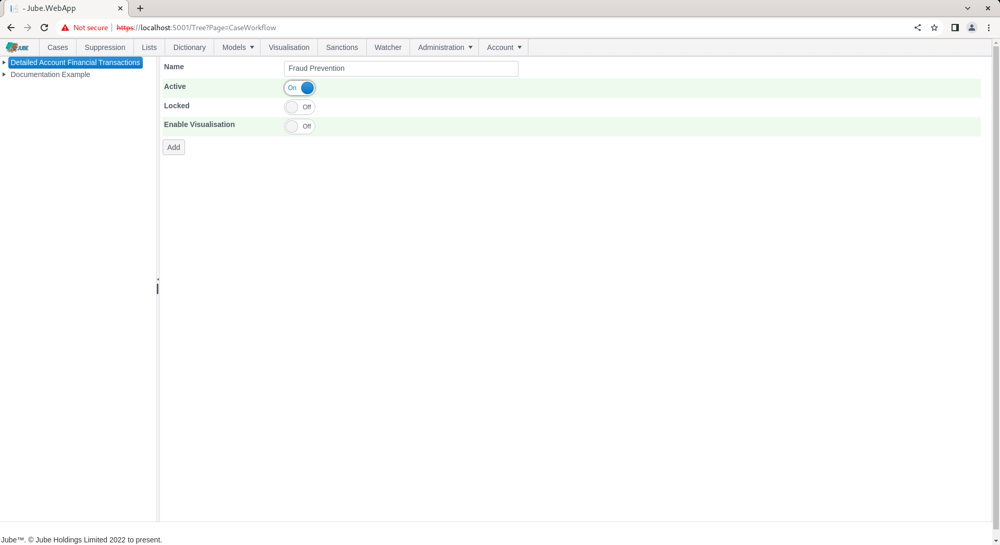
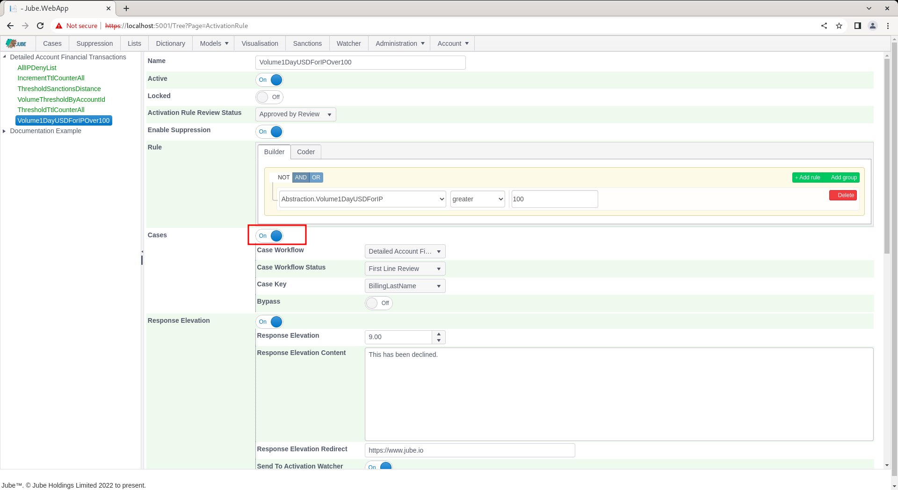

🚀Speed up implementation with hands-on, face-to-face [training](https://www.jube.io/training) from the developer.

# Creating Case Workflows
A case workflow is a logical stream of work that an agent will be allocated to.  For example,  transaction fraud for the purpose of evaluating stolen debit cards might be slightly different in treatment from an anti money laundering workflow.  Where work effort or agent teams are different,  it make sense to break this into different workflows.

Start by navigating to Models >> Cases Workflows >> Cases Workflows:

Cases Workflows are subordinate to models given that the meta data has been constructed at the model level, henceforth a case workflow can only be a child of a model such that the payload created by the model can reliably be presented by the cases page.

Click on the top of the tree to create a new Cases Workflow for the Detailed Financial Transaction Model:

The parameters available are described as follows:

| Value                | Description                                                                                                                                        | Example               |
|----------------------|----------------------------------------------------------------------------------------------------------------------------------------------------|-----------------------|
| Name                 | The name of the workflow for end user navigation.                                                                                                  | Fraud Prevention      | 
| Enable Visualisation | A flag indicating if this case should present a visualisation taking its parameters from the case payload.  Visualisation is documented elsewhere. | True                  |
| Visualisation        | The visualisation to present subject to Enable Visualisation being selected.                                                                       | Example Visualisation |

Complete the page with the parameters as above and as follows:

Scroll down the page and click the Add button to create a version of the Cases Workflow:

For confirmatory purposes, navigate to the Activation Rule definition for Volume1DayUSDForIPOver100 in the main menu:

Scroll down to Cases switch, and toggle to true:

Click on the Case Workflow drop down,  which will expose the available Case Workflow for which entries can be made:

Clicking on the new Cases Workflow will reveal it to be incomplete for the purposes of case creation,  requiring also a Cases Workflow Status:

