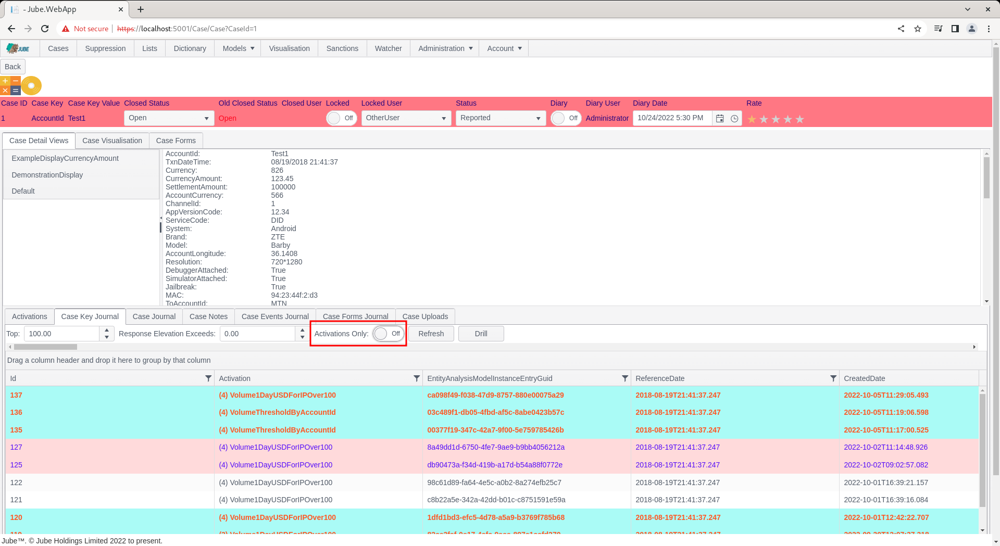
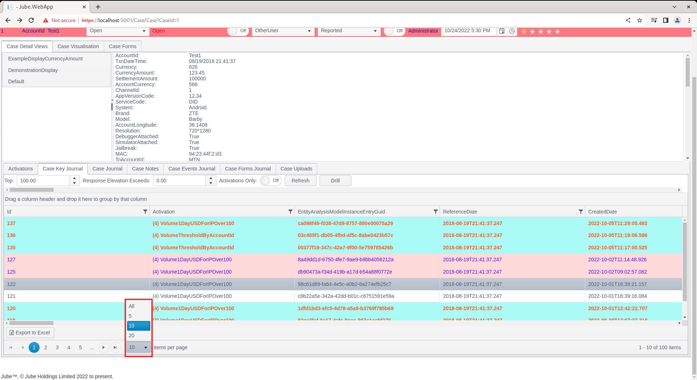
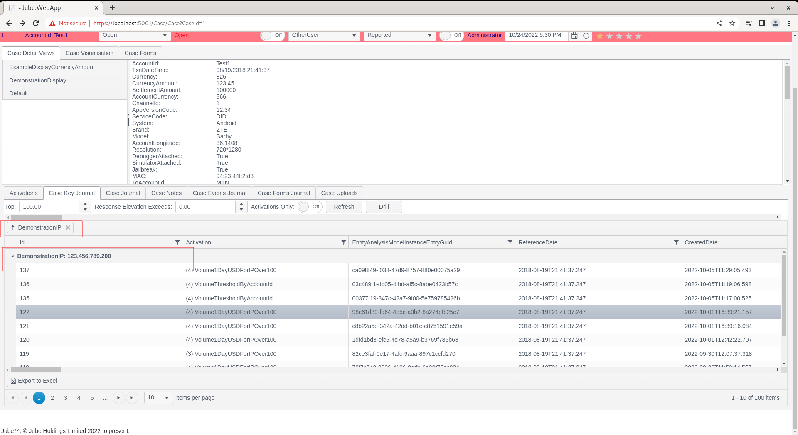
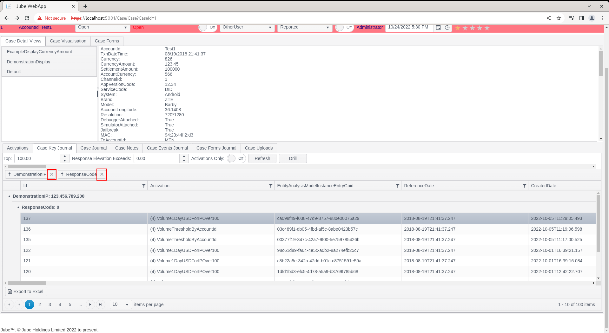
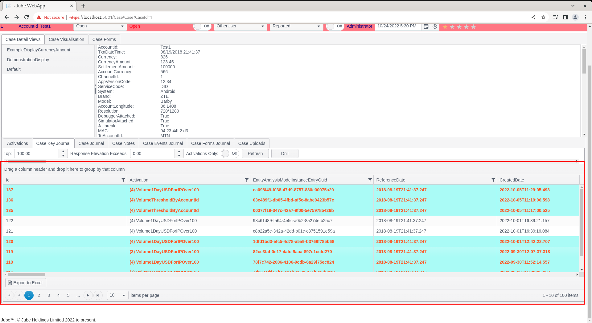
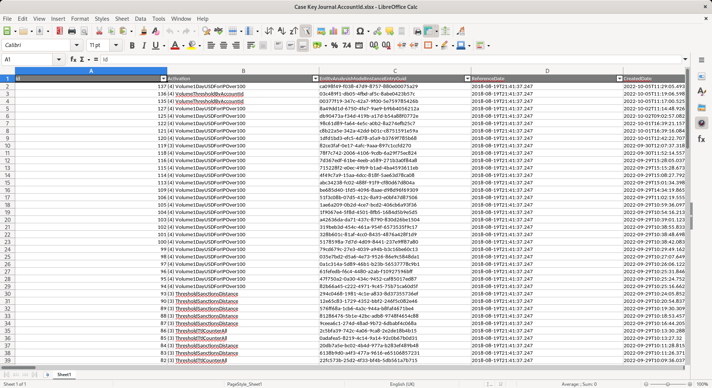

🚀Speed up implementation with hands-on, face-to-face [training](https://www.jube.io/training) from the developer.

# Working Case Key Journal
The case record maintains a copy of the event \ transaction that caused the case to be created.  To underwrite and perform analysis on a case it is generally important to have a wider picture of the transaction or event history for the Case Key Value combination having caused case record creation.

The Case Key Journal exists to return the full model event history, matching the Case Key Value combination for the case.

Navigate to a case record via either Fetch or Skim:

Notice that upon navigation to a case,  the Case Key Journal tab is the default and selected:

## Further Server Filtering
The Case Key Journal takes the following filtering parameters:

| Value                      | Description                                                                                                                                                                                                                                                                                                                              | Example |
|----------------------------|------------------------------------------------------------------------------------------------------------------------------------------------------------------------------------------------------------------------------------------------------------------------------------------------------------------------------------------|---------|
| Top                        | Keeping in mind that the case key journal returns transaction history in descending,  most recent first order, the top parameter will limit the number of matching records brought back to the most recent x records.                                                                                                                    | 100     |
| Response Elevation Exceeds | The Response Elevation is used as a means of performing event decline or real-time action.  It follows that if a Response Elevation has been set, in addition to the activations, it could be inferred that the event is in some way problematic. The logic works on a greater than or equal to basis,  such that 0 would be everything. | 0       |
| Activations Only           | Activations Only indicates that a record must have had a least one Activation Rule match to be returned in the Case Key Journal.                                                                                                                                                                                                         | False   |

The filtering takes place on the server side, henceforth it is efficient.

Change the Activations check box from False:

To True:

Click the Refresh button:

The grid will be refreshed in place, showing records only in the case of a match:

It is important to understand that the settings will be available until the case page is refreshed, hence if the next case is clicked, these modified settings will prevail.

## Horizontal Scrolling
The Case Key Journal grid is potentially quite large both horizontally and vertically. There are two scroll bars for the purpose of scrolling the grid left and right,  at the top (used most commonly):

And the bottom or the case key journal grid:

## Paging
The rendering of the Case Key Journal is done page wise, with each page having by default 10 records available for view.  The user should navigate from page to page by scrolling to the bottom of the grid and using the page controls:

The arrows will navigate back and forth, with the inner arrows moving forward and backward by one,  with the outer arrows moving to the start and end of the pages.  The numeric values will allow for navigation to a specific page.

It is possible to set the number of records to be returned per page by changing the value in the drop down items per page:

Keep in mind that if large pages are being rendered the overall performance of the Case Key Journal will be slightly degraded.

## Further Client Side Filtering
As exhibited,  data is firstly filtered on the server side using a small subset of the most important properties. Once data is returned,  it can be further filtered in the grid on a column wise basis.

In this example,  navigate to the column in the grid titled DemonstrationIP:

Notice that that for the purposes  of this example,  most of the IP values are 123.456.789.200,  yet some are 127.0.0.1.  Taking 127.0.0.1 as the target value,  start by clicking on the funnel in the column header:

Clicking on the funnel exposes some basic filtering options for this column:

In this example,  enter 127.0.0.1 in the "is equal to" section:

Click Filter to enact the filtering in the grid:

It can be seen that the filtering has been applied, in the client side, and has reduced the records in the grid to a single record (which was also in highlight relating to conditional formatting).

To clear the filter, repeat the process outlined above,  instead noting the Clear button:

Upon clicking Clear, the grid will be restored unfiltered:

While the client site grid filtering is fairly basic, there is a reasonable collection of logic operators available (e.g. >, <, >=, <= etc.) and filtering can be applied to a large number of columns.

## Further Sorting on Client
The default sort order of the date is the most recent transaction descending.  Once the data is returned it is possible to further sort the data in the grid with a click on the column.  In this example suppose a sort needs to take place on the DemonstrationIP column, navigate to the column and hover over the column name:

A simple click of the header will sort the data ascending:

Another click will sort the data descending:

Another click will clear the sort altogether:

## Client Grouping on the Grid
Grouping is a helpful feature to review data by grouping common data elements, while still retaining the ability to sort and filter in that group.

Notice firstly the section above the Case Key Journal grid detailing "Drag a column...":

To group by the IP address in this example,  hover over the IP column,  click and hold the mouse:

While holding the mouse button down, drag the IP column to the section containing "Drag a column....":

Release the mouse button over the "Drag a column...." section:

It can be seen that a grouping has been added.  It is possible to group by several fields,  in the following example the the AmountUSD has also been included:

To remove the group,  it is a simple matter of clicking the x icon next to the group entry:

The grid will be returned to its original state:

## Moving Columns
In the previous example grouping was achieved by clicking,  holding and dragging the column to grouping section.  The same approach to dragging a column can be used for the purpose of specifying the display order of a column.  Begin the process by clicking and holding on the IP column and preparing to drag the column:

Although subtle, look for two marks which will indicate where the column would be dropped upon the release of the mouse:

The column will have been moved.  To demonstrate persistence of this new column order for the user (not just the session),  press the F5 key to refresh the page,  or refresh the URL by other means:

The column will be saved to the users account and remembered for every subsequent use of this cases workflow. To alter the width of the columns, hover and click where one column meets the next, to the right of the column to be resized.  An icon will be displayed to confirm that the column is eligible for resizing.  Drag the column to resize:

The ordering and sizing of the columns is stored by user and Cases Workflow id in the database for the user,  so the time spent organising the sort order of the columns will not be redundant upon a new session being established.

## Exporting the Case Key Journal
It is possible to export the grid - which would include the prevailing sort and group - to Excel. Scroll down to the very base of the Case Key Journal,  and note two buttons "Export to Excel":

Click the "Export to Excel" button for the purposes of this example:

It can be seen that a file has been downloaded by the browser.  Simply click to open in Excel (or local equivalent given Linux as follows):

It can be seen that a fair reflection of the case key journal has been transposed to Excel.  Paging will be ignored and the full data will be exported.

The Excel export does not currently support the export of conditional formatting.