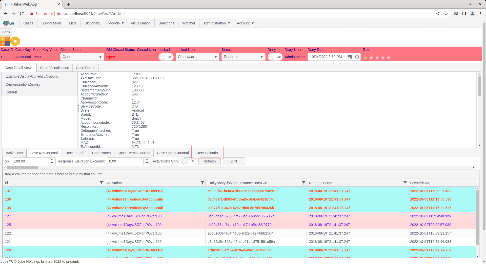

🚀Speed up implementation with hands-on, face-to-face [training](https://www.jube.io/training) from the developer.

# Working Uploading and Recalling Files
It is possible to upload files to a Case Key Value combination,  with these files being centrally stored in the database.

Navigate to a case record via either Fetch or Skim:


Notice the Case Uploads tab:



Click on the Case Uploads tab:


In the case upload tab there exists a file upload pane,  which will accept a dragged and dropped file,  or the specification of a file location by clicking on the Select Files button:


In this example, click on the Select Files button, the Select Files dialogue box will appear:


Use the Select Files dialogue box to navigate to, and select a file, in this case an image:


The file will be uploaded and available in the database (not the file system):

```sql
select * from "CaseFile"
```


The file list is all files rolling up to the Case Key Value combination. To reference or retrieve an uploaded file,  note firstly that the file name is a link:


Click the link:


The file will open up in a new browser tab is the content type is supported,  else downloaded.