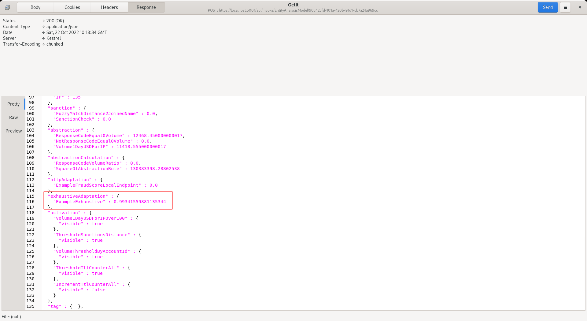

# Exhaustive Adaptation Recall
Upon models having been promoted during Exhaustive training,  they will be available for recall as part of model invocation.

Given the evolutionary nature of Exhaustive model training,  and indeed retraining,  explicit synchronisation is not required.

Proceed to post the example JSON to [https://localhost:5001/api/invoke/EntityAnalysisModel/90c425fd-101a-420b-91d1-cb7a24a969cc](https://localhost:5001/api/invoke/EntityAnalysisModel/90c425fd-101a-420b-91d1-cb7a24a969cc):

Notice that the score has been returned for use in Activation Rules in the Adaptation entity.

It might be observed that many of the elements used in model training do not have corresponding values in the model configuration.  When matching variables with the model,  in the event that the variable cannot be identified by its processing type (e.g. Abstraction) and name,  it will fall back to the mean value having been created by statistics.  Once a model is deployed it is advisable to lock all of the elements for which the model depends as falling back to the average will change model performance given how sensitive Neural Networks tend to be. 