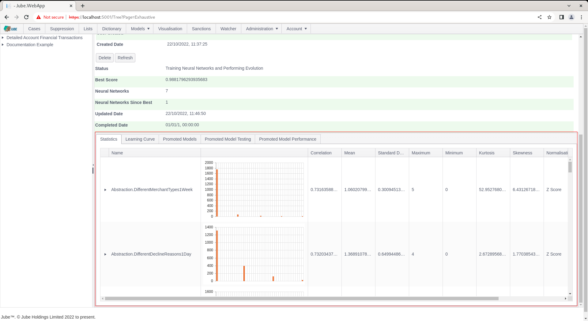

🚀Speed up implementation with hands-on, face-to-face [training](https://www.jube.io/training) from the developer.

# Exhaustive Adaptation Training Variable Statistics
One of the first tasks in training a model in Exhaustive is the process of establishing statistics.  Statistics are important for each variable as they are used in Z Score normalisation of variables,  which is an important concept in Machine Learning generally. The statistics are however comprehensively recorded, which provides rich insight about the dataset and problem domain more generally.

Keep in mind that statistics are calculated after the initial sample, but before class filtering, which means that it the statistics are a representation of the domain at large,  rather than the positive class.

Notice in the model performance tabs, Statistics:

Click on the Statistics tab to expose for each variable summary statistics and histograms:

The variables are presented in the order of their correlation between the class and variable descending (strongest first).

Note that the grid is hierarchical and each row may be expanded upon:

The expansion of the row is intended to present an analysis on the extent to which variables related to one another,  so called multi-colinearity.  Click to expand the row:

For each variable, the correlation to that variable is returned.  The variables are ordered by absolute correlation, with strongest correlations first.  Colour formatting exists on the following basis:

* Red > 0.9.
* Orange > 0.7.
* Else Green.

Understanding the relationships between variables gives opportunity to collapse some variables into each other,  for example by updating Abstraction Rules.