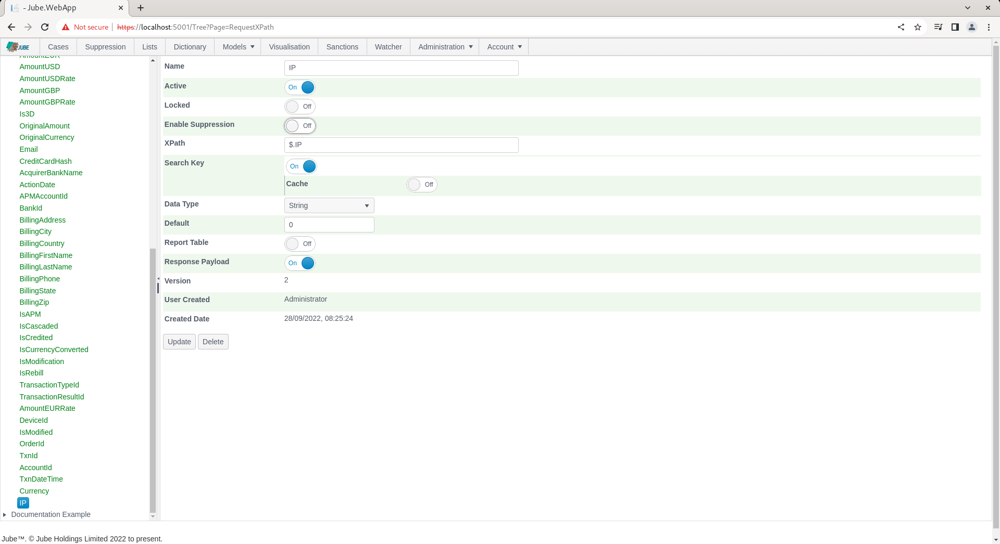
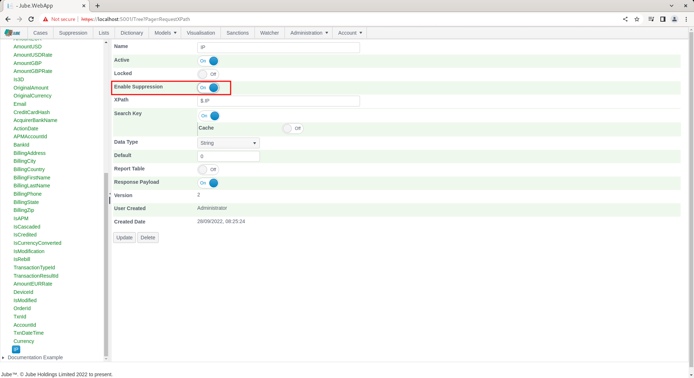
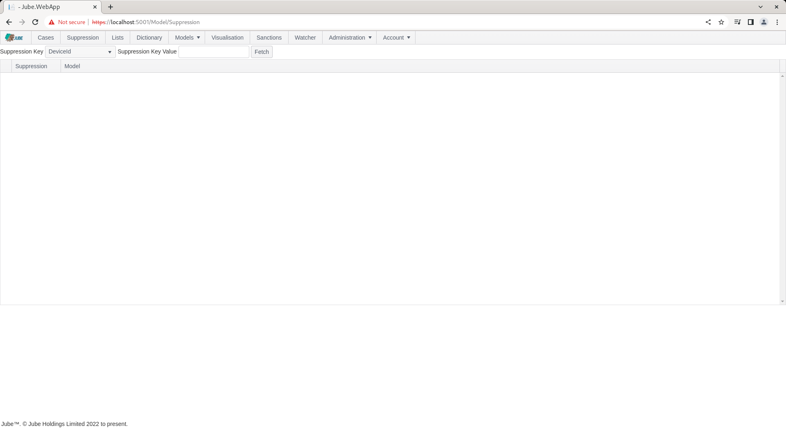
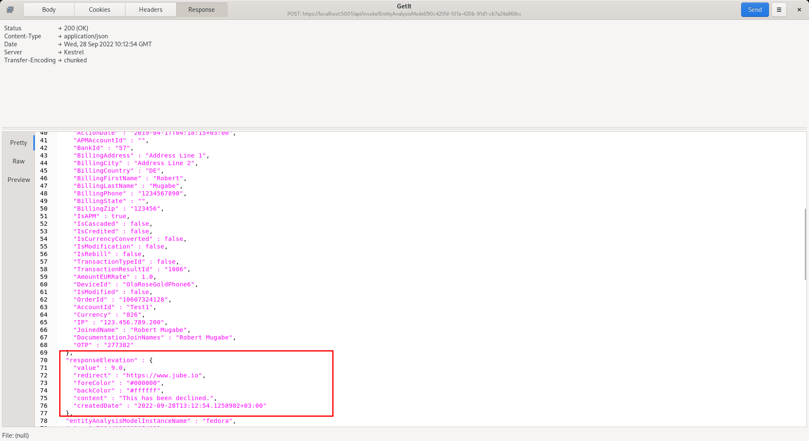
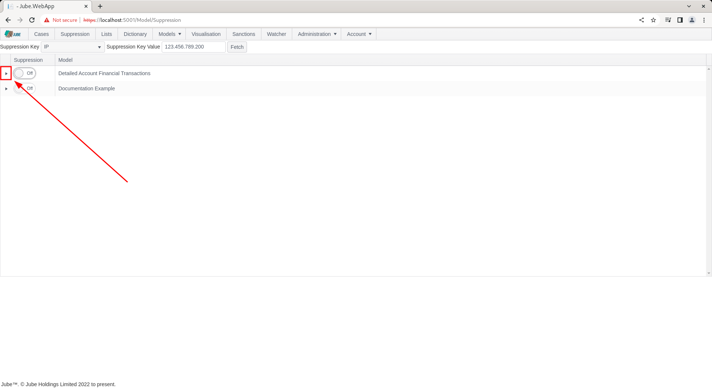

🚀Speed up implementation with hands-on, face-to-face [training](https://www.jube.io/training) from the developer.

# Activation Rules Suppression
In the previous procedure the Response Elevation was set as the result of an Activation Rule matching.  Response Elevations are commonly used initiate the decline of a transaction in real time.

Consider the scenario where a customer has been declined in real time for foreign transactions,  yet it transpires upon investigation,  that that the customer is on holiday.  In such a circumstance,  it would be desirable to suppress any actions as the result of an Activation Rule match,  for that account.

To help illustrate, repeat the HTTP POST to endpoint [https://localhost:5001/api/invoke/EntityAnalysisModel/90c425fd-101a-420b-91d1-cb7a24a969cc](https://localhost:5001/api/invoke/EntityAnalysisModel/90c425fd-101a-420b-91d1-cb7a24a969cc) for response as follows:

It can be seen that there is a Response Elevation being returned, which would be inferred as a transaction decline.

Note that the IP in the JSON transaction message is "123.456.789.200":

To enable the IP for Suppression matching,  navigate to the IP in the Request XPath:

To allow IP to be used in Suppression, toggle the Enable Suppression switch:

Update the Request XPath to create a new version including the Enable Suppression flag:

Synchronise the models to ensure that suppression is recognised in the real-time processing. Suppression is available in the top level menu:

To add a suppression at the model level,  which will suppress on all rules,  navigate to the Suppression page:

It can be seen in the Suppression Key drop down that the distinct list of all Request XPath elements designated for suppression:

It follows that the suppression value must be for the IP for which suppression is required. To add a suppression for the IP,  simply type in the IP in the Suppression Key Value:

Click the Fetch button to return suppression for the IP 123.456.789.200:

Upon clicking the Fetch button,  all models will be returned for which IP is eligible, overlay with a switch to indicate the suppression status for the IP 123.456.789.200:

To suppress for the IP value 123.456.789.200,  simply toggle the switch next to the model name to indicate that all Activation Rules belonging to the model should be suppressed:

Suppression (as Lists and Dictionary) do not require an explicit synchronisation,  rather they will be synchronised in the engine as a matter of routine.

Repeat the HTTP POST to endpoint [https://localhost:5001/api/invoke/EntityAnalysisModel/90c425fd-101a-420b-91d1-cb7a24a969cc](https://localhost:5001/api/invoke/EntityAnalysisModel/90c425fd-101a-420b-91d1-cb7a24a969cc) for response as follows:

It can be seen that the Activation Rule has still matched - which is to be expected - but note that the following actions are suppressed:

* Response Elevations.
* Notifications.
* Case Creation.
* Activation Watcher.

TTL Counter increments will not be suppressed.

In the response,  locate the Response Elevation:

It can be seen that the Response Elevation is zero - as it has been suppressed - and will no longer drive a decline (being a Response Elevation value other than zero).

To remove the suppression,  simply toggle off the switch after having fetched the IP of 123.456.789.200 from the suppression tab:

To validate removal of suppression, repeat the HTTP POST to endpoint [https://localhost:5001/api/invoke/EntityAnalysisModel/90c425fd-101a-420b-91d1-cb7a24a969cc](https://localhost:5001/api/invoke/EntityAnalysisModel/90c425fd-101a-420b-91d1-cb7a24a969cc) for response as follows:

It can be seen that the Response Elevation is now active - given that the suppression has now been removed.

It is also possible to specify just a specific activation rule for suppression.

To expose the Activation Rules rolling up to model,  click on the arrow to the left hand side of the grid:

Click on the arrow to expand Activation Rules:

The suppression process works in the same manner as at the model level with a simple toggle switch to be immediately synchronised,  but suppression will be targeted to a rule name and not encompass the whole model processing of the transaction or event.