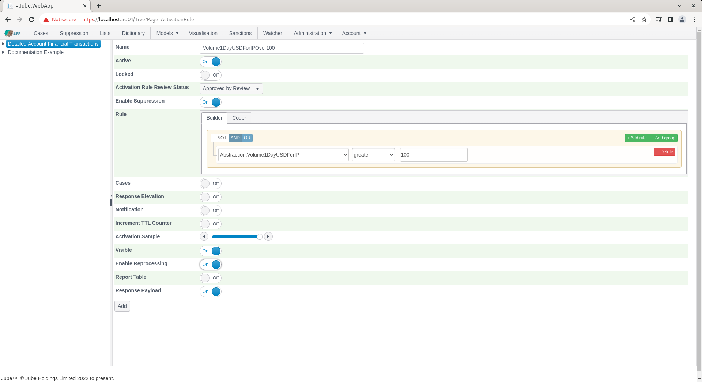

# Basic Activation Rules
Hitherto all processing has served to create an abundance of data surrounding the processing of an event or transaction through a the model,  yet no tangible action has been taken.  For example,  in a transaction fraud prevention platform the requirement might be to decline a transaction if volume exceeds a certain threshold.

The Activation Rule page is available by navigating through the menu as Models >> Activation Rules:

Click on the tree entry in the top left had corner to add a new Activation Rule:

The Page exists to create Activation Rules - which are VB.net code fragments - that will be compiled into the engine. Activation Rules accept collection data objects created thus far and tests the code fragment for equality,  returning a boolean flag to that effect. The Rule and Code Constructor Comprises the following data objects:

| Value                   | Description                                                                                                       |
|-------------------------|-------------------------------------------------------------------------------------------------------------------|
| Payload                 | The fields created in the Request XPath page, Inline Function and Inline Script (if registered).                  |
| TTL Counters            | The TLL Counter and their current incremented values.                                                             |
| Abstraction             | The fields created in the Abstraction Rules page.                                                                 |
| Adaptation              | The Adaptations created in the Adaptations page,  Http Adaptations or Exhaustive Adaptations                      |
| Abstraction Calculation | The Abstraction Calculations created in the Abstraction Calculations Page.                                        |
| Sanctions               | The Sanctions match distance for the multi part string evaluated in real time, documented later in this document. |
| Dictionary              | The lookups against the dictionary KVP.                                                                           |

The parameters for the Activation Rule page are defined follows:

| Value                                                                         | Description                                                                                                                                                                                                                                                                                                                                                                                                                                                                                                                                               | Example                                                     |
|-------------------------------------------------------------------------------|-----------------------------------------------------------------------------------------------------------------------------------------------------------------------------------------------------------------------------------------------------------------------------------------------------------------------------------------------------------------------------------------------------------------------------------------------------------------------------------------------------------------------------------------------------------|-------------------------------------------------------------|
| Activation Rule Review Status                                                 | A drop down list of various review status,  whereby only the Approved By Review status will allow the rule to be activated. This field and its associated permission allows for "Maker Checker" to be accomplished,  as a rule can be constructed,  yet not sent active, except by those with an Administrative permission.  Activation Rules can be further abstracted.                                                                                                                                                                                  | Approved By Review                                          |
| Enable Suppression                                                            | A flag indicating if this rule is eligible for suppression.                                                                                                                                                                                                                                                                                                                                                                                                                                                                                               | True                                                        |
| Cases                                                                         | A flag that indicates if a Case is to be created as a consequence of this Activation Rule matching.                                                                                                                                                                                                                                                                                                                                                                                                                                                       | True                                                        |
| Cases: Cases Workflow                                                         | Subject to the Case being enabled,  the Case Workflow that the new case will be assigned to.                                                                                                                                                                                                                                                                                                                                                                                                                                                              | Fraud Management                                            |
| Cases: Cases Workflow Status                                                  | Subject to the Case being enabled,  the Case Workflow Status,  rolling up to the Case Workflow, that the new case will be assigned to.                                                                                                                                                                                                                                                                                                                                                                                                                    | First Line Defence                                          |
| Cases: Cases Case Key                                                         | The case key and case key value to be used in creating the case,  for example,  Account ID.                                                                                                                                                                                                                                                                                                                                                                                                                                                               | AccountId                                                   |
| Cases: Bypass Suspend Sample                                                  | The percentage of activations to be set to a Bypass Suspend status on case creation.                                                                                                                                                                                                                                                                                                                                                                                                                                                                      | 0% (all cases)                                              |
| Cases: Bypass Suspend: Bypass Suspend Sample Interval Type                    | The interval type for the purposes of setting the date that any case creation should move from Suspend Bypass to Closed.                                                                                                                                                                                                                                                                                                                                                                                                                                  | Hour                                                        |
| Cases: Bypass Suspend: Bypass Suspend Sample Interval Value                   | The interval value for the purposes of setting the date that any case creation as Suspend Bypass should move to closed.                                                                                                                                                                                                                                                                                                                                                                                                                                   | 1                                                           |
| Response Elevation                                                            | A flag to indicate that the Response Elevation value should be raised,  alongside other outbound communication messages                                                                                                                                                                                                                                                                                                                                                                                                                                   | True                                                        |
| Response Elevation: Response Elevation                                        | The upwardly moving numeric value to be reported in the response payload such that a consolidated response (transaction decline) can be inferred.                                                                                                                                                                                                                                                                                                                                                                                                         | 9                                                           |
| Response Elevation: Response Elevation Content                                | A free text string to provide content detailing the Activation Rule.  For example, this might be the error message to be served to the customer in an online fraud prevention implementation.                                                                                                                                                                                                                                                                                                                                                             | There has been an error.  Please contact customer services. |
| Response Elevation: Response Elevation Redirect                               | A url to redirect the user or advertising exchange to on this Activation Rule having matched.                                                                                                                                                                                                                                                                                                                                                                                                                                                             | https://www.jube.io                                         |
| Response Elevation: Send To Activation Watcher                                | A flag that indicates if this Activation Rule match should tick out a message to the Activation Watcher. This flag is used in conjunction with a model configuration that specifies a sample to be taken so not to flood the Activation Watcher in high throughput implementations.                                                                                                                                                                                                                                                                       | True                                                        |
| Response Elevation: Send To Activation Watcher: Response Elevation Key        | The identifier value to accompany the message to the Activation Watcher.                                                                                                                                                                                                                                                                                                                                                                                                                                                                                  | AccountId                                                   |
| Response Elevation: Send To Activation Watcher: Response Elevation Fore Color | The fore colour to send to the Activation Watcher and response payload, selected via a colour picker,  returning hex.                                                                                                                                                                                                                                                                                                                                                                                                                                     | #0000FF                                                     |
| Response Elevation: Send To Activation Watcher: Response Elevation Back Color | The back colour to send to the Activation Watcher and response payload, selected via a colour picker,  returning hex.                                                                                                                                                                                                                                                                                                                                                                                                                                     | #FF0000                                                     |
| Increment TTL Counter                                                         | A flag indicating that TTL Counter incrementation should occur.                                                                                                                                                                                                                                                                                                                                                                                                                                                                                           | True                                                        |
| Increment TTL Counter: Model                                                  | The model containing the TTL Counter to increment.                                                                                                                                                                                                                                                                                                                                                                                                                                                                                                        | Non Monetary Events                                         |
| Increment TTL Counter: TTL Counter                                            | The TTL Counter to be incremented as configured for this model.                                                                                                                                                                                                                                                                                                                                                                                                                                                                                           | Count Of Cross Border                                       |
| Notification                                                                  | A flag indicating an asynchronous Notification should be dispatched                                                                                                                                                                                                                                                                                                                                                                                                                                                                                       | True                                                        |
| Notification: Type                                                            | The Notification Type,  Email or SMS on Activation Rule Match.                                                                                                                                                                                                                                                                                                                                                                                                                                                                                            | SMS                                                         |
| Notification: Destination                                                     | The destination of the Email or SMS notification.                                                                                                                                                                                                                                                                                                                                                                                                                                                                                                         | test@test.com                                               |
| Notification: Subject                                                         | The tokenized subject (which is the replacement of tokens with values from the payload).                                                                                                                                                                                                                                                                                                                                                                                                                                                                  | This is a fraud alert for account [@AccountId@]             |
| Notification: Body                                                            | The tokenized body (which is the replacement of tokens with values from the payload).                                                                                                                                                                                                                                                                                                                                                                                                                                                                     | This is a fraud alert for account [@AccountID@]             |
| Activation Sample                                                             | A percentage value,  between 0 and 1,  detailing the sample that should be allowed for Activation. The sample will only be taken in the event that the Rule returns as true. For example,  if the Activation Sample is set to 20%,  it would imply that only 20% of the matching transactions will be persisted to the database.  It is extremely useful where there is a large volume of transactions or events, yet it is not practical for each transaction or event to be reviewed,  hence a representative sample of the large universe is adequate. | 20%                                                         |
| Visible                                                                       | A flag to indicate if the occurrence of the rule match is to be displayed in the Case Management system. In some cases,  especially when incrementing TTL Counters,  it is not required that the activation be visible.                                                                                                                                                                                                                                                                                                                                   | False                                                       |
| Reprocessing                                                                  | A flag to indicate if this Activation Rule should be subject and visible to a reprocessing job.                                                                                                                                                                                                                                                                                                                                                                                                                                                           | False                                                       | 

In the following example,  a very simple Activation Rule will be created that will not drive Case Creation, Notifications or Response Elevation or TTL Counters, simply have a reference in the response payload JSON.

Taking the above parameters partially, create a rule that seeks to target Abstraction Rule Volume1DayUSDForIP to be over > 100, paying attention to: 

* Approved By Review status.
* Enable Suppression as true.
* Visible as true.
* Response Payload as true.
* Activation Sample to 100%.
* Enable Reprocessing as true.

Click Add to create the first version of the Activation Rule:

Synchronise the model via Entity >> Synchronisation and repeat the HTTP POST to endpoint [https://localhost:5001/api/invoke/EntityAnalysisModel/90c425fd-101a-420b-91d1-cb7a24a969ccc](https://localhost:5001/api/invoke/EntityAnalysisModel/90c425fd-101a-420b-91d1-cb7a24a969ccc) for response as follows:

It can be seen from the response JSON that an Activation entry has been created, showing the rule to have matched. Activations will only be added in the event that there is a match,  whereas most of the other abstractions that take place in model invocation will always return a value. Notice given the Visible flag was set to zero,  the Visible flag next to the Activation Rule entry is set to zero also.  As the Visible flag is set to zero, it will not be displayed in the Case Management pages Case Key Journal grid (the event will,  but the activation not).

