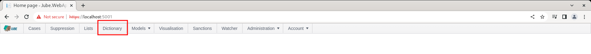
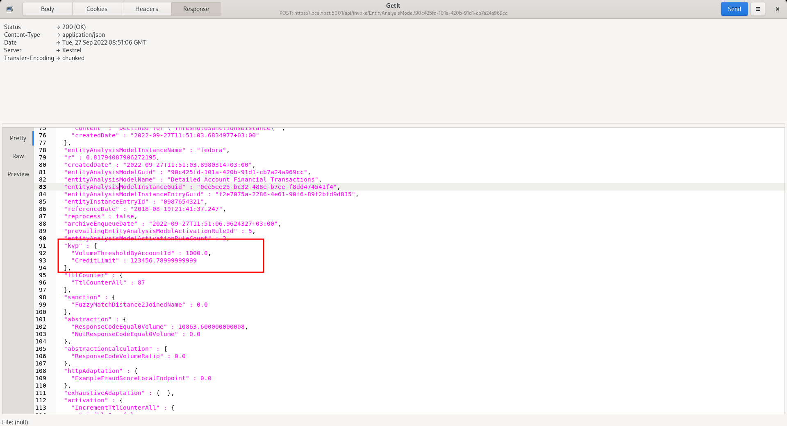
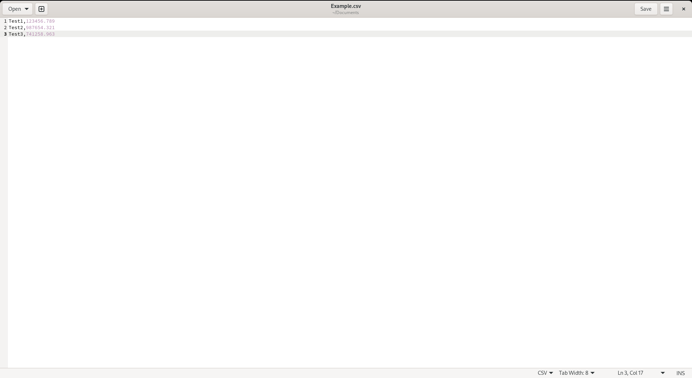
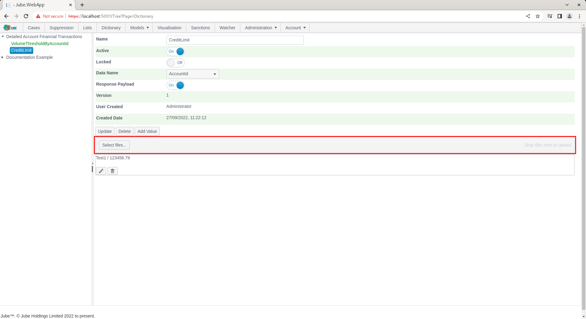

# Dictionary
Dictionary is similar to List functionality,  except,  rather than allow only exist matching on a string value,  they pair a key from the payload in model invocation, and return a value.  Dictionary is a good way to enrich payload data with small amounts of external data without relying on Inline scripts or complex integrations.

The main advantage of Dictionary is that they can be added from the user interface one by one or as part of a CSV text file upload,  which affords the end use the ability to create these lookups without any technical intervention (it can also be added via the database table or API).

Dictionary are populated during model synchronisation and stored in the engines memory, to afford extremely fast lookups in real-time.  It follows that it is not especially well suited for very large datasets,  but it should capably handle a few hundred thousand entries without any noticeable degradation in performance.  It follows that the Dictionary are available for lookup by key in the applications memory.

During processing
For each Dictionary KVP for the model,  the following process takes place:

* For the Dictionary KVP entry, there will be a field name specified that will serve as the key for the lookup.  The first step is to ensure that the data key name specified exists in the payload being processed.  In the event that the data name is not available in the payload,  an INFO message will be written to the logs while the value will be set as zero and added to a separate collection).  For a key to be looked up in the dictionary the key value must be in the transaction or event (although it might have come from an Inline Script, Function as well as the Payload).
* Having established that a value exists for the key,  the value of that key is extracted from the payload in process. 
* Using the key value extracted from the payload,  the key value is used to lookup against a dictionary of all key values for this Dictionary.  Firstly, the existence of the key inside the Dictionary is checked,  where if the key does not exist,  the value is evaluated as zero,  else,  the value for that key from the Dictionary values is returned.

There will always be a value added to the payload, even if it is zero in the case of a match not being made.

For example, a Dictionary arrangement  will be created that will pair an AccountID (from the transaction payload) with a Credit Limit (stored in the Key Value Pair collection of the Dictionary).

Like Lists, the Dictionary does not require explicit synchronisation, happening perpetually.  It follows that the Dictionary and KVP value pairs will be available for model invocation almost straight away.

Navigate to the Dictionary page from the main menu:

Click on the tree node in the top left hand corner of the screen to create a new Dictionary collection definition:

The Dictionary has the following properties:

| Value                  | Description                                                                                                                                                                       |
|------------------------|-----------------------------------------------------------------------------------------------------------------------------------------------------------------------------------|
| Lookup                 | The field from the data payload to pair to Dictionary during model invocation, for the purpose of looking for a value from the key.                                               |

Complete the page with the details as above or as below:

Click Add to create the container for the Key Value Pairs:

Locate the the Add Value button:

Click the Add Value button to expose the Key Value template:

Upon clicking the Add Value button,  the template for the creation of Key Value Pairs will be exposed.  The left most value is the Key. The Key is the value that will be matched with the payload, the value is what will be returned for availability to further processing. Complete the Key with the AccountID value in the transaction payload (e.g. Test1):

The right most value is the value that will be returned as a consequence of the lookup AccountID = Test1 (in this example 123456.78). Complete the Value with 1234567.89,  which will represent the Credit Limit being looked up for this example:

Commit by clicking on the Tick icon:

Or to cancel the creation of the Value click the opposing icon:

Upon the successful commit of the Key Value,  it will appear updated:

Keeping in mind that explicit synchronisation is not required,  repeat the HTTP POST to endpoint [https://localhost:5001/api/invoke/EntityAnalysisModel/90c425fd-101a-420b-91d1-cb7a24a969cc](https://localhost:5001/api/invoke/EntityAnalysisModel/90c425fd-101a-420b-91d1-cb7a24a969cc) for response as follows:

Keep in mind that the AccountId in the POST body was of key Test1,  the value of 123456.789 has been returned by matching during processing.

The updating and deletion of the Key Value pair follows the same process as it it were a List,  documented beforehand.

It is also possible to upload a file of Key Value pair to the following specification:

The control to upload a file is the button Select Files:

Either drag the file to the area show above,  or click the button titled Select files,  navigating to the file:

Clicking Open, which will happen implicitly if the file has been dragged and dropped, will both upload the file and process,  adding each row as a new Dictionary Key Value pair:

In the event of a conflict on the key,  as here, it will be updated,  otherwise inserted.