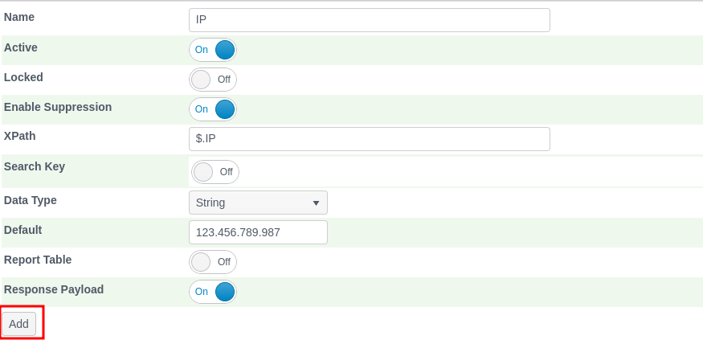
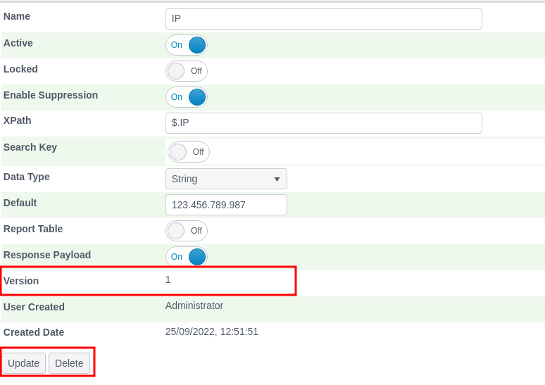

🚀Speed up implementation with hands-on, face-to-face [training](https://www.jube.io/training) from the developer.

# Request XPath

When a request is received from a HTTP Endpoint for a model it should have data contained in the POST body as JSON, as
following example:

```json
{
  "AccountId": "Test1",
  "TxnId": "0987654321",
  "TxnDateTime": "2018-08-19T21:41:37.247",
  "Currency": "826",
  "ResponseCode": "0",
  "CurrencyAmount": "123.45",
  "SettlementAmount": "100000",
  "AccountCurrency": "566",
  "IP": "123.456.789.200",
  "DeviceId": "OlaRoseGoldPhone6",
  "ChannelId": "1",
  "AppVersionCode": "12.34",
  "ServiceCode": "DID",
  "System": "Android",
  "Brand": "ZTE",
  "Model": "Barby",
  "AccountLongitude": "36.1408",
  "AccountLatitude": "5.3536",
  "OS": "Lollypop",
  "Resolution": "720*1280",
  "DebuggerAttached": "True",
  "SimulatorAttached": "True",
  "Jailbreak": "True",
  "MAC": "94:23:44f:2:d3",
  "ToAccountId": "MTN",
  "ToAccountExternalRef": "ChurchmanR",
  "TwoFATypeId": "SMS",
  "TwoFAResponseId": "1",
  "TransactionExternalResponseId": "0",
  "Storage": "True",
  "FingerprintHash": "jhjkhjkhsjh2hjhjkhj2k",
  "IndustryName": "GAMING",
  "BusinessModel": "Sports betting",
  "AmountEUR": "100.0000",
  "AmountEURRate": "1.0000000000",
  "AmountUSD": "113.0550",
  "AmountUSDRate": "1.1305502954",
  "AmountGBP": "86.5866",
  "AmountGBPRate": "0.8658658602",
  "Is3D": "False",
  "OriginalAmount": "100.0000",
  "OriginalCurrency": "EUR",
  "Email": "please@hash.me",
  "CreditCardHash": "0xDA39A3EE5E6B4B0JJJ1890AFD80709",
  "AcquirerBankName": "Caixa",
  "ActionDate": "2019-04-17 01:18:15Z",
  "APMAccountId": "",
  "BankId": "57",
  "BillingAddress": "Address Line 1",
  "BillingCity": "Address Line 2",
  "BillingCountry": "DE",
  "BillingFirstName": "Robert",
  "BillingLastName": "Mugabe",
  "BillingPhone": "1234567890",
  "BillingState": "",
  "BillingZip": "123456",
  "IsAPM": "True",
  "IsCascaded": "False",
  "IsCredited": "False",
  "IsCurrencyConverted": "False",
  "IsModification": "False",
  "IsModified": "False",
  "IsRebill": "False",
  "OrderId": "10607324128",
  "TransactionTypeId": "1000",
  "TransactionResultId": "1006"
}
```

The first step in processing is to parse the JSON to ensure that it is valid.

Once parsed, elements can be extracted from the POST body using JSONPath. The Request XPath page is where model fields
are specified alongside their JSONPath position in the POST Body. Various other parameters specifying how this field
should be processed by the model are alongside the Request XPath value extracted.

The Request XPath page is available by navigating through the menu as Models >> References >> Request XPath:


The models will be available for configuration on the upper left hand side:


Clicking the Documentation Example model top level tree node to expose the page to create a new Request XPath:


The Request XPath accepts the following parameter:

| Value                                       | Description                                                                                                                                                                                                                                                                                                                                                                                                                                                                                                                                                                             | Example      |
|---------------------------------------------|-----------------------------------------------------------------------------------------------------------------------------------------------------------------------------------------------------------------------------------------------------------------------------------------------------------------------------------------------------------------------------------------------------------------------------------------------------------------------------------------------------------------------------------------------------------------------------------------|--------------|
| Enable Suppression                          | A flag indicating if this value should be available in the Suppression page.  Suppression allows the consequences of Rule Activations (such as Response Elevations, thus event decline) to be ignored based on the a key value pair (e.g. IP = 123.456.789.987).                                                                                                                                                                                                                                                                                                                        | True         |
| XPath                                       | Valid JsonPath to extract a value from the JSON received via POST or AMQP.                                                                                                                                                                                                                                                                                                                                                                                                                                                                                                              | $.IP         |
| Search Key                                  | If the field is flagged as a search key it allows the value extracted to be used to query the cache in the Abstraction Rule processing.  For example,  if a count of all transactions having taken place on an IP address are required,  this would be flagged as a Search Key, which would mean that during execution the value extracted in this process will be used as a predicate in a select from the Cache (i.e.All from Cache where Cache IP = This IP).                                                                                                                        | True         |
| TTL Interval Type                           | In the case of Redis a sorted set is maintained of entries for this key which links off to the actual record subject to TTL deletion at as specified in the model level.  The TTL Interval Type is used to calculate a threshold at which the index is deleted for this key.  For example d, when taken with a TTL Interval Value of 1,  would imply that the index is deleted if the record is older than 1 day offset for the Reference Date. In the case of Postgres Database being used for cache, this value has no effect on the traditional index given Postgres Database cache. | H            |
| TTL Interval Value                          | In the case of Redis a sorted set is maintained of entries for this key which links off to the actual record subject to TTL deletion at as specified in the model level.  The TTL Interval Type is used to calculate a threshold at which the index is deleted for this key.  For example 1, when taken with a TTL Interval of d,  would imply that the index is deleted if the record is older than 1 day offset for the Reference Date. In the case of Postgres Database being used for cache, this value has no effect on the traditional index.                                     | 1            |
| Fetch Limit                                 | The return of large amounts of data from the cache can degrade response times and affect response times in a linear fashion.  The maximum number of records to be returned from the index,  and then fetched from the heap \ payload key value pair. In the case of both Redis and Postgres Database the limit is pushed down and limited in the server to to avoid redundant data coming across the wire. Fetch limits to not have any effect on the deletion of data which will defer to the reference date to determine deletion.                                                    | 100          |
| Search Key: Cache                           | For a Search Key to retrieve data for each transaction it can place significant load on the Cache and Jube instance and is quite impractical, as there might be an extremely large amount of data available for that Search Key (e.g. consider a Merchant with millions of transactions a day).  A Search Key Cache defers the processing of these Search Keys to a background engine to process each of the possible Search Keys,  saving the calculations off to a Cache,  with that calculation being referenced real-time rather than the raw data.                                 | False        |
| Search Key: Cache: Cache Key Interval Type  | The Cache Key Interval Type is the date interval taken together with the Cache Key Interval Value which specifies how frequently the Cache Keys should be recalculated (but even then it is only done on new data being available).                                                                                                                                                                                                                                                                                                                                                     | Hour         |
| Search Key: Cache: Cache Key Interval Value | The Cache Key Interval Value is the date interval taken together with the Cache Key Interval Type which specifies how frequently the Cache Keys should be recalculated (but even then it is only done on new data being available).                                                                                                                                                                                                                                                                                                                                                     | 1            |
| Search Key: Cache: Cache Key Sample         | In order to reduce processing demand in the calculation of Search Keys,  a representative sample can be specified to reduce the number of records brought back for each possible search key. All distinct search keys will be processed but only a sample of data for that search key value will be returned.  In most cases a sizeable representative sample is perfectly adequate.                                                                                                                                                                                                    | 1 (for 100%) |
| Search Key: Cache: Fetch Limit              | For each distinct search key value,  the maximum number of transaction that can be returned from the Cache for calculations to be performed.                                                                                                                                                                                                                                                                                                                                                                                                                                            | 100000       |
| Search Key: Cache: TTL Interval Type        | The Cache Key TTL Interval Type is the date interval taken together with Cache Key TTL Interval Value and is how long a distinct Search Key,  once calculated,  should live before being purged from the Cache.                                                                                                                                                                                                                                                                                                                                                                         | Day          |
| Search Key: Cache: TTL Interval Value       | The Cache Key TTL Interval Value is the date interval taken together with Cache Key TTL Interval Type and is how long a distinct Search Key,  once calculated,  should live before being purged from the Cache.                                                                                                                                                                                                                                                                                                                                                                         | 1            |
| Data Type                                   | The datatype of the data being extracted from the HTTP Request.  The datatype specified is important as it effects the types of predication that can happen in the rules.  Possible values are: String (Text and General Data); Integer (Numbers without any decimal places); Float (Numbers with decimal places); Date (Date and Time); Boolean (True or False); Latitude and Longitude (which are Float in effect).                                                                                                                                                                   | String       |
| Default                                     | The default value to be used in the event the XPath returns a null token.                                                                                                                                                                                                                                                                                                                                                                                                                                                                                                               | "Empty"      | 

Complete the fields with the values as follows, being certain to set the Response Payload flag to ensure that the
extract value is returned for testing:


Clicking the Add button:



Upon clicking the Add button the first version of the Request XPath for this Entity Model will be created:



Synchronise the model via Entity >> Synchronisation and repeat the HTTP POST to
endpoint [https://localhost:5001/api/invoke/EntityAnalysisModel/81abd51c-0013-41c1-a4c7-4a6270eb5aa4](https://localhost:5001/api/invoke/EntityAnalysisModel/81abd51c-0013-41c1-a4c7-4a6270eb5aa4)
as follows:


Notice the IP is now present in the response payload which would indicate that the IP was extracted from the request,
processed and then included in the response payload:


This process would be repeated for each element required in processing and is available in the JSON, which for the
purpose of this documentation has already been done by default, as can be observed by navigating Models >> References >>
Request XPath, and expanding on model:


The Guid for the DetailedAccountFinancialTransaction model is 90c425fd-101a-420b-91d1-cb7a24a969cc. The HTTP endpoint
will
be [https://localhost:5001/api/invoke/EntityAnalysisModel/90c425fd-101a-420b-91d1-cb7a24a969cc](https://localhost:5001/api/invoke/EntityAnalysisModel/90c425fd-101a-420b-91d1-cb7a24a969cc)
throughout this documentation. In the case of AMQP integration, a header key value pair of EntityAnalysisModelGuid =
90c425fd-101a-420b-91d1-cb7a24a969cc will be used throughout this documentation:


Whereby performing the HTTP POST to the default model will return a much more comprehensive response payload:


It can be observed throughout the platform that the API is quite flexible. Date parsing and exchange is quite tricky and
to reduce issues in the implementation and support of the platform, a single date format is supported. When a value is
extracted and designated as a date, it will be converted to a .net native date type using the DateTime.TryParse method:

[https://docs.microsoft.com/en-us/dotnet/api/system.datetime.tryparse?view=netframework-4.8](https://docs.microsoft.com/en-us/dotnet/api/system.datetime.tryparse?view=netframework-4.8)

In the event that the TryParse fails, a fall-back to the first possible date and time ever occurs. This can cause some
data integrity issues, hence, for the purposes of data interchange, only the Round-trip date/time pattern is supported:

yyyy'-'MM'-'dd'T'HH':'mm':'ss'.'fffffffK

2008-06-12T18:45:15.0000000-05:00

[https://docs.microsoft.com/en-us/dotnet/standard/base-types/standard-date-and-time-format-strings#Roundtrip](https://docs.microsoft.com/en-us/dotnet/standard/base-types/standard-date-and-time-format-strings#Roundtrip)

It is not necessary to specify the date precision beyond the second level however, it remains optional, with precision
less than or equal to seconds being mandatory.

Given the promiscuous nature of the TryParse function, it is perfectly plausible that other datetime formats will work
adequately and it is possible to achieve reliable datetime exchange without adhering to round-trip date and time format,
however it would rely upon correct configuration of the server culture and is not suggested.


 
 