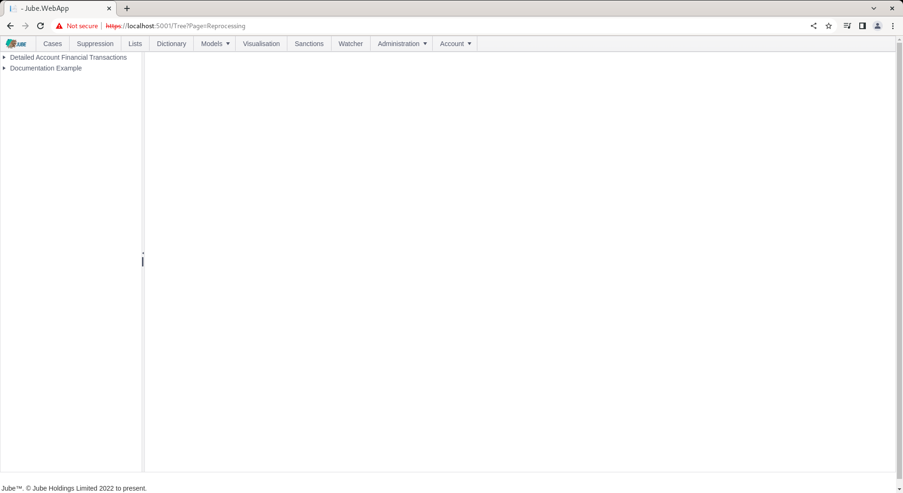
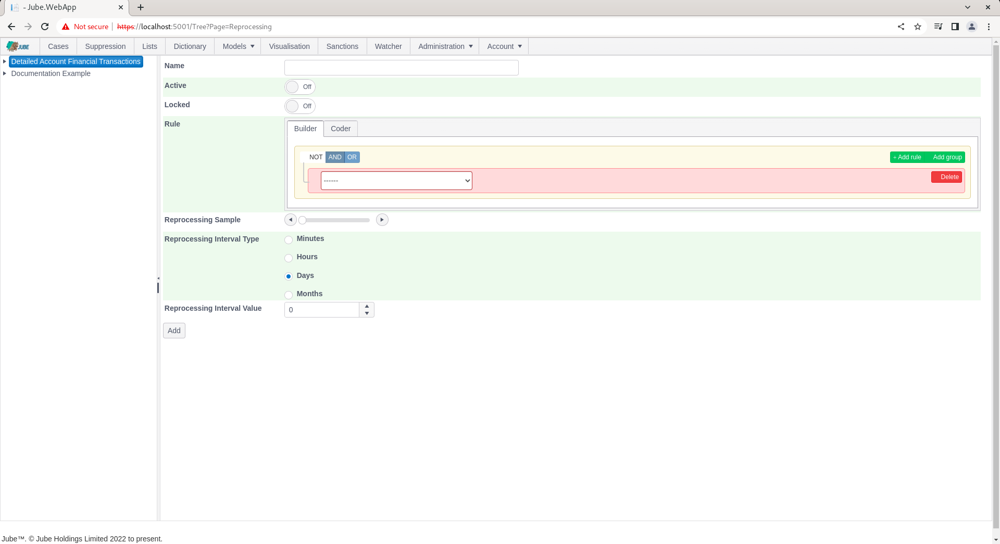
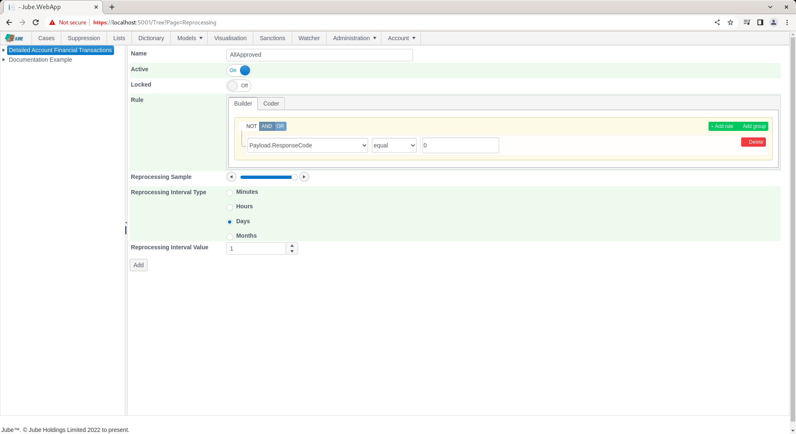

🚀Speed up implementation with hands-on, face-to-face [training](https://www.jube.io/training) from the developer.

# Reprocessing Filters
Reprocessing can demand an overwhelming amount of data and it is extremely important that data be filtered as much as possible.

Start by navigating to Models >> Reprocessing:

Click on the upper left hand side tree entry showing the Transaction model to add a new Reprocessing filter and container:

The Rule constructor has the following limited collections available for filtering:

| Name    | Description                                                                                                  | 
|---------|--------------------------------------------------------------------------------------------------------------|
| Payload | The fields created in the Request XPath page.  The processing will take place as if the transaction was new. |

The reprocessing filter is comprised of the following parameters:

| Value                       | Description                                                                                                     | Example |
|-----------------------------|-----------------------------------------------------------------------------------------------------------------|---------|
| Reprocessing Sample         | The percentage of sampling to take place in the reprocessing, from 0% (nothing) to 100% (everything).           | 100%    |
| Reprocessing Interval Type  | The date interval to subtract the current date by to arrive at a threshold to process data from.                | d       |
| Reprocessing Interval Value | The date interval value interval to subtract the current date by to arrive at a threshold to process data from. | 1       |

Complete the page as above parameters or as below:

Scroll down and Click Add to create a version of the filter:

The reprocessing filter will now have been created.  The reprocessing request collection is a grid containing all reprocessing requests made for this filter,  which will be empty at this point.