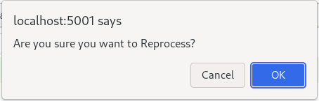

🚀Speed up implementation with hands-on, face-to-face [training](https://www.jube.io/training) from the developer.

# Reprocessing Instance
To create a reprocessing request,  ensure that the Reprocessing Filter created beforehand is available:

Scroll down and locate the Reprocess button:

By clicking the Reprocess button,  an entry will be made in the database requesting the engine perform reprocessing as per the filter specification.

Only one reprocessing request may exist at any given point in time,  and a new request cannot be created until any unprocessed requests move to a completed state.

Click the Reprocess button:

An entry will be created showing the reprocessing job request: 

It is possible to Delete - which will also stop - a reprocessing request by clicking the Delete button:

The reprocessing job has the following processing steps:

| Name          | Description                                                                                     |
|---------------|-------------------------------------------------------------------------------------------------|
| Not Allocated | The request has not been picked up by the reprocessing engine.                                  |
| Allocated     | The request has been picked up by the reprocessing engine.                                      |
| Initial Count | The initial count has been completed,  to establish created date range and universe of records. |
| Processing    | The request has begun processing data.                                                          |
| Completed     | The request has completed.                                                                      |

The reprocessing instance table is available and updated as reprocessing takes place:

| Name            | Description                                                                                                   |
|-----------------|---------------------------------------------------------------------------------------------------------------|
| Status          | The current status of the reprocessing job.                                                                   |
| Created Date    | The date and time the reprocessing request was created.                                                       |
| Reference Date  | The current date and time being processed in that moment.  This is the reference date specified in the model. |
| Available Count | The total number of records in the universe as brought back during the initial counts.                        |
| Sampled Count   | The total number of records that have been sampled for the purposes of reprocessing.                          |
| Matched Count   | The total number of records that have been matched (after being sampled) for the purposes of reprocessing.    |
| Processed Count | The total number of records reprocessed so far.                                                               |
| Completed Date  | The date and time that the job completed.                                                                     |
| Error Count     | The number of records in error observed during reprocessing.                                                  |

Refreshing the grid by navigating again to the Reprocessing Filter (Models >> Reprocessing, clicking on the Reprocessing Filter and scrolling down to the instances gird):

It can be seen that the reprocessing job has completed (which will allow new reprocessing jobs to be created for this reprocessing filter by simply clicking the Reprocess button).