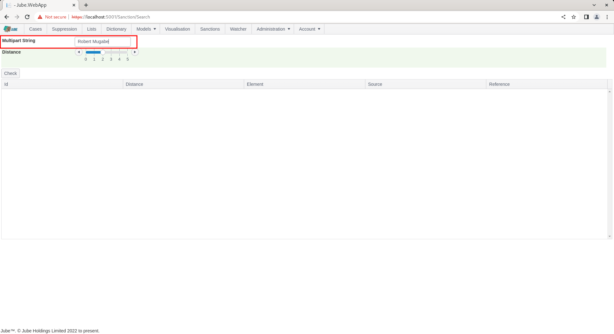
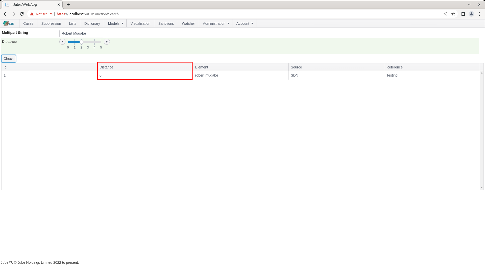

# Sanction Searching
The Sanctions page in Jube exists for the purposes of performing individual and batch sanction name matching against the entries loaded by the engine.

The Sanctions page uses the matching functionality available to the engine and is therefore exactly the same functionality available in model invocation real time.

Subject to the EnableSanctions application setting being set to the string "True" in Environment Variable,  the thread will be started to support the aforementioned.  The thread should be started on all servers that require online recall of sanctions either directly or via model invocation:

```text
EnableSanctions=True
```

| Value           | Description                                              |
|-----------------|----------------------------------------------------------|
| EnableSanctions | A flag indicating if sanctions is enabled in the engine. |

In the default installation of Jube there is only a single Sanction record by name "Robert Mugabe", although Jube supports the remote updating of sanctions from a variety of sources on the internet.

Manual Sanction invocation is available from the top level of the menu:


Navigate to the sanctions page by clicking the top menu item as above:


Sanctions matching in Jube uses a concept of a multipart string,  which means to say that a string (most likely a name) be comprised of several elements (e.g first name and last name), separated by a space character (and only a space character).

A multipart string in Jube makes no distinction in the order in which strings are presented (i.e. first then last name,  would be the same as last then first name for the purposes of matching).

The concept of distance is the implementation of the Levenshtein Distance distance algorithm and the number of characters that would need to be changed to achieve an absolutely perfect match.

Consider the following table which evaluates the multipart string  "Robert Mugabe":

| Multipart String  | Distance                                                      |
|-------------------|---------------------------------------------------------------|
| Robert Mugabe     | 0 characters need be changed to achieve perfect match.        |
| Robert Mugaby     | 1 character need be changed to achieve a perfect match.       |
| Robert Fugaby     | 2 characters need to be changed to achieve a perfect match.   |

The Sanctions page takes two parameters as described in the following table:

| Value            | Description                                                                                                                                                                                                                                                                  | Example       |
|------------------|------------------------------------------------------------------------------------------------------------------------------------------------------------------------------------------------------------------------------------------------------------------------------|---------------|
| Multipart String | The multipart string to be checked against sanctions,  where strings are separated by a space character (and nothing else).                                                                                                                                                  | Robert Mugabe |
| Distance         | The maximum distance to be checked for and returned by for the Levenshtein distance algorithm.Results will not be returned for more than this specified distance threshold - the number of characters required to be changed for a match to be returned - has been exceeded. | 1             |

Complete the Sanctions page as the above parameters:



Click the Check button:


The Sanction functionality is also exposed in the Invoke API, and Check button simply compiles and sends the following GET statement to the Jube Engine server side:

[https://localhost:5001/api/Invoke/Sanction?MultiPartString=Robert+Mugabe&Distance=2](https://localhost:5001/api/Invoke/Sanction?MultiPartString=Robert+Mugabe&Distance=2)

Returning the following response payload:

``` json
[
    {
        "value":"robert mugabe",
        "source":"SDN",
        "reference":"Testing",
        "id":1,
        "distance":0    
    }
]
```

Of course presented in a manner friendly to the end user in a grid as follows:


In this example,  across all Sanctions lists,  it can be seen that there are one record having been returned at matching,  and in all instances the distance to an absolute match of 0 characters requiring change:



To broaden the allowable distance, simply move the distance slider control to the new threshold,  although keep in mind that this will greatly increase false positive.

To demonstrate distance, change the multipart string to "Robert Mugaby" (a deliberate misspelling by one character in the surname Mugabe):


Click Check to match with the revised distance:


It can be seen that matches have still been achieved,  this time specifying the distance of 1,  which indicates that one character needs to be changed in order to achieve an exact match.


There are some additional processing beyond just the use of the Levenshtein Distance distance algorithm that are worth noting. The Sanctions functionality is an implementation of the Levenshtein Distance algorithm that compares strings (e.g. Richard vs Gichard) and returns an integer value specifying the number of characters that have to be changed in order for the two strings to be absolutely matched (e.g. 1 in this example). The purpose of fuzzy matching in the realm of Sanctions checking is to detect the scenario where names are subtly changed by error, deliberate action or cultural reasons (e.g. Mohammed has several possible spellings in practice). The Sanctions process will take the Multipart String that has been passed in the query string in the first instance (e.g. Robert Mugabe).  The multipart string takes each name component separated by a space (i.e. '  ') where the order of the name components does not matter (i.e. Mugabe Robert is identical to Robert Mugabe for the purposes of the processing of sanctions matches). The distance query string parameter is important to limit the return to only records that have a certain match quality (i.e. on a small number of characters need to be changed in order for a match to be achieved). All Sanctions lists are held in the engines memory to assure fast response times.  Although the Levenshtein Distance algorithm exists outside the scope of this document,  as it is a pure implementation,  it is explained in more detail as follows:

[https://en.wikipedia.org/wiki/Levenshtein_distance](https://en.wikipedia.org/wiki/Levenshtein_distance)

The first step in the sanctions processing is to break the Multipart string passed into component parts as an array.  For example,  the string Robert Mugabe passed as a string would be broken into two strings, Robert and Mugabe,  for the purposes of matching.  During the breaking of the multipart string, each string will be cleaned replacing characters based on the following dictionary (currently hard coded):

| Value            | Description                                                                                                                                                 |
|------------------|-------------------------------------------------------------------------------------------------------------------------------------------------------------|
| ,                | Removed.                                                                                                                                                    |
| " " (i.e. space) | Removed,  keeping in mind that it should have been split on this value in any event, it serves to remove the curious instance of double space in a string.. |

The routine now has a list of strings that need to be matched against the sanctions loaded to memory,  keeping in mind that the components of the multipart string (i.e. Robert and Mugabe) will need to be matched with each component of the sanction entry (e.g. Robert AND Gabriel AND Mugabe).  The reason multipart strings are broken into components for both the request (i.e. what the user has provided to be tested) and the file entries is to assure a rigorous matching analysis without the user being required to perform several searches with subtle changes to the multipart string.

For each Sanctions entry available in the engines memory, the process will step through each entry one by one.  The process will be repeated in a step wise fashion depending upon the maximum distance that has been specified in the the request.  For example,  if the user has passed a value that the maximum distance to be considered is five,  then there will be five iterations of sanctions checking, with any matches being recorded alongside the distance threshold that yielded a match. For each Sanction Entry,  for each distance step each component of the multipart string passed by the user will be tested against each component element of the Sanction Entry. The component entries are broken out of the multipart string during the load to save processing time and are referenced distinctly \ only once in this process (e.g. Richard David Richard,  would be tested as Richard David). When processing values for the multipart string either passed by the end user of available in memory from the sanctions loader,  it is done so on a distinct basis. For each component of the multipart string passed by the user, it is tested against each component part of the sanctions entry using the Levenshtein distance algorithm.  The Levenshtein Distance algorithm will return an integer detailing the number of characters that need to be changed in order for the comparison to be a perfect match.  If the distance is less than the value specified in the querystring parameter from the user, the multipart string element is recorded as having matched in a buffer.  The process is repeated until each multipart string element passed by the user is tested against each multipart string element from the sanctions loader (and this in the engine memory).