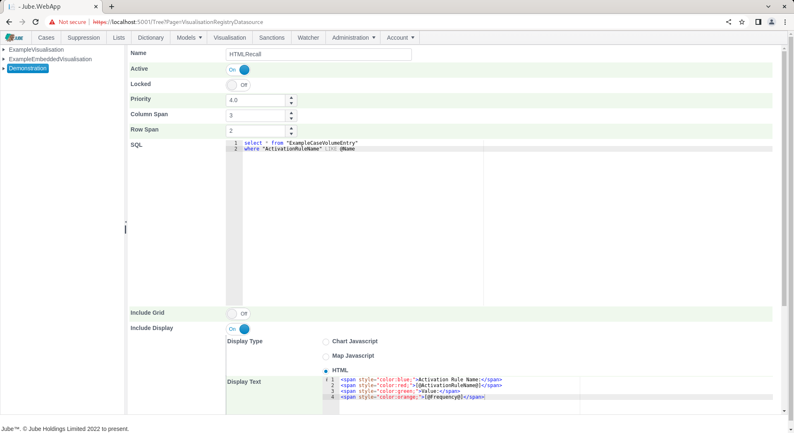
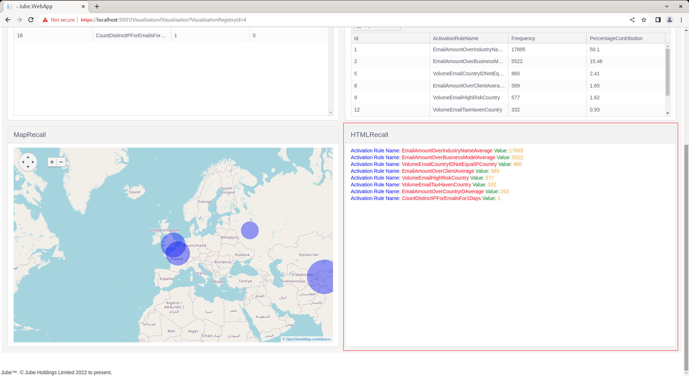

🚀Speed up implementation with hands-on, face-to-face [training](https://www.jube.io/training) from the developer.

# Generate HTML in Visualisation Datasource
Several Kendo Charting controls are supported inside a visualisation datasource for the purpose of the display of data, including Kendo Grid, Kendo Chart and Kendo Map controls.  It is possible to craft HTML and inline CSS to render for each record returned by the SQL.

The common means of [@@] tokenization in Jube is also available to the HTML to allow for the replacement of tokenized values with their actual values.

Assuming the following SQL:

```sql
select * from "ExampleCaseVolumeEntry"
where "ActivationRuleName" LIKE @Name
```
Take the following HTML:

``` html
<span style="color:blue;">Activation Rule Name:</span> 
<span style="color:red;">[@ActivationRuleName@]</span> 
<span style="color:green;">Value:</span>
<span style="color:orange;">[@Frequency@]</span>
```

The HTML is intended to present each individual record returned by the SQL, swapping the token values for the matching column names.

To return only a single record, it is advisable to limit the SQL.

Navigate Administration >> Visualisation >> Visualisation Datasources,  then click on the Visualisation Registry entry to create a new datasource:


Using the above SQL and HTML as above, create a new entry:




Click Add to create a version of the Visualisation Registry Datasource, which will parse the SQL and create the series definitions in the background:


Navigate to the Visualisation Registry through the Visualisation Directory to recall. Noting the default parameter value for Name, as Email, click on Run to execute the datasource,  whereby SQL will be tokenized for with the parameter value provided.  Scroll down to make visible the fourth tile:



It can be seen that the HTML fragment has been repeated for each record returned, styling applied natively and tokenization swapping for the values returned.