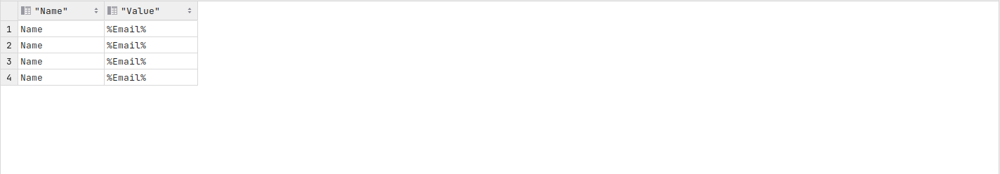

🚀Speed up implementation with hands-on, face-to-face [training](https://www.jube.io/training) from the developer.

# Logging in Visualisation Datasource
On each recall of a Visualisation datasource there is extensive logging in the database for the purpose of capturing user inputs, the time taken to process the SQL and an errors returned by the database.

Given SQL is validated on the creation of a Visualisation Datasource and all parameters  are passed as named variables,  the likelihood of errors at recall are reduced.

To inspect the datasource recall:

``` sql
select * from "VisualisationRegistryDatasourceExecutionLog"
```

Returning the following data:


There exists the possibility to join onto the VisualisationRegistryDatasource to obtain the SQL:

``` sql
select d."Command",l."ResponseTime" from "VisualisationRegistryDatasourceExecutionLog" l
inner join "VisualisationRegistryDatasource"d on d."Id" = l."VisualisationRegistryDatasourceId"
```

Returning the following data:


The table should be inspected for excessive response times and Errors.  In the case of long response times,  it is advisable to manually test the explain plan of the SQL composed and seek optimisation.

The parameters that have been passed in this execution and parameterization of the execution are available:

``` sql
select * from "VisualisationRegistryDatasourceExecutionLogParameter"
```

Returning the following data:


To obtain the name of the parameter a join:

``` sql
select p."Name",l."Value" from "VisualisationRegistryDatasourceExecutionLogParameter" l
inner join "VisualisationRegistryParameter" p on p."Id" = l."VisualisationRegistryParameterId"
```

Returning the following data:



Keep in mind that the SQL cannot be injected as it is validated then stored alongside the datasource and the parameters are passed on a secure basis.  Notwithstanding the secure development of the SQL invocation,  the parameters log should be monitored for potentially malicious statements.