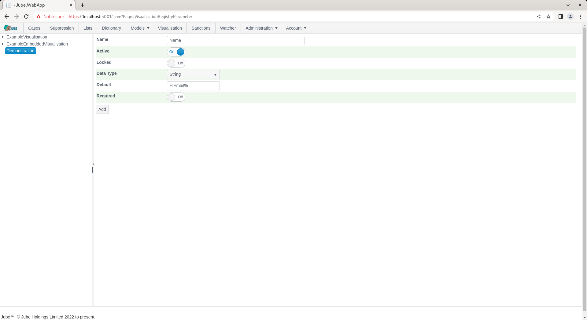
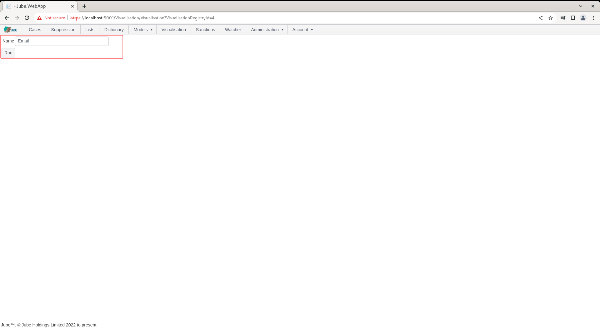
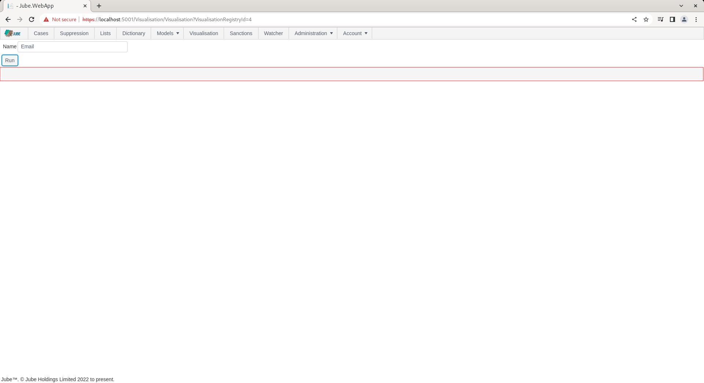

🚀Speed up implementation with hands-on, face-to-face [training](https://www.jube.io/training) from the developer.

# Visualisation Parameters
The concept of visualisations in Jube is that SQL is executed against the database and presented in either grid or chart form. The SQL itself can be parameterized on a tokens basis.

There can be many datasource's available to a Visualisation, however, they are expected to share a common collection of parameters.

Parameters can either be collected via manual form entry or matched to the Case payload in the event that the Visualisation is embedded (where the parameters are matched to the values in the case payload based on their name).

For the purpose of this example,  an example table will be used as follows, with the following basic SQL returning:

```sql
select * from "ExampleCaseVolumeEntry"
```


In this example,  the table will be filtered based on a LIKE statement on name:

```sql
select * from "ExampleCaseVolumeEntry"
where "ActivationRuleName" LIKE '%Email%'
```

Which returns a filtered view of the table:


The SQL will however be parameterized via a named @ parameters (this is SQL syntax rather than the Jube style of tokenization):

```sql
select * from "ExampleCaseVolumeEntry"
where "ActivationRuleName" LIKE @Name
```

Tokenization as supported in the rest of the application is not supported here for reasons of SQL injection prevention,  each parameter has formal equivalence as a scoped parameter in the call to the database.

To create a parameter, start by navigating to Administration >> Visualisation >> Visualisation Parameters:


Click on the node entry for the recently created Visualisation Registry, in this case Demonstration, to expose options for the creation of a parameter:


Visualisation Registry Parameters have the following properties:

| Value     | Description                                                                                                                                                                                                                                           | Example |
|-----------|-------------------------------------------------------------------------------------------------------------------------------------------------------------------------------------------------------------------------------------------------------|---------|
| Data Type | The data type governing the control that will be displayed when collecting parameters.                                                                                                                                                                | True    |
| Default   | The default value to be provided to the control and the scoped parameter matching on report recall (noting that Case embedding does not include controls to capture parameters).  In the case of date,  this will be an offset of the number of days. | %Test%  |
| Required  | A flag indicating if the parameter is mandatory.                                                                                                                                                                                                      | True    |

Keeping in mind the SQL above and the eventual parameterization of this query, create a parameter as follows:



Scroll down and click update to create a version of the Visualisation Registry Parameter:


Navigate to the Visualisation page via the main menu and click through the Demonstration link to recall this Visualisation Registry,  which should expose the parameters:



Clicking run will collate the parameters and make them available for datasource parameterization, yet for the purpose of this example,  there does exists no datasource's to execute SQL:

