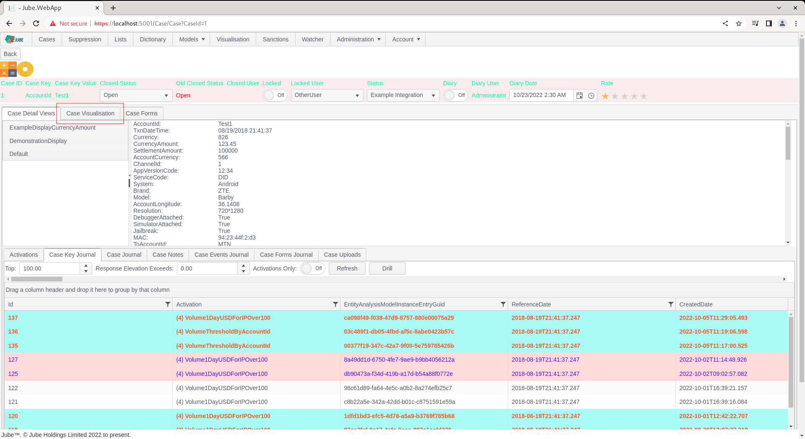

🚀Speed up implementation with hands-on, face-to-face [training](https://www.jube.io/training) from the developer.

# Visualisation Recall
Jube provides a rudimentary reporting tool that exists to execute SQL against the database and presenting as either a grid or visualisation.  The philosophy is to make the creation of reports quick given a rudimentary understanding of SQL and the Kendo JQuery charting library (passed as JSON like Javascript fragments).

Visualisations are available for recall via the Visualisation Directory or the Case page.  There are two default reports available respectively.

To view a report in the Visualisation Directory, navigate to the Visualisation page in the parent menu:

On click, a list of all Visualisations Registry entries toggled to display in the Visualisation Directory will be shown:

Clicking on the link, in this case ExampleVisualisation, will expose the Visualisation parameters:

Complete the parameters and click Run,  in this case using the defaults:

There are two tiles, which are referred to as datasource's, which exist inside a canvas of a set width and height.  The use of datasource's in this manner allow for the creation of dashboards.

In the event that the Visualisation is recalled instead from the case management page, parameters are not exposed, instead the report will recall matching parameters to the case payload.  A Visualisation is allocated to a Case Workflow in the Case Workflow configuration:

A Visualisation does not have to be available to the Visualisation Directory to be available to the Cases page, except the availability of parameters on a like for like basis (matching those between Cases Workflow XPath and the Visualisation Parameters) is required.

To expose an example report embedded in the Case page, navigate to a Case:

Note the Case Visualisation tab,  which will reference the report that is configured alongside the Case Workflow:

The loading of the case has the same effect as clicking on the report via the Visualisation directory,  except,  it will not require manual input of the parameters,  as these will be matched from the case payload.  Clicking on the tab will expose the visualisation:

The practical use of a Case Visualisation is to produce a visual consolidation of the case, oftentimes referred to a dashboard. 